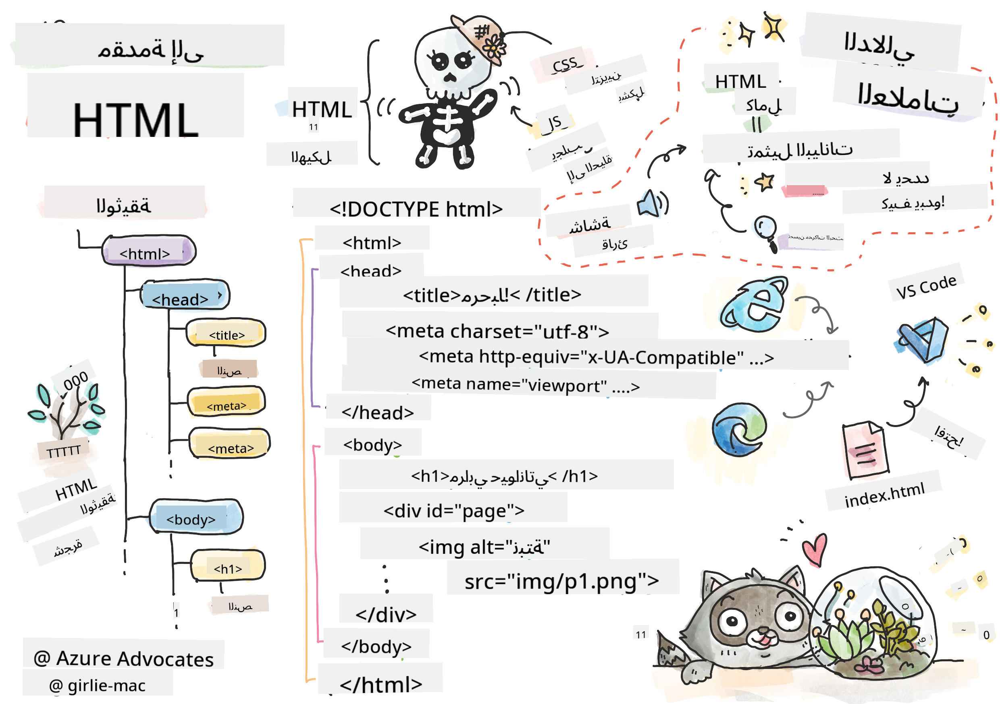
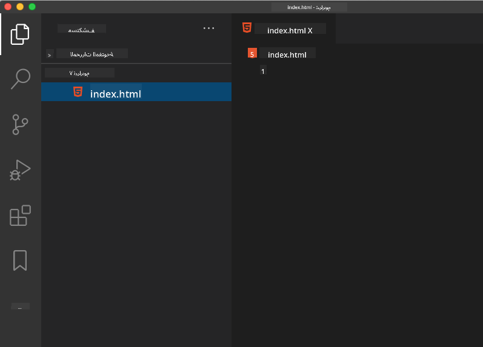

<!--
CO_OP_TRANSLATOR_METADATA:
{
  "original_hash": "46a0639e719b9cf1dfd062aa24cad639",
  "translation_date": "2025-08-25T21:06:02+00:00",
  "source_file": "3-terrarium/1-intro-to-html/README.md",
  "language_code": "ar"
}
-->
# مشروع التيراريوم الجزء الأول: مقدمة إلى HTML

  
> رسم توضيحي بواسطة [Tomomi Imura](https://twitter.com/girlie_mac)

## اختبار ما قبل المحاضرة

[اختبار ما قبل المحاضرة](https://ashy-river-0debb7803.1.azurestaticapps.net/quiz/15)

> شاهد الفيديو

> 
> [](https://www.youtube.com/watch?v=1TvxJKBzhyQ)

### المقدمة

HTML، أو لغة ترميز النصوص التشعبية، هي "الهيكل العظمي" للويب. إذا كانت CSS "تُلبس" HTML و JavaScript تُضفي عليها الحياة، فإن HTML هي جسم تطبيق الويب الخاص بك. حتى أن بناء HTML يعكس هذه الفكرة، حيث يتضمن علامات مثل "head"، "body"، و "footer".

في هذا الدرس، سنستخدم HTML لتصميم "الهيكل العظمي" لواجهة التيراريوم الافتراضي الخاص بنا. ستحتوي الواجهة على عنوان وثلاثة أعمدة: عمود على اليمين وآخر على اليسار حيث تعيش النباتات القابلة للسحب، ومنطقة في المنتصف ستكون التيراريوم الزجاجي. بنهاية هذا الدرس، ستتمكن من رؤية النباتات في الأعمدة، ولكن الواجهة ستبدو غريبة بعض الشيء؛ لا تقلق، في القسم التالي ستضيف أنماط CSS لتحسين مظهر الواجهة.

### المهمة

على جهاز الكمبيوتر الخاص بك، قم بإنشاء مجلد باسم "terrarium" وداخله ملف باسم "index.html". يمكنك القيام بذلك في Visual Studio Code بعد إنشاء مجلد التيراريوم الخاص بك عن طريق فتح نافذة جديدة من VS Code، والنقر على "فتح مجلد"، والتنقل إلى المجلد الجديد. انقر على زر "ملف" الصغير في لوحة المستكشف وقم بإنشاء الملف الجديد:



أو

استخدم هذه الأوامر في Git Bash:
* `mkdir terrarium`
* `cd terrarium`
* `touch index.html`
* `code index.html` أو `nano index.html`

> ملفات index.html تشير إلى المتصفح بأنها الملف الافتراضي في المجلد؛ عناوين URL مثل `https://anysite.com/test` قد تكون مبنية باستخدام هيكل مجلد يتضمن مجلدًا باسم `test` يحتوي على ملف `index.html` بداخله؛ لا يتوجب على `index.html` أن يظهر في عنوان URL.

---

## نوع المستند وعلامات html

السطر الأول في ملف HTML هو نوع المستند. من المدهش قليلاً أنك بحاجة إلى وضع هذا السطر في أعلى الملف، ولكنه يخبر المتصفحات القديمة بأن عليها عرض الصفحة في الوضع القياسي، وفقًا لمواصفات HTML الحالية.

> نصيحة: في VS Code، يمكنك التمرير فوق علامة والحصول على معلومات حول استخدامها من أدلة مرجعية MDN.

السطر الثاني يجب أن يكون علامة الفتح `<html>`، متبوعة الآن بعلامة الإغلاق `</html>`. هذه العلامات هي العناصر الجذرية لواجهتك.

### المهمة

أضف هذه الأسطر في أعلى ملف `index.html` الخاص بك:

```HTML
<!DOCTYPE html>
<html></html>
```

✅ هناك أوضاع مختلفة يمكن تحديدها عن طريق تعيين نوع المستند باستخدام سلسلة استعلام: [وضع Quirks والوضع القياسي](https://developer.mozilla.org/docs/Web/HTML/Quirks_Mode_and_Standards_Mode). كانت هذه الأوضاع تدعم المتصفحات القديمة جدًا التي لا تُستخدم عادةً في الوقت الحاضر (مثل Netscape Navigator 4 و Internet Explorer 5). يمكنك الالتزام بإعلان نوع المستند القياسي.

---

## "الرأس" في المستند

منطقة "الرأس" في مستند HTML تتضمن معلومات أساسية عن صفحتك، تُعرف أيضًا باسم [البيانات الوصفية](https://developer.mozilla.org/docs/Web/HTML/Element/meta). في حالتنا، نخبر خادم الويب الذي سيتم إرسال هذه الصفحة إليه لعرضها، بأربعة أشياء:

- عنوان الصفحة
- بيانات وصفية للصفحة تتضمن:
    - "مجموعة الأحرف"، التي تخبر عن نوع ترميز الأحرف المستخدم في الصفحة
    - معلومات المتصفح، بما في ذلك `x-ua-compatible` التي تشير إلى أن المتصفح IE=edge مدعوم
    - معلومات حول كيفية تصرف نافذة العرض عند تحميلها. تعيين نافذة العرض لتكون بمقياس أولي 1 يتحكم في مستوى التكبير عند تحميل الصفحة لأول مرة.

### المهمة

أضف كتلة "الرأس" إلى مستندك بين علامات الفتح والإغلاق `<html>`.

```html
<head>
	<title>Welcome to my Virtual Terrarium</title>
	<meta charset="utf-8" />
	<meta http-equiv="X-UA-Compatible" content="IE=edge" />
	<meta name="viewport" content="width=device-width, initial-scale=1" />
</head>
```

✅ ماذا سيحدث إذا قمت بتعيين علامة meta لنافذة العرض مثل هذه: `<meta name="viewport" content="width=600">`؟ اقرأ المزيد عن [نافذة العرض](https://developer.mozilla.org/docs/Web/HTML/Viewport_meta_tag).

---

## "الجسم" في المستند

### علامات HTML

في HTML، تضيف علامات إلى ملف .html الخاص بك لإنشاء عناصر صفحة ويب. كل علامة عادةً ما تحتوي على علامة فتح وعلامة إغلاق، مثل: `<p>hello</p>` للإشارة إلى فقرة. قم بإنشاء جسم واجهتك عن طريق إضافة مجموعة من علامات `<body>` داخل زوج علامات `<html>`؛ الآن يبدو الترميز الخاص بك كالتالي:

### المهمة

```html
<!DOCTYPE html>
<html>
	<head>
		<title>Welcome to my Virtual Terrarium</title>
		<meta charset="utf-8" />
		<meta http-equiv="X-UA-Compatible" content="IE=edge" />
		<meta name="viewport" content="width=device-width, initial-scale=1" />
	</head>
	<body></body>
</html>
```

الآن، يمكنك البدء في بناء صفحتك. عادةً، تستخدم علامات `<div>` لإنشاء العناصر المنفصلة في الصفحة. سنقوم بإنشاء سلسلة من عناصر `<div>` التي ستحتوي على صور.

### الصور

إحدى علامات HTML التي لا تحتاج إلى علامة إغلاق هي علامة ``، لأنها تحتوي على عنصر `src` الذي يتضمن كل المعلومات التي تحتاجها الصفحة لعرض العنصر.

قم بإنشاء مجلد في تطبيقك باسم `images` وأضف فيه جميع الصور الموجودة في [مجلد كود المصدر](../../../../3-terrarium/solution/images)؛ (هناك 14 صورة للنباتات).

### المهمة

أضف صور النباتات هذه إلى عمودين بين علامات `<body></body>`:

```html
<div id="page">
	<div id="left-container" class="container">
		<div class="plant-holder">
			
		</div>
		<div class="plant-holder">
			
		</div>
		<div class="plant-holder">
			
		</div>
		<div class="plant-holder">
			
		</div>
		<div class="plant-holder">
			
		</div>
		<div class="plant-holder">
			
		</div>
		<div class="plant-holder">
			
		</div>
	</div>
	<div id="right-container" class="container">
		<div class="plant-holder">
			
		</div>
		<div class="plant-holder">
			
		</div>
		<div class="plant-holder">
			
		</div>
		<div class="plant-holder">
			
		</div>
		<div class="plant-holder">
			
		</div>
		<div class="plant-holder">
			
		</div>
		<div class="plant-holder">
			
		</div>
	</div>
</div>
```

> ملاحظة: الفرق بين Spans و Divs. تعتبر Divs عناصر "كتل"، بينما تعتبر Spans "عناصر خطية". ماذا سيحدث إذا قمت بتحويل هذه divs إلى spans؟

مع هذا الترميز، تظهر النباتات الآن على الشاشة. يبدو الأمر سيئًا، لأنها لم تُنسق بعد باستخدام CSS، وسنقوم بذلك في الدرس التالي.

كل صورة تحتوي على نص بديل يظهر حتى إذا لم تتمكن من رؤية الصورة أو عرضها. هذا عنصر مهم يجب تضمينه لتحسين الوصول. تعرف على المزيد حول الوصول في الدروس المستقبلية؛ في الوقت الحالي، تذكر أن السمة alt توفر معلومات بديلة للصورة إذا لم يتمكن المستخدم لسبب ما من عرضها (بسبب اتصال بطيء، أو خطأ في سمة src، أو إذا كان المستخدم يستخدم قارئ شاشة).

✅ هل لاحظت أن كل صورة تحتوي على نفس النص البديل؟ هل هذا ممارسة جيدة؟ لماذا أو لماذا لا؟ هل يمكنك تحسين هذا الكود؟

---

## الترميز الدلالي

بشكل عام، من الأفضل استخدام "الدلالات" ذات المعنى عند كتابة HTML. ماذا يعني ذلك؟ يعني أنك تستخدم علامات HTML لتمثيل نوع البيانات أو التفاعل الذي صُممت من أجله. على سبيل المثال، النص الرئيسي في صفحة ما يجب أن يستخدم علامة `<h1>`.

أضف السطر التالي مباشرةً أسفل علامة الفتح `<body>`:

```html
<h1>My Terrarium</h1>
```

استخدام الترميز الدلالي مثل وجود العناوين كـ `<h1>` والقوائم غير المرتبة كـ `<ul>` يساعد قارئات الشاشة على التنقل عبر الصفحة. بشكل عام، يجب كتابة الأزرار كـ `<button>` والقوائم كـ `<li>`. بينما من الممكن استخدام عناصر `<span>` ذات أنماط خاصة مع معالجات النقر لمحاكاة الأزرار، من الأفضل للمستخدمين ذوي الإعاقة استخدام تقنيات لتحديد مكان الزر في الصفحة والتفاعل معه، إذا ظهر العنصر كزر. لهذا السبب، حاول استخدام الترميز الدلالي قدر الإمكان.

✅ ألقِ نظرة على قارئ شاشة وكيف يتفاعل مع صفحة ويب [في هذا الفيديو](https://www.youtube.com/watch?v=OUDV1gqs9GA). هل يمكنك رؤية سبب إحباط المستخدم عند وجود ترميز غير دلالي؟

## التيراريوم

الجزء الأخير من هذه الواجهة يتضمن إنشاء ترميز سيتم تنسيقه لإنشاء تيراريوم.

### المهمة:

أضف هذا الترميز فوق علامة `</div>` الأخيرة:

```html
<div id="terrarium">
	<div class="jar-top"></div>
	<div class="jar-walls">
		<div class="jar-glossy-long"></div>
		<div class="jar-glossy-short"></div>
	</div>
	<div class="dirt"></div>
	<div class="jar-bottom"></div>
</div>
```

✅ على الرغم من أنك أضفت هذا الترميز إلى الشاشة، إلا أنك لا ترى أي شيء يظهر. لماذا؟

---

## 🚀التحدي

هناك بعض العلامات "القديمة" في HTML التي لا تزال ممتعة للتجربة، على الرغم من أنه لا يجب استخدام العلامات المهملة مثل [هذه العلامات](https://developer.mozilla.org/docs/Web/HTML/Element#Obsolete_and_deprecated_elements) في ترميزك. مع ذلك، هل يمكنك استخدام العلامة القديمة `<marquee>` لجعل عنوان h1 يتحرك أفقيًا؟ (إذا قمت بذلك، لا تنسَ إزالته بعد ذلك).

## اختبار ما بعد المحاضرة

[اختبار ما بعد المحاضرة](https://ashy-river-0debb7803.1.azurestaticapps.net/quiz/16)

## المراجعة والدراسة الذاتية

HTML هو نظام بناء "مجرب وصحيح" ساعد في بناء الويب كما نعرفه اليوم. تعرف قليلاً على تاريخه من خلال دراسة بعض العلامات القديمة والجديدة. هل يمكنك معرفة سبب إهمال بعض العلامات وإضافة أخرى؟ ما العلامات التي قد يتم تقديمها في المستقبل؟

تعرف على المزيد حول بناء المواقع للويب والأجهزة المحمولة في [Microsoft Learn](https://docs.microsoft.com/learn/modules/build-simple-website/?WT.mc_id=academic-77807-sagibbon).

## الواجب

[تمرن على HTML: قم ببناء نموذج مدونة](assignment.md)

**إخلاء المسؤولية**:  
تم ترجمة هذا المستند باستخدام خدمة الترجمة بالذكاء الاصطناعي [Co-op Translator](https://github.com/Azure/co-op-translator). بينما نسعى لتحقيق الدقة، يرجى العلم أن الترجمات الآلية قد تحتوي على أخطاء أو معلومات غير دقيقة. يجب اعتبار المستند الأصلي بلغته الأصلية المصدر الرسمي. للحصول على معلومات حاسمة، يُوصى بالاستعانة بترجمة بشرية احترافية. نحن غير مسؤولين عن أي سوء فهم أو تفسيرات خاطئة تنشأ عن استخدام هذه الترجمة.