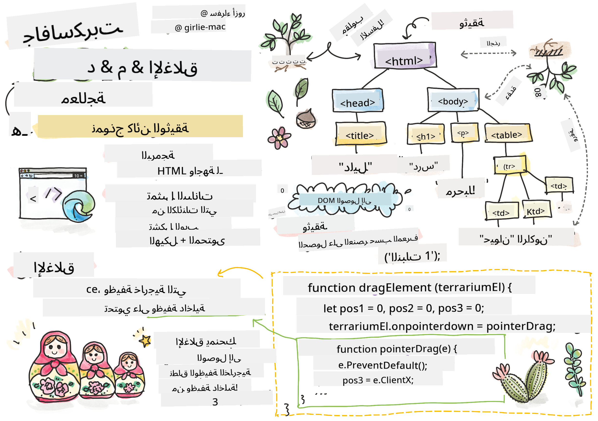
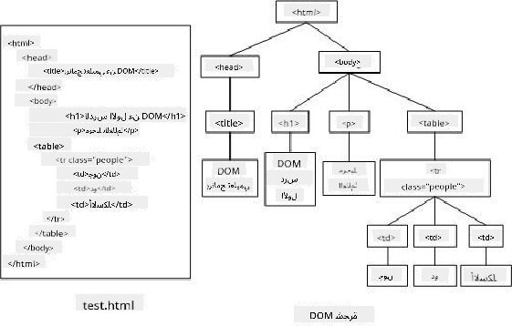

<!--
CO_OP_TRANSLATOR_METADATA:
{
  "original_hash": "30f8903a1f290e3d438dc2c70fe60259",
  "translation_date": "2025-08-25T21:13:58+00:00",
  "source_file": "3-terrarium/3-intro-to-DOM-and-closures/README.md",
  "language_code": "ar"
}
-->
# مشروع التيراريوم الجزء الثالث: التلاعب بـ DOM والإغلاق


> رسم توضيحي بواسطة [Tomomi Imura](https://twitter.com/girlie_mac)

## اختبار ما قبل المحاضرة

[اختبار ما قبل المحاضرة](https://ashy-river-0debb7803.1.azurestaticapps.net/quiz/19)

### المقدمة

التلاعب بـ DOM، أو "نموذج كائن المستند"، هو جانب أساسي من تطوير الويب. وفقًا لـ [MDN](https://developer.mozilla.org/docs/Web/API/Document_Object_Model/Introduction)، "نموذج كائن المستند (DOM) هو تمثيل البيانات للكائنات التي تشكل هيكل ومحتوى المستند على الويب." التحديات المتعلقة بالتلاعب بـ DOM على الويب غالبًا ما كانت الدافع وراء استخدام أطر عمل JavaScript بدلاً من JavaScript العادية لإدارة DOM، ولكننا سنقوم بذلك بأنفسنا!

بالإضافة إلى ذلك، ستقدم هذه الدرس فكرة [الإغلاق في JavaScript](https://developer.mozilla.org/docs/Web/JavaScript/Closures)، والتي يمكنك التفكير فيها كدالة مغلقة بواسطة دالة أخرى بحيث يكون للدالة الداخلية الوصول إلى نطاق الدالة الخارجية.

> الإغلاق في JavaScript هو موضوع واسع ومعقد. يتناول هذا الدرس الفكرة الأساسية فقط، حيث ستجد في كود التيراريوم الخاص بنا إغلاقًا: دالة داخلية ودالة خارجية تم إنشاؤها بطريقة تسمح للدالة الداخلية بالوصول إلى نطاق الدالة الخارجية. للحصول على معلومات أكثر تفصيلًا حول كيفية عمل ذلك، يرجى زيارة [الوثائق الشاملة](https://developer.mozilla.org/docs/Web/JavaScript/Closures).

سنستخدم الإغلاق للتلاعب بـ DOM.

فكر في DOM كشجرة، تمثل جميع الطرق التي يمكن بها التلاعب بمستند صفحة الويب. تم كتابة واجهات برمجة التطبيقات المختلفة (APIs) بحيث يمكن للمبرمجين، باستخدام لغة البرمجة التي يختارونها، الوصول إلى DOM وتحريره وتغييره وإعادة ترتيبه وإدارته بطرق أخرى.



> تمثيل لـ DOM وعلامات HTML التي تشير إليه. من [Olfa Nasraoui](https://www.researchgate.net/publication/221417012_Profile-Based_Focused_Crawler_for_Social_Media-Sharing_Websites)

في هذا الدرس، سنكمل مشروع التيراريوم التفاعلي الخاص بنا عن طريق إنشاء JavaScript الذي سيسمح للمستخدم بالتلاعب بالنباتات على الصفحة.

### المتطلبات الأساسية

يجب أن تكون قد أنشأت HTML وCSS للتيراريوم الخاص بك. بحلول نهاية هذا الدرس، ستتمكن من نقل النباتات إلى داخل وخارج التيراريوم عن طريق سحبها.

### المهمة

في مجلد التيراريوم الخاص بك، قم بإنشاء ملف جديد يسمى `script.js`. قم باستيراد هذا الملف في قسم `<head>`:

```html
	<script src="./script.js" defer></script>
```

> ملاحظة: استخدم `defer` عند استيراد ملف JavaScript خارجي إلى ملف HTML للسماح بتنفيذ JavaScript فقط بعد تحميل ملف HTML بالكامل. يمكنك أيضًا استخدام السمة `async`، التي تسمح بتنفيذ البرنامج النصي أثناء تحليل ملف HTML، ولكن في حالتنا، من المهم أن تكون عناصر HTML متاحة بالكامل للسحب قبل السماح بتنفيذ برنامج السحب.

---

## عناصر DOM

أول شيء تحتاج إلى القيام به هو إنشاء مراجع للعناصر التي تريد التلاعب بها في DOM. في حالتنا، هي النباتات الـ 14 التي تنتظر حاليًا في الجوانب.

### المهمة

```html
dragElement(document.getElementById('plant1'));
dragElement(document.getElementById('plant2'));
dragElement(document.getElementById('plant3'));
dragElement(document.getElementById('plant4'));
dragElement(document.getElementById('plant5'));
dragElement(document.getElementById('plant6'));
dragElement(document.getElementById('plant7'));
dragElement(document.getElementById('plant8'));
dragElement(document.getElementById('plant9'));
dragElement(document.getElementById('plant10'));
dragElement(document.getElementById('plant11'));
dragElement(document.getElementById('plant12'));
dragElement(document.getElementById('plant13'));
dragElement(document.getElementById('plant14'));
```

ما الذي يحدث هنا؟ أنت تشير إلى المستند وتبحث في DOM الخاص به للعثور على عنصر بمعرف معين. تذكر في الدرس الأول عن HTML أنك أعطيت معرفات فردية لكل صورة نبات (`id="plant1"`). الآن ستستفيد من هذا الجهد. بعد تحديد كل عنصر، تقوم بتمرير هذا العنصر إلى دالة تسمى `dragElement` التي ستقوم بإنشائها قريبًا. وبالتالي، يصبح العنصر في HTML قابلًا للسحب، أو سيكون كذلك قريبًا.

✅ لماذا نشير إلى العناصر بواسطة المعرف؟ لماذا لا نستخدم الفئة الخاصة بـ CSS؟ قد ترغب في الرجوع إلى الدرس السابق عن CSS للإجابة على هذا السؤال.

---

## الإغلاق

الآن أنت جاهز لإنشاء إغلاق `dragElement`، وهو دالة خارجية تغلق دالة داخلية أو دوال (في حالتنا، سيكون لدينا ثلاث دوال).

الإغلاقات مفيدة عندما تحتاج دالة أو أكثر إلى الوصول إلى نطاق الدالة الخارجية. إليك مثال:

```javascript
function displayCandy(){
	let candy = ['jellybeans'];
	function addCandy(candyType) {
		candy.push(candyType)
	}
	addCandy('gumdrops');
}
displayCandy();
console.log(candy)
```

في هذا المثال، تحيط دالة `displayCandy` بدالة تضيف نوعًا جديدًا من الحلوى إلى مصفوفة موجودة بالفعل في الدالة. إذا قمت بتشغيل هذا الكود، ستكون المصفوفة `candy` غير معرفة، لأنها متغير محلي (محلي للإغلاق).

✅ كيف يمكنك جعل المصفوفة `candy` قابلة للوصول؟ حاول نقلها خارج الإغلاق. بهذه الطريقة، تصبح المصفوفة عالمية، بدلاً من أن تظل متاحة فقط لنطاق الإغلاق المحلي.

### المهمة

تحت التصريحات الخاصة بالعناصر في `script.js`، قم بإنشاء دالة:

```javascript
function dragElement(terrariumElement) {
	//set 4 positions for positioning on the screen
	let pos1 = 0,
		pos2 = 0,
		pos3 = 0,
		pos4 = 0;
	terrariumElement.onpointerdown = pointerDrag;
}
```

تأخذ `dragElement` كائن `terrariumElement` الخاص بها من التصريحات في أعلى البرنامج النصي. ثم تقوم بتعيين بعض المواضع المحلية عند `0` للكائن الممرر إلى الدالة. هذه هي المتغيرات المحلية التي سيتم التلاعب بها لكل عنصر أثناء إضافة وظيفة السحب والإفلات داخل الإغلاق لكل عنصر. سيتم ملء التيراريوم بهذه العناصر المسحوبة، لذا يحتاج التطبيق إلى تتبع مكان وضعها.

بالإضافة إلى ذلك، يتم تعيين `terrariumElement` الذي يتم تمريره إلى هذه الدالة إلى حدث `pointerdown`، وهو جزء من [واجهات برمجة التطبيقات للويب](https://developer.mozilla.org/docs/Web/API) المصممة للمساعدة في إدارة DOM. يتم تشغيل `onpointerdown` عند الضغط على زر، أو في حالتنا، عند لمس عنصر قابل للسحب. يعمل هذا المعالج للأحداث على كل من [متصفحات الويب والجوال](https://caniuse.com/?search=onpointerdown)، مع بعض الاستثناءات.

✅ [معالج الحدث `onclick`](https://developer.mozilla.org/docs/Web/API/GlobalEventHandlers/onclick) لديه دعم أكبر عبر المتصفحات؛ لماذا لا تستخدمه هنا؟ فكر في نوع التفاعل الدقيق الذي تحاول إنشاؤه هنا.

---

## دالة Pointerdrag

يصبح `terrariumElement` جاهزًا للسحب؛ عندما يتم تشغيل حدث `onpointerdown`، يتم استدعاء دالة `pointerDrag`. أضف تلك الدالة مباشرة تحت هذا السطر: `terrariumElement.onpointerdown = pointerDrag;`:

### المهمة 

```javascript
function pointerDrag(e) {
	e.preventDefault();
	console.log(e);
	pos3 = e.clientX;
	pos4 = e.clientY;
}
```

تحدث عدة أمور. أولاً، تمنع الأحداث الافتراضية التي تحدث عادةً عند الضغط على المؤشر من الحدوث باستخدام `e.preventDefault();`. بهذه الطريقة، لديك المزيد من التحكم في سلوك الواجهة.

> عد إلى هذا السطر عندما تكون قد أنشأت ملف البرنامج النصي بالكامل وجربه بدون `e.preventDefault()` - ماذا يحدث؟

ثانيًا، افتح `index.html` في نافذة المتصفح، وقم بفحص الواجهة. عندما تنقر على نبات، يمكنك رؤية كيف يتم التقاط حدث 'e'. استكشف الحدث لترى مقدار المعلومات التي يتم جمعها بواسطة حدث واحد عند الضغط على المؤشر!

بعد ذلك، لاحظ كيف يتم تعيين المتغيرات المحلية `pos3` و `pos4` إلى e.clientX. يمكنك العثور على قيم `e` في نافذة الفحص. تلتقط هذه القيم إحداثيات x و y للنبات في اللحظة التي تنقر عليه أو تلمسه. ستحتاج إلى التحكم الدقيق في سلوك النباتات أثناء النقر عليها وسحبها، لذا تحتفظ بتتبع إحداثياتها.

✅ هل أصبح من الواضح أكثر لماذا يتم بناء هذا التطبيق بالكامل باستخدام إغلاق كبير؟ إذا لم يكن كذلك، كيف ستحتفظ بالنطاق لكل من النباتات الـ 14 القابلة للسحب؟

أكمل الدالة الأولية بإضافة اثنين من التلاعبات الأخرى بأحداث المؤشر تحت `pos4 = e.clientY`:

```html
document.onpointermove = elementDrag;
document.onpointerup = stopElementDrag;
```

الآن تشير إلى أنك تريد أن يتم سحب النبات مع المؤشر أثناء تحريكه، وأن تتوقف حركة السحب عندما تقوم بإلغاء تحديد النبات. `onpointermove` و `onpointerup` هما جزءان من نفس واجهة برمجة التطبيقات مثل `onpointerdown`. ستقوم الواجهة الآن بإلقاء أخطاء حيث لم تقم بعد بتعريف دوال `elementDrag` و `stopElementDrag`، لذا قم بإنشائها بعد ذلك.

---

## دوال elementDrag و stopElementDrag

ستكمل الإغلاق الخاص بك بإضافة دالتين داخليتين إضافيتين ستتعاملان مع ما يحدث عندما تسحب نباتًا وتتوقف عن سحبه. السلوك الذي تريده هو أن تتمكن من سحب أي نبات في أي وقت ووضعه في أي مكان على الشاشة. هذه الواجهة غير متحيزة تمامًا (لا توجد منطقة إسقاط على سبيل المثال) للسماح لك بتصميم التيراريوم الخاص بك تمامًا كما تريد عن طريق إضافة النباتات وإزالتها وإعادة وضعها.

### المهمة

أضف دالة `elementDrag` مباشرة بعد القوس المغلق لـ `pointerDrag`:

```javascript
function elementDrag(e) {
	pos1 = pos3 - e.clientX;
	pos2 = pos4 - e.clientY;
	pos3 = e.clientX;
	pos4 = e.clientY;
	console.log(pos1, pos2, pos3, pos4);
	terrariumElement.style.top = terrariumElement.offsetTop - pos2 + 'px';
	terrariumElement.style.left = terrariumElement.offsetLeft - pos1 + 'px';
}
```

في هذه الدالة، تقوم بالكثير من تحرير المواضع الأولية 1-4 التي قمت بتعيينها كمتغيرات محلية في الدالة الخارجية. ما الذي يحدث هنا؟

أثناء السحب، تعيد تعيين `pos1` بجعلها مساوية لـ `pos3` (التي قمت بتعيينها سابقًا كـ `e.clientX`) ناقص القيمة الحالية لـ `e.clientX`. تقوم بعملية مشابهة لـ `pos2`. ثم تعيد تعيين `pos3` و `pos4` إلى إحداثيات X و Y الجديدة للعنصر. يمكنك مشاهدة هذه التغييرات في وحدة التحكم أثناء السحب. ثم تقوم بالتلاعب بأسلوب CSS الخاص بالنبات لتعيين موضعه الجديد بناءً على المواضع الجديدة لـ `pos1` و `pos2`، مع حساب إحداثيات X و Y العلوية واليسرى للنبات بناءً على مقارنة إزاحته بهذه المواضع الجديدة.

> `offsetTop` و `offsetLeft` هما خصائص CSS تحدد موضع العنصر بناءً على موضع العنصر الأب؛ يمكن أن يكون العنصر الأب أي عنصر ليس موضعه `static`.

كل هذا إعادة الحساب للمواضع يسمح لك بضبط سلوك التيراريوم ونباتاته بدقة.

### المهمة 

المهمة النهائية لإكمال الواجهة هي إضافة دالة `stopElementDrag` بعد القوس المغلق لـ `elementDrag`:

```javascript
function stopElementDrag() {
	document.onpointerup = null;
	document.onpointermove = null;
}
```

هذه الدالة الصغيرة تعيد تعيين أحداث `onpointerup` و `onpointermove` بحيث يمكنك إما إعادة بدء تقدم النبات عن طريق البدء في سحبه مرة أخرى، أو البدء في سحب نبات جديد.

✅ ماذا يحدث إذا لم تقم بتعيين هذه الأحداث إلى null؟

الآن لقد أكملت مشروعك!

🥇تهانينا! لقد انتهيت من تيراريومك الجميل. 

---

## 🚀التحدي

أضف معالج حدث جديد إلى الإغلاق الخاص بك للقيام بشيء إضافي للنباتات؛ على سبيل المثال، انقر مرتين على نبات لجعله يظهر في المقدمة. كن مبدعًا!

## اختبار ما بعد المحاضرة

[اختبار ما بعد المحاضرة](https://ashy-river-0debb7803.1.azurestaticapps.net/quiz/20)

## المراجعة والدراسة الذاتية

بينما يبدو سحب العناصر حول الشاشة أمرًا بسيطًا، هناك العديد من الطرق للقيام بذلك والعديد من المزالق، اعتمادًا على التأثير الذي تسعى إليه. في الواقع، هناك [واجهة برمجة تطبيقات السحب والإفلات](https://developer.mozilla.org/docs/Web/API/HTML_Drag_and_Drop_API) يمكنك تجربتها. لم نستخدمها في هذه الوحدة لأن التأثير الذي أردناه كان مختلفًا بعض الشيء، ولكن جرب هذه الواجهة في مشروعك الخاص وشاهد ما يمكنك تحقيقه.

ابحث عن المزيد من المعلومات حول أحداث المؤشر في [وثائق W3C](https://www.w3.org/TR/pointerevents1/) وعلى [وثائق MDN للويب](https://developer.mozilla.org/docs/Web/API/Pointer_events).

تحقق دائمًا من قدرات المتصفح باستخدام [CanIUse.com](https://caniuse.com/).

## الواجب

[اعمل قليلاً مع DOM](assignment.md)

**إخلاء المسؤولية**:  
تم ترجمة هذا المستند باستخدام خدمة الترجمة بالذكاء الاصطناعي [Co-op Translator](https://github.com/Azure/co-op-translator). بينما نسعى لتحقيق الدقة، يرجى العلم أن الترجمات الآلية قد تحتوي على أخطاء أو معلومات غير دقيقة. يجب اعتبار المستند الأصلي بلغته الأصلية المصدر الموثوق. للحصول على معلومات حاسمة، يُوصى بالاستعانة بترجمة بشرية احترافية. نحن غير مسؤولين عن أي سوء فهم أو تفسيرات خاطئة تنشأ عن استخدام هذه الترجمة.