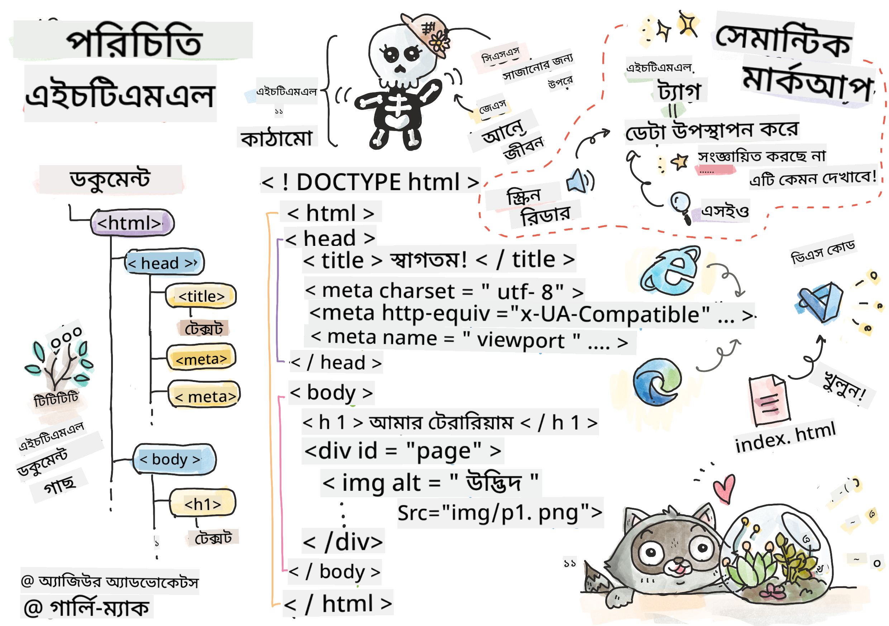
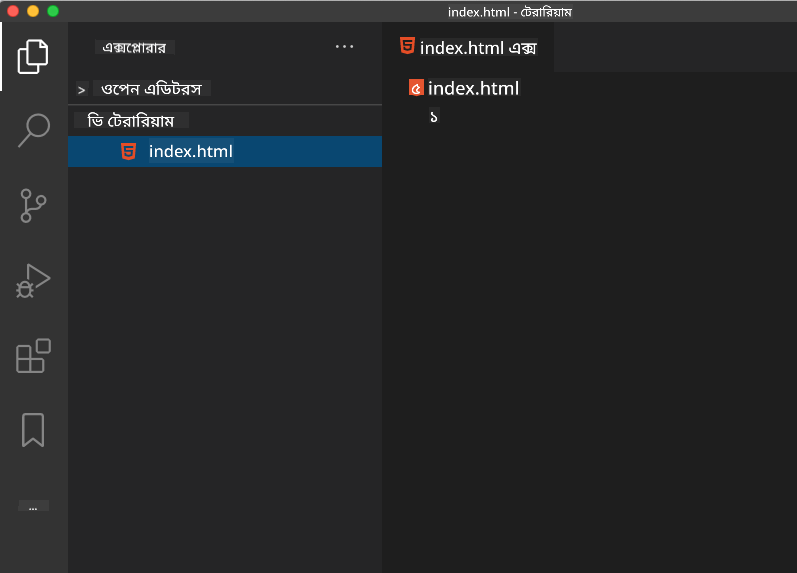

<!--
CO_OP_TRANSLATOR_METADATA:
{
  "original_hash": "46a0639e719b9cf1dfd062aa24cad639",
  "translation_date": "2025-08-25T21:07:41+00:00",
  "source_file": "3-terrarium/1-intro-to-html/README.md",
  "language_code": "bn"
}
-->
# টেরারিয়াম প্রকল্প পার্ট ১: HTML এর পরিচিতি


> স্কেচনোট: [Tomomi Imura](https://twitter.com/girlie_mac)

## প্রাক-লেকচার কুইজ

[প্রাক-লেকচার কুইজ](https://ashy-river-0debb7803.1.azurestaticapps.net/quiz/15)


> ভিডিও দেখুন

> 
> [](https://www.youtube.com/watch?v=1TvxJKBzhyQ)

### পরিচিতি

HTML, বা HyperText Markup Language, হলো ওয়েবের 'কঙ্কাল'। যদি CSS আপনার HTML-কে সাজায় এবং JavaScript এটিকে প্রাণ দেয়, তাহলে HTML হলো আপনার ওয়েব অ্যাপ্লিকেশনের শরীর। HTML এর সিনট্যাক্সও এই ধারণাকে প্রতিফলিত করে, কারণ এতে "head", "body", এবং "footer" ট্যাগ অন্তর্ভুক্ত রয়েছে।

এই পাঠে, আমরা HTML ব্যবহার করে আমাদের ভার্চুয়াল টেরারিয়ামের ইন্টারফেসের 'কঙ্কাল' তৈরি করব। এতে একটি শিরোনাম এবং তিনটি কলাম থাকবে: ডান এবং বাম কলাম যেখানে ড্র্যাগযোগ্য গাছপালা থাকবে, এবং একটি কেন্দ্রীয় এলাকা যা আসল কাচের মতো টেরারিয়াম হবে। এই পাঠের শেষে, আপনি কলামগুলিতে গাছপালা দেখতে পাবেন, তবে ইন্টারফেসটি একটু অদ্ভুত দেখাবে; চিন্তা করবেন না, পরবর্তী অংশে আপনি CSS স্টাইল যোগ করে ইন্টারফেসটিকে আরও সুন্দর করবেন।

### কাজ

আপনার কম্পিউটারে 'terrarium' নামে একটি ফোল্ডার তৈরি করুন এবং এর ভিতরে 'index.html' নামে একটি ফাইল তৈরি করুন। আপনি Visual Studio Code-এ এটি করতে পারেন, প্রথমে আপনার terrarium ফোল্ডার তৈরি করে একটি নতুন VS Code উইন্ডো খুলে, 'open folder' ক্লিক করে আপনার নতুন ফোল্ডারে নেভিগেট করুন। Explorer প্যানেলে ছোট 'file' বোতামটি ক্লিক করে নতুন ফাইল তৈরি করুন:



অথবা

আপনার git bash-এ এই কমান্ডগুলি ব্যবহার করুন:
* `mkdir terrarium`
* `cd terrarium`
* `touch index.html`
* `code index.html` অথবা `nano index.html`

> index.html ফাইলগুলি ব্রাউজারকে নির্দেশ করে যে এটি একটি ফোল্ডারের ডিফল্ট ফাইল; যেমন URL `https://anysite.com/test` একটি ফোল্ডার কাঠামো ব্যবহার করে তৈরি হতে পারে যেখানে `test` নামে একটি ফোল্ডার এবং তার ভিতরে `index.html` রয়েছে; URL-এ `index.html` দেখানোর প্রয়োজন নেই।

---

## DocType এবং html ট্যাগ

HTML ফাইলের প্রথম লাইনটি হলো এর doctype। এটি একটু আশ্চর্যজনক যে এই লাইনটি ফাইলের একেবারে শীর্ষে থাকতে হবে, তবে এটি পুরনো ব্রাউজারকে জানায় যে পৃষ্ঠাটি বর্তমান HTML স্পেসিফিকেশন অনুসারে স্ট্যান্ডার্ড মোডে রেন্ডার করতে হবে।

> টিপ: VS Code-এ, আপনি একটি ট্যাগের উপর হোভার করলে MDN Reference গাইড থেকে এর ব্যবহার সম্পর্কে তথ্য পেতে পারেন।

দ্বিতীয় লাইনটি হওয়া উচিত `<html>` ট্যাগের ওপেনিং ট্যাগ, এবং তারপরে এর ক্লোজিং ট্যাগ `</html>`। এই ট্যাগগুলি আপনার ইন্টারফেসের মূল উপাদান।

### কাজ

আপনার `index.html` ফাইলের শীর্ষে এই লাইনগুলি যোগ করুন:

```HTML
<!DOCTYPE html>
<html></html>
```

✅ DocType সেট করে বিভিন্ন মোড নির্ধারণ করা যায়: [Quirks Mode এবং Standards Mode](https://developer.mozilla.org/docs/Web/HTML/Quirks_Mode_and_Standards_Mode)। এই মোডগুলি খুব পুরনো ব্রাউজারগুলিকে সমর্থন করত যা এখন সাধারণত ব্যবহৃত হয় না (Netscape Navigator 4 এবং Internet Explorer 5)। আপনি স্ট্যান্ডার্ড doctype ডিক্লারেশনে থাকতে পারেন।

---

## ডকুমেন্টের 'head'

HTML ডকুমেন্টের 'head' অংশে আপনার ওয়েব পৃষ্ঠার গুরুত্বপূর্ণ তথ্য থাকে, যা [metadata](https://developer.mozilla.org/docs/Web/HTML/Element/meta) নামে পরিচিত। আমাদের ক্ষেত্রে, আমরা ওয়েব সার্ভারকে এই চারটি জিনিস জানাই:

-   পৃষ্ঠার শিরোনাম
-   পৃষ্ঠার মেটাডেটা, যার মধ্যে রয়েছে:
    -   'character set', যা পৃষ্ঠায় ব্যবহৃত অক্ষর এনকোডিং সম্পর্কে জানায়
    -   ব্রাউজার তথ্য, যার মধ্যে `x-ua-compatible` রয়েছে যা নির্দেশ করে যে IE=edge ব্রাউজার সমর্থিত
    -   ভিউপোর্ট লোড হওয়ার সময় কীভাবে আচরণ করবে তার তথ্য। ভিউপোর্টের প্রাথমিক স্কেল ১ সেট করা পৃষ্ঠাটি প্রথম লোড হওয়ার সময় জুম লেভেল নিয়ন্ত্রণ করে।

### কাজ

`<html>` ট্যাগের ওপেনিং এবং ক্লোজিং ট্যাগের মধ্যে একটি 'head' ব্লক যোগ করুন।

```html
<head>
	<title>Welcome to my Virtual Terrarium</title>
	<meta charset="utf-8" />
	<meta http-equiv="X-UA-Compatible" content="IE=edge" />
	<meta name="viewport" content="width=device-width, initial-scale=1" />
</head>
```

✅ যদি আপনি এইভাবে একটি ভিউপোর্ট মেটা ট্যাগ সেট করেন: `<meta name="viewport" content="width=600">`, তাহলে কী হবে? [ভিউপোর্ট](https://developer.mozilla.org/docs/Web/HTML/Viewport_meta_tag) সম্পর্কে আরও পড়ুন।

---

## ডকুমেন্টের `body`

### HTML ট্যাগ

HTML-এ, আপনি আপনার .html ফাইলে ট্যাগ যোগ করে একটি ওয়েব পৃষ্ঠার উপাদান তৈরি করেন। প্রতিটি ট্যাগ সাধারণত একটি ওপেনিং এবং ক্লোজিং ট্যাগ থাকে, যেমন: `<p>hello</p>` একটি প্যারাগ্রাফ নির্দেশ করতে। আপনার ইন্টারফেসের body তৈরি করতে `<html>` ট্যাগ জোড়ার ভিতরে `<body>` ট্যাগের একটি সেট যোগ করুন; এখন আপনার মার্কআপ দেখতে এইরকম:

### কাজ

```html
<!DOCTYPE html>
<html>
	<head>
		<title>Welcome to my Virtual Terrarium</title>
		<meta charset="utf-8" />
		<meta http-equiv="X-UA-Compatible" content="IE=edge" />
		<meta name="viewport" content="width=device-width, initial-scale=1" />
	</head>
	<body></body>
</html>
```

এখন, আপনি আপনার পৃষ্ঠা তৈরি করা শুরু করতে পারেন। সাধারণত, আপনি `<div>` ট্যাগ ব্যবহার করে একটি পৃষ্ঠার পৃথক উপাদান তৈরি করেন। আমরা একটি সিরিজ `<div>` উপাদান তৈরি করব যা চিত্র ধারণ করবে।

### চিত্র

একটি HTML ট্যাগ যা ক্লোজিং ট্যাগের প্রয়োজন হয় না তা হলো `` ট্যাগ, কারণ এতে একটি `src` উপাদান থাকে যা পৃষ্ঠার আইটেমটি রেন্ডার করার জন্য প্রয়োজনীয় সমস্ত তথ্য ধারণ করে।

আপনার অ্যাপে একটি `images` নামে একটি ফোল্ডার তৈরি করুন এবং তাতে [source code folder](../../../../3-terrarium/solution/images) থেকে সমস্ত চিত্র যোগ করুন; (গাছপালার ১৪টি চিত্র রয়েছে)।

### কাজ

এই গাছপালার চিত্রগুলি `<body></body>` ট্যাগের মধ্যে দুটি কলামে যোগ করুন:

```html
<div id="page">
	<div id="left-container" class="container">
		<div class="plant-holder">
			
		</div>
		<div class="plant-holder">
			
		</div>
		<div class="plant-holder">
			
		</div>
		<div class="plant-holder">
			
		</div>
		<div class="plant-holder">
			
		</div>
		<div class="plant-holder">
			
		</div>
		<div class="plant-holder">
			
		</div>
	</div>
	<div id="right-container" class="container">
		<div class="plant-holder">
			
		</div>
		<div class="plant-holder">
			
		</div>
		<div class="plant-holder">
			
		</div>
		<div class="plant-holder">
			
		</div>
		<div class="plant-holder">
			
		</div>
		<div class="plant-holder">
			
		</div>
		<div class="plant-holder">
			
		</div>
	</div>
</div>
```

> নোট: Spans বনাম Divs। Divs 'block' উপাদান হিসেবে বিবেচিত হয়, এবং Spans 'inline'। যদি আপনি এই divs-কে spans-এ রূপান্তর করেন তাহলে কী হবে?

এই মার্কআপ দিয়ে, গাছপালা এখন স্ক্রিনে প্রদর্শিত হয়। এটি দেখতে খুব খারাপ, কারণ এগুলি এখনও CSS ব্যবহার করে স্টাইল করা হয়নি, এবং আমরা এটি পরবর্তী পাঠে করব।

প্রতিটি চিত্রে alt টেক্সট রয়েছে যা এমনকি আপনি যদি চিত্রটি দেখতে বা রেন্ডার করতে না পারেন তবুও প্রদর্শিত হবে। এটি অন্তর্ভুক্ত করা একটি গুরুত্বপূর্ণ বৈশিষ্ট্য যা অ্যাক্সেসিবিলিটির জন্য প্রয়োজনীয়। ভবিষ্যতের পাঠে অ্যাক্সেসিবিলিটি সম্পর্কে আরও জানুন; আপাতত, মনে রাখুন যে alt অ্যাট্রিবিউট একটি চিত্রের জন্য বিকল্প তথ্য প্রদান করে যদি কোনো কারণে ব্যবহারকারী এটি দেখতে না পারে (ধীর সংযোগ, src অ্যাট্রিবিউটে ত্রুটি, অথবা ব্যবহারকারী যদি স্ক্রিন রিডার ব্যবহার করে)।

✅ আপনি কি লক্ষ্য করেছেন যে প্রতিটি চিত্রে একই alt ট্যাগ রয়েছে? এটি কি ভালো অভ্যাস? কেন বা কেন নয়? আপনি কি এই কোডটি উন্নত করতে পারেন?

---

## সেমান্টিক মার্কআপ

সাধারণভাবে, HTML লেখার সময় অর্থপূর্ণ 'semantics' ব্যবহার করা ভালো। এর মানে কী? এর মানে হলো আপনি HTML ট্যাগ ব্যবহার করেন যাতে তারা যে ধরণের ডেটা বা ইন্টারঅ্যাকশনের জন্য ডিজাইন করা হয়েছে তা উপস্থাপন করে। উদাহরণস্বরূপ, একটি পৃষ্ঠার প্রধান শিরোনাম টেক্সট `<h1>` ট্যাগ ব্যবহার করা উচিত।

আপনার ওপেনিং `<body>` ট্যাগের ঠিক নিচে নিম্নলিখিত লাইনটি যোগ করুন:

```html
<h1>My Terrarium</h1>
```

সেমান্টিক মার্কআপ ব্যবহার যেমন `<h1>` দিয়ে হেডার এবং `<ul>` দিয়ে আনঅর্ডারড লিস্ট রেন্ডার করা স্ক্রিন রিডারকে একটি পৃষ্ঠার মাধ্যমে নেভিগেট করতে সাহায্য করে। সাধারণভাবে, বোতামগুলি `<button>` হিসেবে লেখা উচিত এবং তালিকাগুলি `<li>` হওয়া উচিত। যদিও এটি _সম্ভব_ বিশেষভাবে স্টাইল করা `<span>` উপাদান ব্যবহার করে ক্লিক হ্যান্ডলার দিয়ে বোতামগুলিকে নকল করা, এটি প্রতিবন্ধী ব্যবহারকারীদের জন্য ভালো যে তারা প্রযুক্তি ব্যবহার করে একটি পৃষ্ঠায় বোতাম কোথায় রয়েছে তা নির্ধারণ করতে পারে এবং এটি ইন্টারঅ্যাক্ট করতে পারে, যদি উপাদানটি একটি বোতাম হিসেবে প্রদর্শিত হয়। এই কারণে, যতটা সম্ভব সেমান্টিক মার্কআপ ব্যবহার করার চেষ্টা করুন।

✅ একটি স্ক্রিন রিডার দেখুন এবং [কীভাবে এটি একটি ওয়েব পৃষ্ঠার সাথে ইন্টারঅ্যাক্ট করে](https://www.youtube.com/watch?v=OUDV1gqs9GA)। আপনি কি দেখতে পাচ্ছেন কেন অ-সেমান্টিক মার্কআপ ব্যবহারকারীকে হতাশ করতে পারে?

## টেরারিয়াম

এই ইন্টারফেসের শেষ অংশটি এমন মার্কআপ তৈরি করা যা স্টাইল করা হবে টেরারিয়াম তৈরি করতে।

### কাজ:

শেষ `</div>` ট্যাগের উপরে এই মার্কআপ যোগ করুন:

```html
<div id="terrarium">
	<div class="jar-top"></div>
	<div class="jar-walls">
		<div class="jar-glossy-long"></div>
		<div class="jar-glossy-short"></div>
	</div>
	<div class="dirt"></div>
	<div class="jar-bottom"></div>
</div>
```

✅ যদিও আপনি এই মার্কআপটি স্ক্রিনে যোগ করেছেন, আপনি কিছুই রেন্ডার হতে দেখছেন না। কেন?

---

## 🚀চ্যালেঞ্জ

HTML-এ কিছু পুরনো 'মজার' ট্যাগ রয়েছে যা এখনও খেলার জন্য মজার, যদিও আপনি [এই ট্যাগগুলি](https://developer.mozilla.org/docs/Web/HTML/Element#Obsolete_and_deprecated_elements) এর মতো ডিপ্রিকেটেড ট্যাগগুলি আপনার মার্কআপে ব্যবহার করা উচিত নয়। তবুও, আপনি কি পুরনো `<marquee>` ট্যাগ ব্যবহার করে h1 শিরোনামটি অনুভূমিকভাবে স্ক্রল করতে পারেন? (যদি করেন, পরে এটি সরাতে ভুলবেন না)

## পোস্ট-লেকচার কুইজ

[পোস্ট-লেকচার কুইজ](https://ashy-river-0debb7803.1.azurestaticapps.net/quiz/16)

## পর্যালোচনা এবং স্ব-অধ্যয়ন

HTML হলো 'পরীক্ষিত এবং সত্য' বিল্ডিং ব্লক সিস্টেম যা ওয়েবকে আজকের অবস্থানে নিয়ে এসেছে। এর ইতিহাস সম্পর্কে কিছু শিখুন পুরনো এবং নতুন ট্যাগগুলি অধ্যয়ন করে। আপনি কি বুঝতে পারেন কেন কিছু ট্যাগ ডিপ্রিকেটেড হয়েছে এবং কিছু যোগ করা হয়েছে? ভবিষ্যতে কী ট্যাগ যোগ করা হতে পারে?

ওয়েব এবং মোবাইল ডিভাইসের জন্য সাইট তৈরি করার বিষয়ে আরও জানুন [Microsoft Learn](https://docs.microsoft.com/learn/modules/build-simple-website/?WT.mc_id=academic-77807-sagibbon) এ।

## অ্যাসাইনমেন্ট

[আপনার HTML অনুশীলন করুন: একটি ব্লগ মকআপ তৈরি করুন](assignment.md)

**অস্বীকৃতি**:  
এই নথিটি AI অনুবাদ পরিষেবা [Co-op Translator](https://github.com/Azure/co-op-translator) ব্যবহার করে অনুবাদ করা হয়েছে। আমরা যথাসাধ্য সঠিকতা নিশ্চিত করার চেষ্টা করি, তবে অনুগ্রহ করে মনে রাখবেন যে স্বয়ংক্রিয় অনুবাদে ত্রুটি বা অসঙ্গতি থাকতে পারে। মূল ভাষায় থাকা নথিটিকে প্রামাণিক উৎস হিসেবে বিবেচনা করা উচিত। গুরুত্বপূর্ণ তথ্যের জন্য, পেশাদার মানব অনুবাদ সুপারিশ করা হয়। এই অনুবাদ ব্যবহারের ফলে কোনো ভুল বোঝাবুঝি বা ভুল ব্যাখ্যা হলে আমরা দায়বদ্ধ থাকব না।