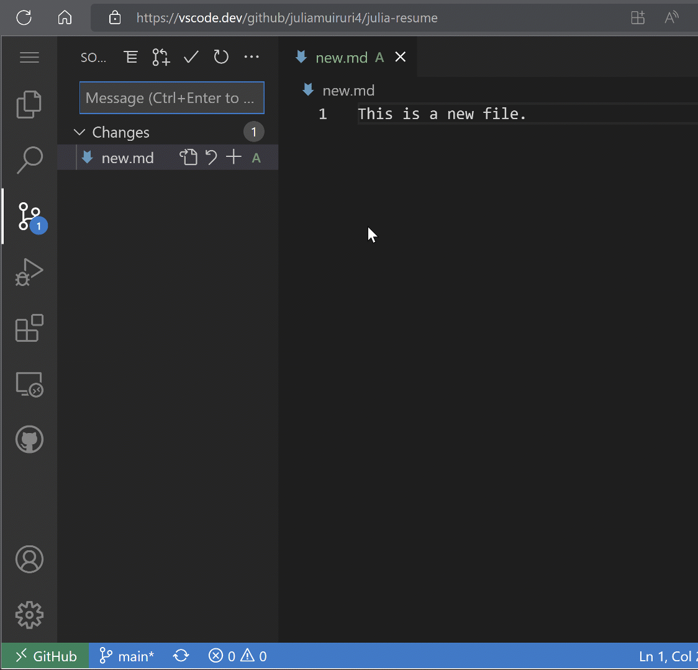
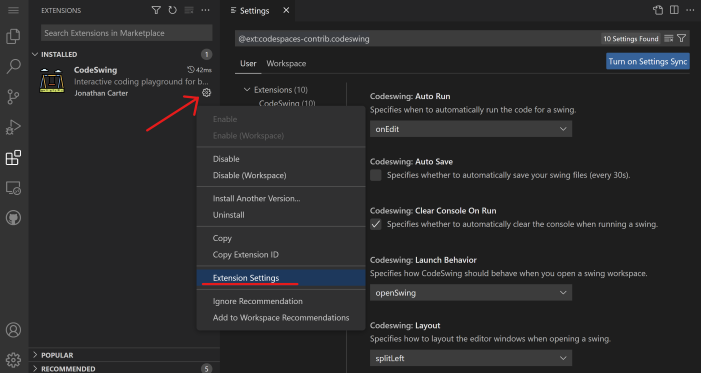

<!--
CO_OP_TRANSLATOR_METADATA:
{
  "original_hash": "7aa6e4f270d38d9cb17f2b5bd86b863d",
  "translation_date": "2025-08-24T13:02:21+00:00",
  "source_file": "8-code-editor/1-using-a-code-editor/README.md",
  "language_code": "es"
}
-->
# Usando un editor de código

Esta lección cubre los conceptos básicos de cómo usar [VSCode.dev](https://vscode.dev), un editor de código basado en la web, para que puedas realizar cambios en tu código y contribuir a un proyecto sin necesidad de instalar nada en tu computadora.

## Objetivos de aprendizaje

En esta lección, aprenderás a:

- Usar un editor de código en un proyecto de programación
- Llevar un registro de los cambios con control de versiones
- Personalizar el editor para el desarrollo

### Prerrequisitos

Antes de comenzar, necesitarás crear una cuenta en [GitHub](https://github.com). Dirígete a [GitHub](https://github.com/) y crea una cuenta si aún no lo has hecho.

### Introducción

Un editor de código es una herramienta esencial para escribir programas y colaborar en proyectos de programación existentes. Una vez que entiendas los conceptos básicos de un editor y cómo aprovechar sus funciones, podrás aplicarlos al escribir código.

## Comenzando con VSCode.dev

[VSCode.dev](https://vscode.dev) es un editor de código en la web. No necesitas instalar nada para usarlo, es como abrir cualquier otro sitio web. Para comenzar con el editor, abre el siguiente enlace: [https://vscode.dev](https://vscode.dev). Si no has iniciado sesión en [GitHub](https://github.com/), sigue las indicaciones para iniciar sesión o crear una nueva cuenta y luego inicia sesión.

Una vez que se cargue, debería verse similar a esta imagen:


Hay tres secciones principales, comenzando desde la izquierda y moviéndose hacia la derecha:

1. La _barra de actividad_, que incluye algunos íconos, como la lupa 🔎, el engranaje ⚙️ y algunos otros.
2. La barra de actividad expandida, que por defecto muestra el _Explorador_, llamada la _barra lateral_.
3. Y finalmente, el área de código a la derecha.

Haz clic en cada uno de los íconos para mostrar un menú diferente. Una vez que termines, haz clic en el _Explorador_ para volver al punto de inicio.

Cuando empieces a crear código o modificar código existente, lo harás en el área más grande a la derecha. También usarás esta área para visualizar código existente, lo cual harás a continuación.

## Abrir un repositorio de GitHub

Lo primero que necesitarás es abrir un repositorio de GitHub. Hay múltiples formas de abrir un repositorio. En esta sección verás dos maneras diferentes de abrir un repositorio para comenzar a trabajar en los cambios.

### 1. Con el editor

Usa el propio editor para abrir un repositorio remoto. Si vas a [VSCode.dev](https://vscode.dev), verás un botón llamado _"Open Remote Repository"_:


También puedes usar la paleta de comandos. La paleta de comandos es un cuadro de entrada donde puedes escribir cualquier palabra que forme parte de un comando o acción para encontrar el comando correcto para ejecutar. Usa el menú en la parte superior izquierda, luego selecciona _View_ y elige _Command Palette_, o utiliza el siguiente atajo de teclado: Ctrl-Shift-P (en MacOS sería Command-Shift-P).


Una vez que se abra el menú, escribe _open remote repository_ y selecciona la primera opción. Aparecerán múltiples repositorios de los que formas parte o que has abierto recientemente. También puedes usar una URL completa de GitHub para seleccionar uno. Usa la siguiente URL y pégala en el cuadro:

```
https://github.com/microsoft/Web-Dev-For-Beginners
```

✅ Si es exitoso, verás todos los archivos de este repositorio cargados en el editor de texto.

### 2. Usando la URL

También puedes usar directamente una URL para cargar un repositorio. Por ejemplo, la URL completa del repositorio actual es [https://github.com/microsoft/Web-Dev-For-Beginners](https://github.com/microsoft/Web-Dev-For-Beginners), pero puedes reemplazar el dominio de GitHub con `VSCode.dev/github` y cargar el repositorio directamente. La URL resultante sería [https://vscode.dev/github/microsoft/Web-Dev-For-Beginners](https://vscode.dev/github/microsoft/Web-Dev-For-Beginners).

## Editar archivos

Una vez que hayas abierto el repositorio en el navegador/vscode.dev, el siguiente paso será realizar actualizaciones o cambios en el proyecto.

### 1. Crear un archivo nuevo

Puedes crear un archivo dentro de una carpeta existente o en el directorio/raíz principal. Para crear un archivo nuevo, abre una ubicación/directorio donde quieras guardar el archivo y selecciona el ícono _'New file ...'_ en la barra de actividad _(izquierda)_, dale un nombre y presiona enter.


### 2. Editar y guardar un archivo en el repositorio

Usar vscode.dev es útil cuando necesitas realizar actualizaciones rápidas a tu proyecto sin tener que cargar ningún software localmente.  
Para actualizar tu código, haz clic en el ícono 'Explorer', también ubicado en la barra de actividad, para ver los archivos y carpetas en el repositorio.  
Selecciona un archivo para abrirlo en el área de código, realiza tus cambios y guarda.


Una vez que hayas terminado de actualizar tu proyecto, selecciona el ícono _`source control`_, que contiene todos los nuevos cambios que has realizado en tu repositorio.

Para ver los cambios que realizaste en tu proyecto, selecciona los archivos en la carpeta `Changes` en la barra de actividad expandida. Esto abrirá un 'Working Tree' para que visualices los cambios realizados en el archivo. El color rojo muestra una omisión en el proyecto, mientras que el verde indica una adición.


Si estás satisfecho con los cambios realizados, pasa el cursor sobre la carpeta `Changes` y haz clic en el botón `+` para preparar los cambios. Preparar significa simplemente preparar tus cambios para confirmarlos en GitHub.

Si no estás cómodo con algunos cambios y deseas descartarlos, pasa el cursor sobre la carpeta `Changes` y selecciona el ícono `undo`.

Luego, escribe un `commit message` _(Una descripción del cambio que realizaste en el proyecto)_, haz clic en el ícono de verificación para confirmar y enviar tus cambios.

Una vez que hayas terminado de trabajar en tu proyecto, selecciona el ícono del menú de hamburguesa en la parte superior izquierda para regresar al repositorio en github.com.



## Usando extensiones

Instalar extensiones en VSCode te permite agregar nuevas funciones y opciones de personalización al entorno de desarrollo en tu editor para mejorar tu flujo de trabajo. Estas extensiones también te ayudan a agregar soporte para múltiples lenguajes de programación y suelen ser extensiones genéricas o basadas en lenguajes.

Para explorar la lista de todas las extensiones disponibles, haz clic en el ícono _`Extensions`_ en la barra de actividad y comienza a escribir el nombre de la extensión en el campo de texto etiquetado como _'Search Extensions in Marketplace'_.  
Verás una lista de extensiones, cada una con **el nombre de la extensión, el nombre del editor, una descripción breve, el número de descargas** y **una calificación por estrellas**.


También puedes ver todas las extensiones previamente instaladas expandiendo la carpeta _`Installed`_, extensiones populares utilizadas por la mayoría de los desarrolladores en la carpeta _`Popular`_ y extensiones recomendadas para ti, ya sea por usuarios en el mismo espacio de trabajo o basadas en tus archivos abiertos recientemente en la carpeta _`Recommended`_.


### 1. Instalar extensiones

Para instalar una extensión, escribe el nombre de la extensión en el campo de búsqueda y haz clic en ella para ver información adicional sobre la extensión en el área de código una vez que aparezca en la barra de actividad expandida.

Puedes hacer clic en el _botón azul de instalación_ en la barra de actividad expandida para instalarla o usar el botón de instalación que aparece en el área de código una vez que seleccionas la extensión para cargar información adicional.


### 2. Personalizar extensiones

Después de instalar la extensión, es posible que necesites modificar su comportamiento y personalizarla según tus preferencias. Para hacerlo, selecciona el ícono de Extensiones y, esta vez, tu extensión aparecerá en la carpeta _Installed_, haz clic en el _**ícono de engranaje**_ y navega a _Extensions Setting_.



### 3. Administrar extensiones

Después de instalar y usar tu extensión, vscode.dev ofrece opciones para administrarla según diferentes necesidades. Por ejemplo, puedes elegir:

- **Deshabilitar:** _(Puedes deshabilitar temporalmente una extensión cuando ya no la necesites pero no quieras desinstalarla completamente)_

    Selecciona la extensión instalada en la barra de actividad expandida > haz clic en el ícono de engranaje > selecciona 'Disable' o 'Disable (Workspace)' **O** abre la extensión en el área de código y haz clic en el botón azul Disable.

- **Desinstalar:** Selecciona la extensión instalada en la barra de actividad expandida > haz clic en el ícono de engranaje > selecciona 'Uninstall' **O** abre la extensión en el área de código y haz clic en el botón azul Uninstall.

---

## Tarea

[Crear un sitio web de currículum usando vscode.dev](https://github.com/microsoft/Web-Dev-For-Beginners/blob/main/8-code-editor/1-using-a-code-editor/assignment.md)

## Revisión y autoestudio

Lee más sobre [VSCode.dev](https://code.visualstudio.com/docs/editor/vscode-web?WT.mc_id=academic-0000-alfredodeza) y algunas de sus otras características.

**Descargo de responsabilidad**:  
Este documento ha sido traducido utilizando el servicio de traducción automática [Co-op Translator](https://github.com/Azure/co-op-translator). Si bien nos esforzamos por lograr precisión, tenga en cuenta que las traducciones automáticas pueden contener errores o imprecisiones. El documento original en su idioma nativo debe considerarse como la fuente autorizada. Para información crítica, se recomienda una traducción profesional realizada por humanos. No nos hacemos responsables de malentendidos o interpretaciones erróneas que puedan surgir del uso de esta traducción.