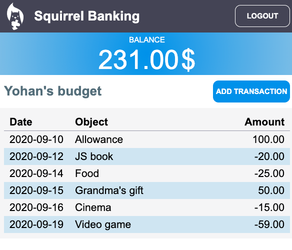

<!--
CO_OP_TRANSLATOR_METADATA:
{
  "original_hash": "f587e913e3f7c0b1c549a05dd74ee8e5",
  "translation_date": "2025-08-24T00:02:55+00:00",
  "source_file": "7-bank-project/3-data/README.md",
  "language_code": "hk"
}
-->
# 建立銀行應用程式第三部分：獲取及使用數據的方法

## 課前測驗

[課前測驗](https://ashy-river-0debb7803.1.azurestaticapps.net/quiz/45)

### 簡介

每個網頁應用程式的核心都是*數據*。數據可以有多種形式，但其主要目的是向用戶展示信息。隨著網頁應用程式越來越互動化和複雜，用戶如何訪問和操作信息已成為網頁開發的重要部分。

在本課中，我們將學習如何從伺服器異步獲取數據，並使用這些數據在不重新加載 HTML 的情況下在網頁上顯示信息。

### 先決條件

您需要完成本課程的[登錄和註冊表單](../2-forms/README.md)部分。此外，您需要安裝 [Node.js](https://nodejs.org) 並[在本地運行伺服器 API](../api/README.md)，以便獲取帳戶數據。

您可以通過在終端執行以下命令來測試伺服器是否正常運行：

```sh
curl http://localhost:5000/api
# -> should return "Bank API v1.0.0" as a result
```

---

## AJAX 和數據獲取

傳統網站在用戶選擇鏈接或使用表單提交數據時，通過重新加載整個 HTML 頁面來更新顯示的內容。每次需要加載新數據時，網頁伺服器都會返回一個全新的 HTML 頁面，瀏覽器需要重新處理，這會中斷當前的用戶操作並限制加載期間的互動。這種工作流程也被稱為*多頁應用程式*（Multi-Page Application，MPA）。


隨著網頁應用程式變得更加複雜和互動化，一種名為 [AJAX（Asynchronous JavaScript and XML）](https://en.wikipedia.org/wiki/Ajax_(programming)) 的新技術出現了。這種技術允許網頁應用程式使用 JavaScript 從伺服器異步發送和獲取數據，而無需重新加載 HTML 頁面，從而實現更快的更新和更流暢的用戶互動。當從伺服器接收到新數據時，可以使用 [DOM](https://developer.mozilla.org/docs/Web/API/Document_Object_Model) API 通過 JavaScript 更新當前的 HTML 頁面。隨著時間的推移，這種方法演變成現在所謂的[*單頁應用程式*（Single-Page Application，SPA）](https://en.wikipedia.org/wiki/Single-page_application)。


在 AJAX 剛推出時，唯一可用的異步獲取數據的 API 是 [`XMLHttpRequest`](https://developer.mozilla.org/docs/Web/API/XMLHttpRequest/Using_XMLHttpRequest)。但現代瀏覽器現在也實現了更方便且功能更強大的 [`Fetch` API](https://developer.mozilla.org/docs/Web/API/Fetch_API)，它使用 Promise 並更適合處理 JSON 數據。

> 雖然所有現代瀏覽器都支持 `Fetch API`，但如果您希望您的網頁應用程式在舊版或過時的瀏覽器上運行，最好先檢查 [caniuse.com 的兼容性表](https://caniuse.com/fetch)。

### 任務

在[上一課](../2-forms/README.md)中，我們實現了註冊表單以創建帳戶。現在，我們將添加代碼以使用現有帳戶登錄並獲取其數據。打開 `app.js` 文件並添加一個新的 `login` 函數：

```js
async function login() {
  const loginForm = document.getElementById('loginForm')
  const user = loginForm.user.value;
}
```

首先，我們使用 `getElementById()` 獲取表單元素，然後使用 `loginForm.user.value` 從輸入中獲取用戶名。每個表單控件都可以通過其名稱（在 HTML 中使用 `name` 屬性設置）作為表單的屬性來訪問。

與我們在註冊中所做的類似，我們將創建另一個函數來執行伺服器請求，但這次是用於獲取帳戶數據：

```js
async function getAccount(user) {
  try {
    const response = await fetch('//localhost:5000/api/accounts/' + encodeURIComponent(user));
    return await response.json();
  } catch (error) {
    return { error: error.message || 'Unknown error' };
  }
}
```

我們使用 `fetch` API 從伺服器異步請求數據，但這次除了要調用的 URL 外，我們不需要任何額外的參數，因為我們只是查詢數據。默認情況下，`fetch` 創建一個 [`GET`](https://developer.mozilla.org/docs/Web/HTTP/Methods/GET) HTTP 請求，這正是我們需要的。

✅ `encodeURIComponent()` 是一個用於對 URL 中的特殊字符進行編碼的函數。如果我們不調用此函數而直接在 URL 中使用 `user` 值，可能會出現什麼問題？

現在讓我們更新 `login` 函數以使用 `getAccount`：

```js
async function login() {
  const loginForm = document.getElementById('loginForm')
  const user = loginForm.user.value;
  const data = await getAccount(user);

  if (data.error) {
    return console.log('loginError', data.error);
  }

  account = data;
  navigate('/dashboard');
}
```

首先，由於 `getAccount` 是一個異步函數，我們需要使用 `await` 關鍵字來等待伺服器結果。與任何伺服器請求一樣，我們還需要處理錯誤情況。目前，我們只添加了一條日誌消息來顯示錯誤，稍後再回來處理。

然後，我們需要將數據存儲在某個地方，以便稍後用於顯示儀表板信息。由於 `account` 變數尚不存在，我們將在文件的頂部創建一個全局變數：

```js
let account = null;
```

在用戶數據保存到變數後，我們可以使用已經存在的 `navigate()` 函數從*登錄*頁面導航到*儀表板*。

最後，我們需要在提交登錄表單時調用 `login` 函數，通過修改 HTML：

```html
<form id="loginForm" action="javascript:login()">
```

通過註冊新帳戶並嘗試使用相同帳戶登錄，測試一切是否正常運行。

在進入下一部分之前，我們還可以通過在函數底部添加以下內容來完成 `register` 函數：

```js
account = result;
navigate('/dashboard');
```

✅ 您知道嗎？默認情況下，您只能從與您正在查看的網頁相同的*域名和端口*調用伺服器 API？這是瀏覽器強制執行的安全機制。但等等，我們的網頁應用程式運行在 `localhost:3000`，而伺服器 API 運行在 `localhost:5000`，為什麼它能正常工作？通過使用一種名為[跨來源資源共享（CORS）](https://developer.mozilla.org/docs/Web/HTTP/CORS)的技術，如果伺服器在響應中添加特殊標頭，允許特定域名的例外情況，就可以執行跨來源 HTTP 請求。

> 了解更多有關 API 的知識，請參加這個[課程](https://docs.microsoft.com/learn/modules/use-apis-discover-museum-art/?WT.mc_id=academic-77807-sagibbon)。

## 更新 HTML 以顯示數據

現在我們有了用戶數據，我們需要更新現有的 HTML 以顯示它。我們已經知道如何使用例如 `document.getElementById()` 從 DOM 中檢索元素。在獲取基礎元素後，以下是一些可以用來修改或添加子元素的 API：

- 使用 [`textContent`](https://developer.mozilla.org/docs/Web/API/Node/textContent) 屬性可以更改元素的文本。請注意，更改此值會移除元素的所有子元素（如果有的話），並用提供的文本替換。因此，通過分配空字符串 `''`，它也是移除給定元素所有子元素的一種高效方法。

- 使用 [`document.createElement()`](https://developer.mozilla.org/docs/Web/API/Document/createElement) 和 [`append()`](https://developer.mozilla.org/docs/Web/API/ParentNode/append) 方法，您可以創建並附加一個或多個新的子元素。

✅ 使用元素的 [`innerHTML`](https://developer.mozilla.org/docs/Web/API/Element/innerHTML) 屬性也可以更改其 HTML 內容，但應避免使用此方法，因為它容易受到[跨站腳本（XSS）](https://developer.mozilla.org/docs/Glossary/Cross-site_scripting)攻擊。

### 任務

在進入*儀表板*屏幕之前，我們需要在*登錄*頁面上做一件事。目前，如果您嘗試使用不存在的用戶名登錄，控制台中會顯示一條消息，但普通用戶不會看到任何變化，也不知道發生了什麼。

讓我們在登錄表單中添加一個佔位元素，以便在需要時顯示錯誤消息。一個不錯的位置是登錄 `<button>` 的前面：

```html
...
<div id="loginError"></div>
<button>Login</button>
...
```

這個 `<div>` 元素是空的，這意味著在我們添加內容之前，屏幕上不會顯示任何內容。我們還為它設置了一個 `id`，以便可以通過 JavaScript 輕鬆檢索。

回到 `app.js` 文件並創建一個新的輔助函數 `updateElement`：

```js
function updateElement(id, text) {
  const element = document.getElementById(id);
  element.textContent = text;
}
```

這個函數非常簡單：給定一個元素的 *id* 和 *text*，它會更新具有匹配 `id` 的 DOM 元素的文本內容。讓我們在 `login` 函數中使用此方法來替代之前的錯誤消息：

```js
if (data.error) {
  return updateElement('loginError', data.error);
}
```

現在，如果您嘗試使用無效帳戶登錄，您應該會看到類似以下的內容：


現在我們有了視覺上顯示的錯誤文本，但如果您使用屏幕閱讀器嘗試，您會注意到什麼都沒有被宣告。為了讓動態添加到頁面的文本被屏幕閱讀器宣告，我們需要使用一種名為[Live Region](https://developer.mozilla.org/docs/Web/Accessibility/ARIA/ARIA_Live_Regions)的技術。這裡我們將使用一種特定類型的 Live Region，稱為警告（alert）：

```html
<div id="loginError" role="alert"></div>
```

為 `register` 函數的錯誤實現相同的行為（別忘了更新 HTML）。

## 在儀表板上顯示信息

使用我們剛剛看到的相同技術，我們還將處理在儀表板頁面上顯示帳戶信息。

以下是從伺服器接收到的帳戶對象的樣子：

```json
{
  "user": "test",
  "currency": "$",
  "description": "Test account",
  "balance": 75,
  "transactions": [
    { "id": "1", "date": "2020-10-01", "object": "Pocket money", "amount": 50 },
    { "id": "2", "date": "2020-10-03", "object": "Book", "amount": -10 },
    { "id": "3", "date": "2020-10-04", "object": "Sandwich", "amount": -5 }
  ],
}
```

> 注意：為了讓您的操作更簡單，您可以使用已經填充了數據的預設 `test` 帳戶。

### 任務

首先，我們將替換 HTML 中的“餘額”部分，添加佔位元素：

```html
<section>
  Balance: <span id="balance"></span><span id="currency"></span>
</section>
```

我們還將在下面添加一個新部分以顯示帳戶描述：

```html
<h2 id="description"></h2>
```

✅ 由於帳戶描述作為下面內容的標題，它在語義上被標記為標題。了解更多有關[標題結構](https://www.nomensa.com/blog/2017/how-structure-headings-web-accessibility)對可訪問性的重要性，並仔細檢查頁面以確定還有什麼可以作為標題。

接下來，我們將在 `app.js` 中創建一個新函數來填充佔位元素：

```js
function updateDashboard() {
  if (!account) {
    return navigate('/login');
  }

  updateElement('description', account.description);
  updateElement('balance', account.balance.toFixed(2));
  updateElement('currency', account.currency);
}
```

首先，我們檢查是否有需要的帳戶數據，然後再進一步操作。然後，我們使用之前創建的 `updateElement()` 函數來更新 HTML。

> 為了讓餘額顯示更美觀，我們使用方法 [`toFixed(2)`](https://developer.mozilla.org/docs/Web/JavaScript/Reference/Global_Objects/Number/toFixed) 強制顯示小數點後兩位。

現在，我們需要在每次加載儀表板時調用 `updateDashboard()` 函數。如果您已完成[第一課的作業](../1-template-route/assignment.md)，這應該很簡單，否則您可以使用以下實現。

將此代碼添加到 `updateRoute()` 函數的末尾：

```js
if (typeof route.init === 'function') {
  route.init();
}
```

並使用以下代碼更新路由定義：

```js
const routes = {
  '/login': { templateId: 'login' },
  '/dashboard': { templateId: 'dashboard', init: updateDashboard }
};
```

通過此更改，每次顯示儀表板頁面時，都會調用 `updateDashboard()` 函數。登錄後，您應該能夠看到帳戶餘額、貨幣和描述。

## 使用 HTML 模板動態創建表格行

在[第一課](../1-template-route/README.md)中，我們使用 HTML 模板和 [`appendChild()`](https://developer.mozilla.org/docs/Web/API/Node/appendChild) 方法實現了應用程式中的導航。模板也可以更小，並用於動態填充頁面中的重複部分。

我們將使用類似的方法在 HTML 表格中顯示交易列表。

### 任務

在 HTML `<body>` 中添加一個新模板：

```html
<template id="transaction">
  <tr>
    <td></td>
    <td></td>
    <td></td>
  </tr>
</template>
```

此模板表示單個表格行，包含我們希望填充的三列：交易的*日期*、*對象*和*金額*。

然後，將此 `id` 屬性添加到儀表板模板中的表格 `<tbody>` 元素，以便使用 JavaScript 更容易找到：

```html
<tbody id="transactions"></tbody>
```

我們的 HTML 已準備好，接下來切換到 JavaScript 代碼並創建一個新函數 `createTransactionRow`：

```js
function createTransactionRow(transaction) {
  const template = document.getElementById('transaction');
  const transactionRow = template.content.cloneNode(true);
  const tr = transactionRow.querySelector('tr');
  tr.children[0].textContent = transaction.date;
  tr.children[1].textContent = transaction.object;
  tr.children[2].textContent = transaction.amount.toFixed(2);
  return transactionRow;
}
```

此函數正如其名稱所示：使用我們之前創建的模板，它創建一個新的表格行並使用交易數據填充其內容。我們將在 `updateDashboard()` 函數中使用此函數來填充表格：

```js
const transactionsRows = document.createDocumentFragment();
for (const transaction of account.transactions) {
  const transactionRow = createTransactionRow(transaction);
  transactionsRows.appendChild(transactionRow);
}
updateElement('transactions', transactionsRows);
```

這裡我們使用方法 [`document.createDocumentFragment()`](https://developer.mozilla.org/docs/Web/API/Document/createDocumentFragment)，它創建了一個新的 DOM 片段，我們可以在其上操作，然後最終將其附加到 HTML 表格中。

在此代碼能正常工作之前，我們還需要做一件事，因為我們的 `updateElement()` 函數目前僅支持文本內容。讓我們稍微修改一下它的代碼：

```js
function updateElement(id, textOrNode) {
  const element = document.getElementById(id);
  element.textContent = ''; // Removes all children
  element.append(textOrNode);
}
```

我們使用 [`append()`](https://developer.mozilla.org/docs/Web/API/ParentNode/append) 方法，因為它允許將文本或 [DOM 節點](https://developer.mozilla.org/docs/Web/API/Node) 附加到父元素，這非常適合我們的所有使用場景。
如果你嘗試使用 `test` 帳戶登入，現在應該可以在儀表板上看到交易列表了 🎉。

---

## 🚀 挑戰

一起合作，讓儀表板頁面看起來像一個真正的銀行應用程式。如果你已經為應用程式設計了樣式，試著使用 [媒體查詢](https://developer.mozilla.org/docs/Web/CSS/Media_Queries) 來創建一個 [響應式設計](https://developer.mozilla.org/docs/Web/Progressive_web_apps/Responsive/responsive_design_building_blocks)，讓它在桌面和移動設備上都能良好運作。

以下是一個設計過的儀表板頁面的範例：



## 課後測驗

[課後測驗](https://ashy-river-0debb7803.1.azurestaticapps.net/quiz/46)

## 作業

[重構並為你的程式碼添加註解](assignment.md)

**免責聲明**：  
本文件使用人工智能翻譯服務 [Co-op Translator](https://github.com/Azure/co-op-translator) 進行翻譯。我們致力於提供準確的翻譯，但請注意，自動翻譯可能包含錯誤或不準確之處。應以原文文件作為權威來源。對於關鍵資訊，建議尋求專業人工翻譯。我們對因使用此翻譯而引起的任何誤解或誤釋不承擔責任。