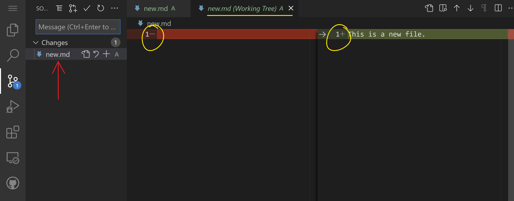

<!--
CO_OP_TRANSLATOR_METADATA:
{
  "original_hash": "7aa6e4f270d38d9cb17f2b5bd86b863d",
  "translation_date": "2025-08-23T23:32:28+00:00",
  "source_file": "8-code-editor/1-using-a-code-editor/README.md",
  "language_code": "hk"
}
-->
# 使用程式碼編輯器

本課程涵蓋了使用 [VSCode.dev](https://vscode.dev)（一個基於網頁的程式碼編輯器）的基礎知識，讓你可以在不需要在電腦上安裝任何軟件的情況下修改程式碼並為專案作出貢獻。

## 學習目標

在本課程中，你將學會：

- 在程式碼專案中使用程式碼編輯器
- 使用版本控制追蹤變更
- 自訂編輯器以進行開發

### 先決條件

在開始之前，你需要先建立一個 [GitHub](https://github.com) 帳戶。如果你還沒有帳戶，請前往 [GitHub](https://github.com/) 註冊。

### 簡介

程式碼編輯器是撰寫程式和與現有程式專案協作的重要工具。一旦你了解了編輯器的基礎知識以及如何利用其功能，你就可以在撰寫程式碼時應用這些技能。

## 開始使用 VSCode.dev

[VSCode.dev](https://vscode.dev) 是一個基於網頁的程式碼編輯器。你不需要安裝任何東西，就像打開其他網站一樣簡單。要開始使用編輯器，請打開以下連結：[https://vscode.dev](https://vscode.dev)。如果你尚未登入 [GitHub](https://github.com/)，請按照提示登入或建立新帳戶後再登入。

載入後，畫面應該看起來類似於以下圖片：


主要有三個區域，從最左邊到右邊依次為：

1. **活動欄**，包含一些圖示，例如放大鏡 🔎、齒輪 ⚙️ 等。
2. 展開的活動欄，預設為 **檔案總管**，稱為 **側邊欄**。
3. 最右邊是程式碼區域。

點擊每個圖示以顯示不同的選單。完成後，點擊 **檔案總管**，回到初始畫面。

當你開始撰寫程式碼或修改現有程式碼時，這些操作將在右側最大的區域進行。你也會在這裡查看現有程式碼，接下來我們將進一步探討。

## 開啟 GitHub 儲存庫

首先，你需要開啟一個 GitHub 儲存庫。有多種方式可以開啟儲存庫。在本節中，我們將介紹兩種不同的方法，讓你可以開始進行修改。

### 1. 使用編輯器

使用編輯器本身來開啟遠端儲存庫。如果你訪問 [VSCode.dev](https://vscode.dev)，你會看到一個 **"Open Remote Repository"** 按鈕：


你也可以使用命令面板。命令面板是一個輸入框，你可以在其中輸入任何與命令或操作相關的字詞來找到正確的命令。使用左上角的選單，然後選擇 **檢視**，接著選擇 **命令面板**，或者使用以下鍵盤快捷鍵：Ctrl-Shift-P（在 MacOS 上為 Command-Shift-P）。


當選單打開後，輸入 **open remote repository**，然後選擇第一個選項。你參與的或最近開啟的多個儲存庫將顯示出來。你也可以使用完整的 GitHub URL 來選擇一個儲存庫。將以下 URL 貼入輸入框中：

```
https://github.com/microsoft/Web-Dev-For-Beginners
```

✅ 如果成功，你將看到該儲存庫的所有檔案載入到文字編輯器中。

### 2. 使用 URL

你也可以直接使用 URL 來載入儲存庫。例如，目前儲存庫的完整 URL 是 [https://github.com/microsoft/Web-Dev-For-Beginners](https://github.com/microsoft/Web-Dev-For-Beginners)，但你可以將 GitHub 網域替換為 `VSCode.dev/github`，直接載入儲存庫。結果 URL 將是 [https://vscode.dev/github/microsoft/Web-Dev-For-Beginners](https://vscode.dev/github/microsoft/Web-Dev-For-Beginners)。

## 編輯檔案

當你在瀏覽器或 vscode.dev 上開啟儲存庫後，下一步就是對專案進行更新或修改。

### 1. 建立新檔案

你可以在現有的資料夾中建立檔案，或者在根目錄/資料夾中建立檔案。要建立新檔案，打開你希望儲存檔案的位置/目錄，然後選擇活動欄（左側）上的 **'New file ...'** 圖示，為檔案命名並按下 Enter。


### 2. 編輯並儲存儲存庫中的檔案

使用 vscode.dev 是一個方便的方式，當你想快速更新專案而不需要在本地載入任何軟件時。

要更新程式碼，點擊活動欄上的 **檔案總管** 圖示，查看儲存庫中的檔案和資料夾。選擇一個檔案以在程式碼區域中打開，進行修改並儲存。


完成專案更新後，選擇 **`原始碼控制`** 圖示，這裡包含了你對儲存庫所做的所有新變更。

要查看你對專案所做的變更，選擇展開的活動欄中 `Changes` 資料夾中的檔案。這將打開一個 **'工作樹'**，讓你直觀地查看檔案的變更。紅色表示刪除的部分，而綠色表示新增的部分。



如果你對所做的變更感到滿意，將滑鼠移到 `Changes` 資料夾上，然後點擊 `+` 按鈕以暫存變更。暫存的意思是準備好將變更提交到 GitHub。

如果你對某些變更不滿意並希望捨棄它們，將滑鼠移到 `Changes` 資料夾上，然後選擇 `撤銷` 圖示。

接著，輸入一個 **提交訊息**（對你所做變更的描述），點擊 **勾選圖示** 提交並推送你的變更。

完成專案工作後，選擇左上角的 **漢堡選單圖示** 返回到 github.com 上的儲存庫。


## 使用擴展功能

在 VSCode 上安裝擴展功能可以為你的編輯器新增功能並自訂開發環境選項，從而改善你的開發工作流程。這些擴展功能還可以幫助你支援多種程式語言，通常分為通用擴展或基於語言的擴展。

要瀏覽所有可用的擴展功能列表，點擊活動欄上的 **`擴展圖示`**，然後在標有 **'Search Extensions in Marketplace'** 的文字框中開始輸入擴展名稱。你將看到一個擴展列表，每個擴展都包含 **擴展名稱、發佈者名稱、一句話描述、下載次數** 和 **星級評分**。


你還可以通過展開 **`已安裝資料夾`** 查看所有已安裝的擴展功能，通過 **`熱門資料夾`** 查看大多數開發者使用的熱門擴展，或者通過 **`推薦資料夾`** 查看基於相同工作區用戶或你最近打開的檔案推薦的擴展。


### 1. 安裝擴展功能

要安裝擴展功能，在搜尋框中輸入擴展名稱，然後點擊它以在程式碼區域中查看該擴展的更多資訊（當它出現在展開的活動欄中時）。

你可以點擊展開活動欄上的 **藍色安裝按鈕** 進行安裝，或者在選擇擴展以載入更多資訊後，使用程式碼區域中出現的安裝按鈕。


### 2. 自訂擴展功能

安裝擴展後，你可能需要根據自己的偏好修改其行為並進行自訂。要執行此操作，選擇擴展圖示，這次你的擴展將出現在 **已安裝資料夾** 中，點擊 **齒輪圖示** 並導航到 **擴展設定**。


### 3. 管理擴展功能

安裝並使用擴展後，vscode.dev 提供了基於不同需求管理擴展的選項。例如，你可以選擇：

- **停用：**（當你暫時不需要某個擴展但又不想完全卸載它時，可以選擇停用）

    選擇展開活動欄中的已安裝擴展 > 點擊齒輪圖示 > 選擇 **'停用'** 或 **'停用（工作區）'** **或** 在程式碼區域中打開擴展並點擊藍色停用按鈕。

- **卸載：** 選擇展開活動欄中的已安裝擴展 > 點擊齒輪圖示 > 選擇 **'卸載'** **或** 在程式碼區域中打開擴展並點擊藍色卸載按鈕。

---

## 作業

[使用 vscode.dev 建立一個履歷網站](https://github.com/microsoft/Web-Dev-For-Beginners/blob/main/8-code-editor/1-using-a-code-editor/assignment.md)

## 複習與自學

閱讀更多關於 [VSCode.dev](https://code.visualstudio.com/docs/editor/vscode-web?WT.mc_id=academic-0000-alfredodeza) 及其其他功能的資訊。

**免責聲明**：  
本文件已使用人工智能翻譯服務 [Co-op Translator](https://github.com/Azure/co-op-translator) 進行翻譯。雖然我們致力於提供準確的翻譯，但請注意，自動翻譯可能包含錯誤或不準確之處。原始文件的母語版本應被視為權威來源。對於重要信息，建議使用專業人工翻譯。我們對因使用此翻譯而引起的任何誤解或錯誤解釋概不負責。