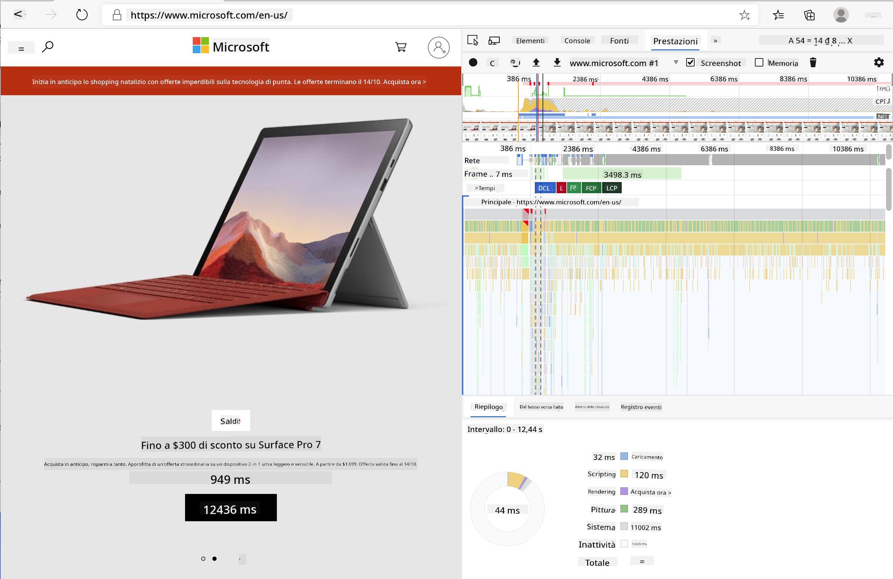
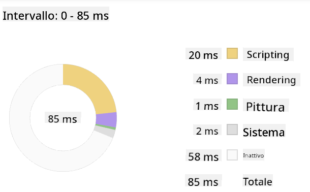

<!--
CO_OP_TRANSLATOR_METADATA:
{
  "original_hash": "f198c6b817b4b2a99749f4662e7cae98",
  "translation_date": "2025-08-25T23:47:50+00:00",
  "source_file": "5-browser-extension/3-background-tasks-and-performance/README.md",
  "language_code": "it"
}
-->
# Progetto Estensione Browser Parte 3: Scopri i Task in Background e le Prestazioni

## Quiz Pre-Lezione

[Quiz pre-lezione](https://ashy-river-0debb7803.1.azurestaticapps.net/quiz/27)

### Introduzione

Nelle ultime due lezioni di questo modulo, hai imparato a creare un modulo e un'area di visualizzazione per i dati recuperati da un'API. È un modo molto comune per creare una presenza sul web. Hai anche imparato a gestire il recupero dei dati in modo asincrono. La tua estensione per il browser è quasi completa.

Resta da gestire alcuni task in background, incluso l'aggiornamento del colore dell'icona dell'estensione. Questo è un ottimo momento per parlare di come il browser gestisce questo tipo di attività. Pensiamo a questi task del browser nel contesto delle prestazioni delle tue risorse web mentre le sviluppi.

## Nozioni di Base sulle Prestazioni Web

> "Le prestazioni di un sito web riguardano due cose: quanto velocemente si carica la pagina e quanto velocemente viene eseguito il codice." -- [Zack Grossbart](https://www.smashingmagazine.com/2012/06/javascript-profiling-chrome-developer-tools/)

Il tema di come rendere i tuoi siti web incredibilmente veloci su tutti i tipi di dispositivi, per tutti i tipi di utenti, in tutte le situazioni, è, come prevedibile, vasto. Ecco alcuni punti da tenere a mente mentre sviluppi un progetto web standard o un'estensione per il browser.

La prima cosa da fare per assicurarti che il tuo sito funzioni in modo efficiente è raccogliere dati sulle sue prestazioni. Il primo posto dove farlo è negli strumenti per sviluppatori del tuo browser web. In Edge, puoi selezionare il pulsante "Impostazioni e altro" (l'icona con i tre puntini in alto a destra del browser), quindi navigare su Altri strumenti > Strumenti per sviluppatori e aprire la scheda Prestazioni. Puoi anche utilizzare le scorciatoie da tastiera `Ctrl` + `Shift` + `I` su Windows o `Option` + `Command` + `I` su Mac per aprire gli strumenti per sviluppatori.

La scheda Prestazioni contiene uno strumento di Profiling. Apri un sito web (prova, ad esempio, [https://www.microsoft.com](https://www.microsoft.com/?WT.mc_id=academic-77807-sagibbon)) e fai clic sul pulsante 'Registra', quindi aggiorna il sito. Interrompi la registrazione in qualsiasi momento e potrai vedere le routine generate per 'script', 'render' e 'paint' del sito:



✅ Visita la [Documentazione Microsoft](https://docs.microsoft.com/microsoft-edge/devtools-guide/performance/?WT.mc_id=academic-77807-sagibbon) sulla scheda Prestazioni in Edge.

> Suggerimento: per ottenere una lettura accurata del tempo di avvio del tuo sito web, svuota la cache del browser.

Seleziona elementi della timeline del profilo per ingrandire gli eventi che si verificano durante il caricamento della tua pagina.

Ottieni uno snapshot delle prestazioni della tua pagina selezionando una parte della timeline del profilo e guardando il pannello di riepilogo:



Controlla il pannello del Registro Eventi per vedere se qualche evento ha impiegato più di 15 ms:


✅ Familiarizza con il tuo profiler! Apri gli strumenti per sviluppatori su questo sito e verifica se ci sono colli di bottiglia. Qual è la risorsa che si carica più lentamente? E quella più velocemente?

## Controlli di Profiling

In generale, ci sono alcune "aree problematiche" che ogni sviluppatore web dovrebbe monitorare durante la creazione di un sito per evitare brutte sorprese al momento del deployment in produzione.

**Dimensioni delle risorse**: Negli ultimi anni, il web è diventato più "pesante" e, di conseguenza, più lento. Parte di questo peso è dovuto all'uso delle immagini.

✅ Dai un'occhiata all'[Internet Archive](https://httparchive.org/reports/page-weight) per una visione storica del peso delle pagine e altro.

Una buona pratica è assicurarsi che le immagini siano ottimizzate e fornite nella dimensione e risoluzione corrette per i tuoi utenti.

**Traversamenti del DOM**: Il browser deve costruire il suo Document Object Model in base al codice che scrivi, quindi è nell'interesse di buone prestazioni della pagina mantenere i tag al minimo, utilizzando e stilizzando solo ciò di cui la pagina ha bisogno. A tal proposito, il CSS in eccesso associato a una pagina potrebbe essere ottimizzato; gli stili che devono essere utilizzati solo su una pagina non devono essere inclusi nel foglio di stile principale, ad esempio.

**JavaScript**: Ogni sviluppatore JavaScript dovrebbe monitorare gli script che bloccano il rendering e che devono essere caricati prima che il resto del DOM possa essere attraversato e disegnato nel browser. Considera l'uso di `defer` con i tuoi script inline (come fatto nel modulo Terrarium).

✅ Prova alcuni siti su un [sito di test della velocità](https://www.webpagetest.org/) per saperne di più sui controlli comuni effettuati per determinare le prestazioni di un sito.

Ora che hai un'idea di come il browser renderizza le risorse che gli invii, vediamo le ultime cose che devi fare per completare la tua estensione:

### Crea una funzione per calcolare il colore

Lavorando in `/src/index.js`, aggiungi una funzione chiamata `calculateColor()` dopo la serie di variabili `const` che hai impostato per accedere al DOM:

```JavaScript
function calculateColor(value) {
	let co2Scale = [0, 150, 600, 750, 800];
	let colors = ['#2AA364', '#F5EB4D', '#9E4229', '#381D02', '#381D02'];

	let closestNum = co2Scale.sort((a, b) => {
		return Math.abs(a - value) - Math.abs(b - value);
	})[0];
	console.log(value + ' is closest to ' + closestNum);
	let num = (element) => element > closestNum;
	let scaleIndex = co2Scale.findIndex(num);

	let closestColor = colors[scaleIndex];
	console.log(scaleIndex, closestColor);

	chrome.runtime.sendMessage({ action: 'updateIcon', value: { color: closestColor } });
}
```

Cosa sta succedendo qui? Passi un valore (l'intensità di carbonio) dalla chiamata API che hai completato nella lezione precedente, e poi calcoli quanto il suo valore si avvicina all'indice presentato nell'array dei colori. Quindi invii quel valore di colore più vicino al runtime di Chrome.

Il chrome.runtime ha [un'API](https://developer.chrome.com/extensions/runtime) che gestisce tutti i tipi di task in background, e la tua estensione la sta utilizzando:

> "Usa l'API chrome.runtime per recuperare la pagina in background, restituire dettagli sul manifest e ascoltare e rispondere agli eventi nel ciclo di vita dell'app o dell'estensione. Puoi anche usare questa API per convertire il percorso relativo degli URL in URL completamente qualificati."

✅ Se stai sviluppando questa estensione per Edge, potrebbe sorprenderti che stai usando un'API di Chrome. Le versioni più recenti del browser Edge funzionano sul motore del browser Chromium, quindi puoi sfruttare questi strumenti.

> Nota: se vuoi fare il profiling di un'estensione del browser, avvia gli strumenti per sviluppatori dall'interno dell'estensione stessa, poiché è una sua istanza separata del browser.

### Imposta un colore predefinito per l'icona

Ora, nella funzione `init()`, imposta l'icona su un generico verde iniziale chiamando nuovamente l'azione `updateIcon` di Chrome:

```JavaScript
chrome.runtime.sendMessage({
	action: 'updateIcon',
		value: {
			color: 'green',
		},
});
```

### Chiama la funzione, esegui la chiamata

Successivamente, chiama la funzione che hai appena creato aggiungendola alla promessa restituita dall'API C02Signal:

```JavaScript
//let CO2...
calculateColor(CO2);
```

E infine, in `/dist/background.js`, aggiungi il listener per queste chiamate di azione in background:

```JavaScript
chrome.runtime.onMessage.addListener(function (msg, sender, sendResponse) {
	if (msg.action === 'updateIcon') {
		chrome.browserAction.setIcon({ imageData: drawIcon(msg.value) });
	}
});
//borrowed from energy lollipop extension, nice feature!
function drawIcon(value) {
	let canvas = document.createElement('canvas');
	let context = canvas.getContext('2d');

	context.beginPath();
	context.fillStyle = value.color;
	context.arc(100, 100, 50, 0, 2 * Math.PI);
	context.fill();

	return context.getImageData(50, 50, 100, 100);
}
```

In questo codice, stai aggiungendo un listener per qualsiasi messaggio inviato al task manager in background. Se viene chiamato 'updateIcon', il codice successivo viene eseguito per disegnare un'icona del colore corretto utilizzando l'API Canvas.

✅ Imparerai di più sull'API Canvas nelle [lezioni sul Gioco Spaziale](../../6-space-game/2-drawing-to-canvas/README.md).

Ora, ricostruisci la tua estensione (`npm run build`), aggiorna e avvia la tua estensione, e osserva il cambiamento di colore. È un buon momento per fare una commissione o lavare i piatti? Ora lo sai!

Congratulazioni, hai creato un'estensione per il browser utile e hai imparato di più su come funziona il browser e su come fare il profiling delle sue prestazioni.

---

## 🚀 Sfida

Esamina alcuni siti web open source che esistono da molto tempo e, basandoti sulla loro cronologia su GitHub, verifica se riesci a determinare come sono stati ottimizzati nel corso degli anni per le prestazioni, se lo sono stati. Qual è il problema più comune?

## Quiz Post-Lezione

[Quiz post-lezione](https://ashy-river-0debb7803.1.azurestaticapps.net/quiz/28)

## Revisione e Studio Autonomo

Considera di iscriverti a una [newsletter sulle prestazioni](https://perf.email/).

Esamina alcuni dei modi in cui i browser valutano le prestazioni web guardando le schede delle prestazioni nei loro strumenti web. Trovi differenze significative?

## Compito

[Analizza un sito per le prestazioni](assignment.md)

**Disclaimer**:  
Questo documento è stato tradotto utilizzando il servizio di traduzione automatica [Co-op Translator](https://github.com/Azure/co-op-translator). Sebbene ci impegniamo per garantire l'accuratezza, si prega di notare che le traduzioni automatiche possono contenere errori o imprecisioni. Il documento originale nella sua lingua nativa dovrebbe essere considerato la fonte autorevole. Per informazioni critiche, si raccomanda una traduzione professionale effettuata da un traduttore umano. Non siamo responsabili per eventuali incomprensioni o interpretazioni errate derivanti dall'uso di questa traduzione.