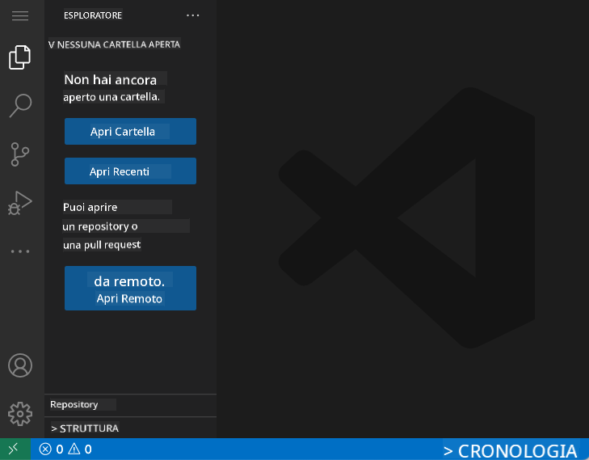
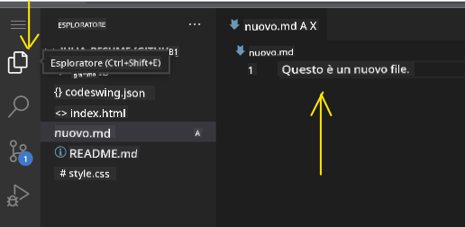
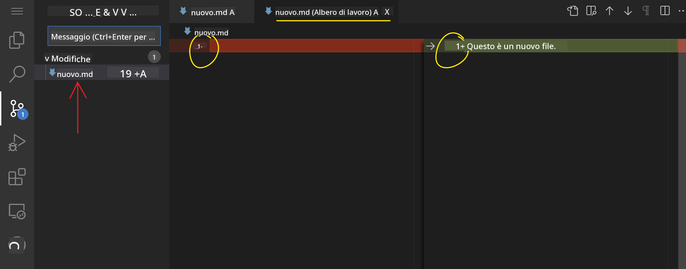
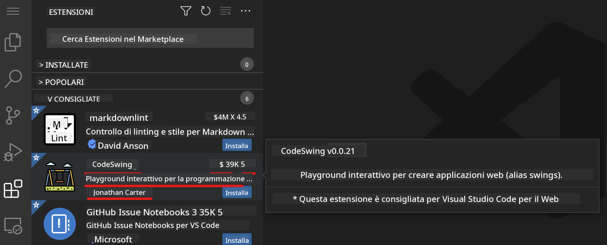
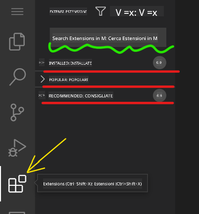
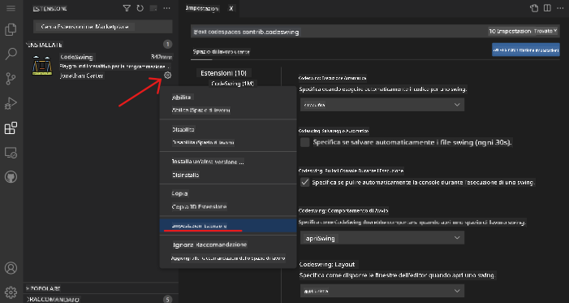

<!--
CO_OP_TRANSLATOR_METADATA:
{
  "original_hash": "7aa6e4f270d38d9cb17f2b5bd86b863d",
  "translation_date": "2025-08-25T23:19:41+00:00",
  "source_file": "8-code-editor/1-using-a-code-editor/README.md",
  "language_code": "it"
}
-->
# Utilizzare un editor di codice

Questa lezione copre le basi dell'utilizzo di [VSCode.dev](https://vscode.dev), un editor di codice basato sul web, per consentirti di apportare modifiche al tuo codice e contribuire a un progetto senza dover installare nulla sul tuo computer.

## Obiettivi di apprendimento

In questa lezione imparerai a:

- Utilizzare un editor di codice in un progetto di programmazione
- Tenere traccia delle modifiche con il controllo di versione
- Personalizzare l'editor per lo sviluppo

### Prerequisiti

Prima di iniziare, dovrai creare un account su [GitHub](https://github.com). Vai su [GitHub](https://github.com/) e crea un account se non lo hai già fatto.

### Introduzione

Un editor di codice è uno strumento essenziale per scrivere programmi e collaborare a progetti di programmazione esistenti. Una volta che avrai compreso le basi di un editor e come sfruttarne le funzionalità, sarai in grado di applicarle durante la scrittura del codice.

## Iniziare con VSCode.dev

[VSCode.dev](https://vscode.dev) è un editor di codice sul web. Non è necessario installare nulla per utilizzarlo, proprio come aprire qualsiasi altro sito web. Per iniziare con l'editor, apri il seguente link: [https://vscode.dev](https://vscode.dev). Se non hai effettuato l'accesso a [GitHub](https://github.com/), segui le istruzioni per accedere o creare un nuovo account e poi accedi.

Una volta caricato, dovrebbe apparire simile a questa immagine:



Ci sono tre sezioni principali, partendo da sinistra verso destra:

1. La _barra delle attività_ che include alcune icone, come la lente d'ingrandimento 🔎, l'ingranaggio ⚙️ e altre.
2. La barra delle attività espansa che di default mostra l'_Esplora risorse_, chiamata _barra laterale_.
3. Infine, l'area del codice a destra.

Clicca su ciascuna delle icone per visualizzare un menu diverso. Una volta terminato, clicca su _Esplora risorse_ per tornare al punto di partenza.

Quando inizi a creare o modificare codice, lo farai nell'area più grande a destra. Utilizzerai questa area anche per visualizzare il codice esistente, come vedrai nel prossimo passaggio.

## Aprire un repository GitHub

La prima cosa che devi fare è aprire un repository GitHub. Ci sono diversi modi per aprire un repository. In questa sezione vedrai due modi diversi per aprire un repository e iniziare a lavorare sulle modifiche.

### 1. Con l'editor

Utilizza l'editor stesso per aprire un repository remoto. Se vai su [VSCode.dev](https://vscode.dev), vedrai un pulsante _"Open Remote Repository"_:


Puoi anche utilizzare il command palette. Il command palette è una casella di input dove puoi digitare qualsiasi parola che faccia parte di un comando o un'azione per trovare il comando giusto da eseguire. Usa il menu in alto a sinistra, seleziona _View_ e poi scegli _Command Palette_, oppure utilizza la seguente scorciatoia da tastiera: Ctrl-Shift-P (su MacOS sarebbe Command-Shift-P).


Una volta aperto il menu, digita _open remote repository_ e seleziona la prima opzione. Verranno mostrati diversi repository a cui partecipi o che hai aperto di recente. Puoi anche utilizzare un URL completo di GitHub per selezionarne uno. Usa il seguente URL e incollalo nella casella:

```
https://github.com/microsoft/Web-Dev-For-Beginners
```

✅ Se l'operazione ha successo, vedrai tutti i file di questo repository caricati nell'editor di testo.

### 2. Utilizzando l'URL

Puoi anche utilizzare direttamente un URL per caricare un repository. Ad esempio, l'URL completo per il repository corrente è [https://github.com/microsoft/Web-Dev-For-Beginners](https://github.com/microsoft/Web-Dev-For-Beginners), ma puoi sostituire il dominio GitHub con `VSCode.dev/github` e caricare direttamente il repository. L'URL risultante sarebbe [https://vscode.dev/github/microsoft/Web-Dev-For-Beginners](https://vscode.dev/github/microsoft/Web-Dev-For-Beginners).

## Modificare i file

Una volta aperto il repository nel browser/vscode.dev, il passaggio successivo sarà apportare aggiornamenti o modifiche al progetto.

### 1. Creare un nuovo file

Puoi creare un file all'interno di una cartella esistente o nella directory/cartella principale. Per creare un nuovo file, apri una posizione/cartella in cui desideri salvare il file e seleziona l'icona _'Nuovo file ...'_ sulla barra delle attività _(a sinistra)_, assegnagli un nome e premi invio.


### 2. Modificare e salvare un file nel repository

Utilizzare vscode.dev è utile ogni volta che desideri apportare aggiornamenti rapidi al tuo progetto senza dover caricare alcun software localmente.  
Per aggiornare il tuo codice, clicca sull'icona 'Esplora risorse', situata anche sulla barra delle attività, per visualizzare i file e le cartelle nel repository.  
Seleziona un file per aprirlo nell'area del codice, apporta le modifiche e salva.



Una volta terminato l'aggiornamento del progetto, seleziona l'icona _`source control`_ che contiene tutte le nuove modifiche apportate al tuo repository.

Per visualizzare le modifiche apportate al progetto, seleziona il/i file nella cartella `Changes` nella barra delle attività espansa. Questo aprirà un 'Working Tree' per consentirti di vedere visivamente le modifiche apportate al file. Il rosso indica un'omissione al progetto, mentre il verde indica un'aggiunta.



Se sei soddisfatto delle modifiche apportate, passa con il mouse sulla cartella `Changes` e clicca sul pulsante `+` per mettere in stage le modifiche. Mettere in stage significa semplicemente preparare le modifiche per il commit su GitHub.

Se invece non sei soddisfatto di alcune modifiche e desideri annullarle, passa con il mouse sulla cartella `Changes` e seleziona l'icona `undo`.

Poi, digita un `messaggio di commit` _(Una descrizione delle modifiche apportate al progetto)_, clicca sull'icona del `check` per effettuare il commit e inviare le modifiche.

Una volta terminato il lavoro sul progetto, seleziona l'icona del `menu hamburger` in alto a sinistra per tornare al repository su github.com.


## Utilizzare le estensioni

Installare estensioni su VSCode ti consente di aggiungere nuove funzionalità e opzioni di personalizzazione all'ambiente di sviluppo del tuo editor per migliorare il flusso di lavoro. Queste estensioni ti aiutano anche ad aggiungere supporto per più linguaggi di programmazione e sono spesso estensioni generiche o basate su linguaggi specifici.

Per sfogliare l'elenco di tutte le estensioni disponibili, clicca sull'icona _`Estensioni`_ sulla barra delle attività e inizia a digitare il nome dell'estensione nel campo di testo etichettato _'Search Extensions in Marketplace'_.  
Vedrai un elenco di estensioni, ognuna contenente **il nome dell'estensione, il nome del publisher, una descrizione di una frase, il numero di download** e **una valutazione con stelle**.



Puoi anche visualizzare tutte le estensioni precedentemente installate espandendo la cartella _`Installed`_, le estensioni popolari utilizzate dalla maggior parte degli sviluppatori nella cartella _`Popular`_ e le estensioni consigliate per te, basate su utenti nello stesso workspace o sui file aperti di recente, nella cartella _`Recommended`_.



### 1. Installare estensioni

Per installare un'estensione, digita il nome dell'estensione nel campo di ricerca e cliccaci sopra per visualizzare ulteriori informazioni sull'estensione nell'area del codice una volta che appare nella barra delle attività espansa.

Puoi cliccare sul _pulsante blu di installazione_ nella barra delle attività espansa per installarla oppure utilizzare il pulsante di installazione che appare nell'area del codice una volta selezionata l'estensione per caricare ulteriori informazioni.


### 2. Personalizzare le estensioni

Dopo aver installato l'estensione, potresti doverne modificare il comportamento e personalizzarla in base alle tue preferenze. Per farlo, seleziona l'icona delle Estensioni e questa volta la tua estensione apparirà nella cartella _Installed_. Clicca sull'icona _**Gear**_ e naviga su _Extensions Setting_.



### 3. Gestire le estensioni

Dopo aver installato e utilizzato un'estensione, vscode.dev offre opzioni per gestirla in base a diverse esigenze. Ad esempio, potresti scegliere di:

- **Disabilitare:** _(Disabiliti temporaneamente un'estensione quando non ne hai più bisogno ma non vuoi disinstallarla completamente)_

    Seleziona l'estensione installata nella barra delle attività espansa > clicca sull'icona Gear > seleziona 'Disable' o 'Disable (Workspace)' **OPPURE** Apri l'estensione nell'area del codice e clicca sul pulsante blu Disable.

- **Disinstallare:** Seleziona l'estensione installata nella barra delle attività espansa > clicca sull'icona Gear > seleziona 'Uninstall' **OPPURE** Apri l'estensione nell'area del codice e clicca sul pulsante blu Uninstall.

---

## Compito

[Creare un sito web curriculum utilizzando vscode.dev](https://github.com/microsoft/Web-Dev-For-Beginners/blob/main/8-code-editor/1-using-a-code-editor/assignment.md)

## Revisione e studio autonomo

Leggi di più su [VSCode.dev](https://code.visualstudio.com/docs/editor/vscode-web?WT.mc_id=academic-0000-alfredodeza) e alcune delle sue altre funzionalità.

**Disclaimer (Avvertenza)**:  
Questo documento è stato tradotto utilizzando il servizio di traduzione automatica [Co-op Translator](https://github.com/Azure/co-op-translator). Sebbene ci impegniamo per garantire l'accuratezza, si prega di tenere presente che le traduzioni automatiche possono contenere errori o imprecisioni. Il documento originale nella sua lingua nativa dovrebbe essere considerato la fonte autorevole. Per informazioni critiche, si consiglia una traduzione professionale effettuata da un traduttore umano. Non siamo responsabili per eventuali malintesi o interpretazioni errate derivanti dall'uso di questa traduzione.