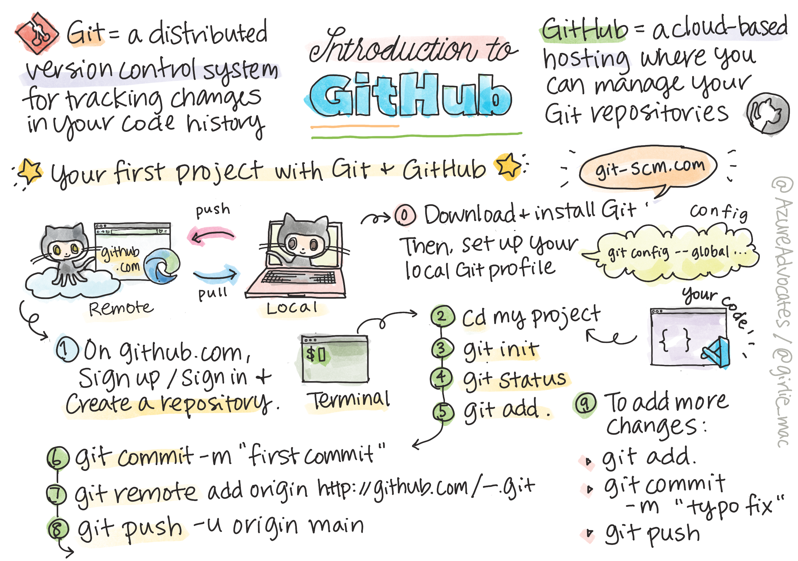

<!--
CO_OP_TRANSLATOR_METADATA:
{
  "original_hash": "05666cecb8983a72cf0ce1d18932b5b7",
  "translation_date": "2025-08-23T23:19:37+00:00",
  "source_file": "1-getting-started-lessons/2-github-basics/README.md",
  "language_code": "ja"
}
-->
# GitHubの概要

このレッスンでは、コードのホスティングと変更管理を行うプラットフォームであるGitHubの基本を学びます。


> スケッチノート: [Tomomi Imura](https://twitter.com/girlie_mac)

## 講義前のクイズ
[講義前のクイズ](https://ashy-river-0debb7803.1.azurestaticapps.net/quiz/3)

## はじめに

このレッスンでは以下を学びます：

- 自分のマシンでの作業を追跡する方法
- 他の人とプロジェクトを進める方法
- オープンソースソフトウェアに貢献する方法

### 前提条件

始める前に、Gitがインストールされているか確認してください。ターミナルで以下を入力します：
`git --version`

Gitがインストールされていない場合は、[Gitをダウンロード](https://git-scm.com/downloads)してください。その後、ターミナルでローカルGitプロファイルを設定します：
* `git config --global user.name "your-name"`
* `git config --global user.email "your-email"`

Gitがすでに設定されているか確認するには以下を入力します：
`git config --list`

また、GitHubアカウント、コードエディタ（例: Visual Studio Code）、ターミナル（またはコマンドプロンプト）が必要です。

[github.com](https://github.com/)にアクセスして、まだアカウントを作成していない場合は作成し、ログインしてプロファイルを完成させてください。

✅ GitHubは世界で唯一のコードリポジトリではありません。他にもありますが、GitHubが最もよく知られています。

### 準備

ローカルマシン（ノートPCまたはPC）にコードプロジェクトのフォルダと、他の人のプロジェクトに貢献する方法を学ぶための例として使用するGitHub上の公開リポジトリが必要です。

---

## コード管理

ローカルにコードプロジェクトのフォルダがあり、その進捗をバージョン管理システムであるGitを使って追跡したいとします。Gitを使うことは、未来の自分へのラブレターを書くようなものだと例えられることがあります。数日、数週間、数ヶ月後にコミットメッセージを読むことで、なぜその決定をしたのかを思い出したり、変更を「巻き戻す」ことができます。ただし、良い「コミットメッセージ」を書いた場合に限ります。

### タスク: リポジトリを作成してコードをコミットする  

> 動画をチェック
> 
> [](https://www.youtube.com/watch?v=9R31OUPpxU4)

1. **GitHubでリポジトリを作成**。GitHub.comで、リポジトリタブまたは右上のナビゲーションバーから**新しいリポジトリ**ボタンを見つけます。

   1. リポジトリ（フォルダ）に名前を付けます。
   1. **リポジトリを作成**を選択します。

1. **作業フォルダに移動**。ターミナルで、追跡を開始したいフォルダ（ディレクトリ）に移動します。以下を入力します：

   ```bash
   cd [name of your folder]
   ```

1. **Gitリポジトリを初期化**。プロジェクトで以下を入力します：

   ```bash
   git init
   ```

1. **ステータスを確認**。リポジトリのステータスを確認するには以下を入力します：

   ```bash
   git status
   ```

   出力は以下のようになることがあります：

   ```output
   Changes not staged for commit:
   (use "git add <file>..." to update what will be committed)
   (use "git checkout -- <file>..." to discard changes in working directory)

        modified:   file.txt
        modified:   file2.txt
   ```

   通常、`git status`コマンドは、リポジトリに保存する準備ができたファイルや変更があるファイルなどを教えてくれます。

1. **すべてのファイルを追跡対象に追加**
   これはファイルをステージングエリアに追加することを意味します。

   ```bash
   git add .
   ```

   `git add`と`.`の引数は、すべてのファイルと変更を追跡対象にすることを示します。

1. **選択したファイルを追跡対象に追加**

   ```bash
   git add [file or folder name]
   ```

   すべてのファイルを一度にコミットしたくない場合に、選択したファイルだけをステージングエリアに追加するのに役立ちます。

1. **すべてのファイルをステージング解除**

   ```bash
   git reset
   ```

   このコマンドは、すべてのファイルを一度にステージング解除するのに役立ちます。

1. **特定のファイルをステージング解除**

   ```bash
   git reset [file or folder name]
   ```

   このコマンドは、次のコミットに含めたくない特定のファイルだけをステージング解除するのに役立ちます。

1. **作業を永続化**。この時点で、ファイルをいわゆるステージングエリアに追加しました。Gitがファイルを追跡している場所です。変更を永続化するには、ファイルをコミットする必要があります。コミットを作成するには、`git commit`コマンドを使用します。コミットはリポジトリの履歴における保存ポイントを表します。以下を入力してコミットを作成します：

   ```bash
   git commit -m "first commit"
   ```

   これにより、すべてのファイルがコミットされ、「first commit」というメッセージが追加されます。将来のコミットメッセージでは、変更の種類を伝えるためにもっと具体的な説明をすることをお勧めします。

1. **ローカルGitリポジトリをGitHubと接続**。ローカルリポジトリはマシン上で便利ですが、ファイルのバックアップをどこかに保存したり、他の人をリポジトリに招待したりしたい場合があります。そのための素晴らしい場所がGitHubです。すでにGitHubでリポジトリを作成しているので、ローカルGitリポジトリをGitHubと接続するだけです。`git remote add`コマンドを使用します。以下のコマンドを入力してください：

   > 注意：コマンドを入力する前に、GitHubリポジトリページに移動してリポジトリURLを見つけてください。このURLを以下のコマンドで使用します。```https://github.com/username/repository_name.git```をGitHub URLに置き換えてください。

   ```bash
   git remote add origin https://github.com/username/repository_name.git
   ```

   これにより、「origin」という名前のリモート接続が作成され、先ほど作成したGitHubリポジトリを指します。

1. **ローカルファイルをGitHubに送信**。これまでのところ、ローカルリポジトリとGitHubリポジトリの間に接続を作成しました。次に、これらのファイルをGitHubに送信します。以下の`git push`コマンドを使用します：

   > 注意：デフォルトのブランチ名が```main```と異なる場合があります。

   ```bash
   git push -u origin main
   ```

   これにより、「main」ブランチのコミットがGitHubに送信されます。

2. **さらに変更を加える**。変更を続けてGitHubにプッシュしたい場合は、以下の3つのコマンドを使用するだけです：

   ```bash
   git add .
   git commit -m "type your commit message here"
   git push
   ```

   > ヒント：`.gitignore`ファイルを採用して、GitHubに表示したくないファイルを追跡対象から除外することを検討してください。例えば、同じフォルダに保存しているメモファイルなどで、公開リポジトリには不要なものです。`.gitignore`ファイルのテンプレートは[.gitignore templates](https://github.com/github/gitignore)で見つけることができます。

#### コミットメッセージ

優れたGitコミットの件名は以下の文を完成させます：
「このコミットが適用されると、<件名>」

件名では命令形の現在形を使用します。「変更する」ではなく「変更した」や「変更する予定」ではありません。  
件名と同様に、本文（オプション）でも命令形の現在形を使用します。本文には変更の動機を含め、以前の動作と対比させます。`なぜ`を説明するのであって、`どのように`ではありません。

✅ GitHubを少し探索してみてください。非常に優れたコミットメッセージを見つけることができますか？非常に簡素なものはどうですか？コミットメッセージで伝えるべき最も重要で有用な情報は何だと思いますか？

### タスク: コラボレーション

GitHubにコードをアップロードする主な理由は、他の開発者とコラボレーションを可能にすることです。

## 他の人とプロジェクトを進める

> 動画をチェック
>
> [](https://www.youtube.com/watch?v=bFCM-PC3cu8)

リポジトリ内で、`Insights > Community`に移動して、プロジェクトが推奨されるコミュニティ標準とどのように比較されるかを確認します。

以下はGitHubリポジトリを改善するためのポイントです：
- **説明**。プロジェクトに説明を追加しましたか？
- **README**。READMEを追加しましたか？GitHubは[READMEの書き方](https://docs.github.com/articles/about-readmes/?WT.mc_id=academic-77807-sagibbon)についてのガイダンスを提供しています。
- **貢献ガイドライン**。プロジェクトに[貢献ガイドライン](https://docs.github.com/articles/setting-guidelines-for-repository-contributors/?WT.mc_id=academic-77807-sagibbon)がありますか？
- **行動規範**。[行動規範](https://docs.github.com/articles/adding-a-code-of-conduct-to-your-project/)がありますか？
- **ライセンス**。おそらく最も重要な[ライセンス](https://docs.github.com/articles/adding-a-license-to-a-repository/)がありますか？

これらのリソースは新しいチームメンバーのオンボーディングに役立ちます。そして、これらは通常、新しい貢献者がコードを見る前にプロジェクトが自分の時間を費やす価値があるかどうかを判断するために見るものです。

✅ READMEファイルは準備に時間がかかることがありますが、忙しいメンテナーによってしばしば無視されます。特に説明的なREADMEの例を見つけることができますか？注：良いREADMEを作成するための[ツール](https://www.makeareadme.com/)がいくつかありますので、試してみてください。

### タスク: コードをマージする

貢献ドキュメントは人々がプロジェクトに貢献するのを助けます。どのような種類の貢献を求めているか、プロセスがどのように機能するかを説明します。貢献者はGitHubのリポジトリに貢献するために一連のステップを踏む必要があります：

1. **リポジトリをフォークする**。通常、プロジェクトをフォークするように求めます。フォークとは、リポジトリの複製を自分のGitHubプロファイルに作成することを意味します。
1. **クローン**。そこからプロジェクトをローカルマシンにクローンします。
1. **ブランチを作成**。作業用のブランチを作成するように求めます。
1. **変更を1つの領域に集中**。貢献者に1度に1つのことに集中するように求めます。そうすることで、彼らの作業をマージする可能性が高くなります。例えば、バグ修正、新機能の追加、複数のテストの更新を行った場合、3つのうち2つまたは1つしか実装できない場合はどうしますか？

✅ ブランチが特に重要になる状況を想像してみてください。どのようなユースケースが考えられますか？

> 注意：自分自身もブランチを作成して作業することで、他の人に良い例を示しましょう。現在「チェックアウト」しているブランチにコミットが行われます。`git status`を使用して、どのブランチにいるか確認してください。

貢献者のワークフローを見てみましょう。貢献者がすでにリポジトリをフォークし、クローンしていると仮定します。つまり、ローカルマシンで作業可能なGitリポジトリが準備されています：

1. **ブランチを作成**。`git branch`コマンドを使用して、貢献する変更を含むブランチを作成します：

   ```bash
   git branch [branch-name]
   ```

1. **作業ブランチに切り替え**。指定したブランチに切り替え、`git switch`で作業ディレクトリを更新します：

   ```bash
   git switch [branch-name]
   ```

1. **作業を行う**。この時点で変更を加えます。以下のコマンドを使用してGitに変更を伝えるのを忘れないでください：

   ```bash
   git add .
   git commit -m "my changes"
   ```

   コミットに良い名前を付けることを忘れないでください。自分のためにも、リポジトリのメンテナーのためにも役立ちます。

1. **作業を`main`ブランチと統合**。作業が完了したら、`main`ブランチと作業を統合したいと思います。`main`ブランチはその間に変更されている可能性があるので、以下のコマンドで最新の状態に更新してください：

   ```bash
   git switch main
   git pull
   ```

   この時点で、競合（Gitが変更を簡単に統合できない状況）が作業ブランチで発生することを確認してください。そのため、以下のコマンドを実行します：

   ```bash
   git switch [branch_name]
   git merge main
   ```

   これにより、`main`ブランチからすべての変更がブランチに取り込まれ、問題なく作業を続けることができます。もし競合が発生した場合は、VS CodeがGitが混乱している箇所を教えてくれるので、影響を受けたファイルを変更して最も正確な内容を指定します。

1. **作業をGitHubに送信**。作業をGitHubに送信するには2つのことが必要です。ブランチをリポジトリにプッシュし、PR（プルリクエスト）を開くことです。

   ```bash
   git push --set-upstream origin [branch-name]
   ```

   上記のコマンドはフォークしたリポジトリにブランチを作成します。

1. **PRを開く**。次に、PRを開きます。フォークしたリポジトリのGitHubページに移動します。GitHubで新しいPRを作成するかどうかを尋ねる表示があり、それをクリックすると、コミットメッセージのタイトルを変更したり、より適切な説明を追加したりするインターフェースに移動します。これで、フォークしたリポジトリのメンテナーがこのPRを確認し、_うまくいけば_ PRを評価してマージしてくれるでしょう。これで貢献者になりました、やったね！

1. **クリーンアップ**。PRが正常にマージされた後は、クリーンアップすることが良い習慣とされています。ローカルブランチとGitHubにプッシュしたブランチの両方をクリーンアップしたいと思います。まず、以下のコマンドでローカルブランチを削除します：

   ```bash
   git branch -d [branch-name]
   ```
GitHub のフォークしたリポジトリのページに移動し、先ほどプッシュしたリモートブランチを削除してください。

`Pull request`（プルリクエスト）という言葉は少し変に思えるかもしれません。実際にはプロジェクトに変更を「プッシュ」したいわけですが、メンテナー（プロジェクトの所有者）やコアチームがその変更をプロジェクトの「メイン」ブランチにマージする前に検討する必要があります。つまり、メンテナーに変更の判断を「リクエスト」しているのです。

プルリクエストは、ブランチで導入された差分をレビュー、コメント、統合テストなどを通じて比較・議論する場です。良いプルリクエストは、コミットメッセージとほぼ同じルールに従います。例えば、作業が特定の課題を解決する場合、課題トラッカーの課題番号を参照として追加できます。これは `#` に続けて課題番号を記載することで行います。例: `#97`

🤞すべてのチェックが通り、プロジェクトの所有者があなたの変更をプロジェクトにマージしてくれることを祈りましょう🤞

現在のローカル作業ブランチを GitHub 上の対応するリモートブランチの新しいコミットで更新するには、以下を実行します：

`git pull`

## オープンソースへの貢献方法

まず、GitHub 上で興味のあるリポジトリ（または **repo**）を見つけ、そこに変更を加えたいと思ったら、その内容を自分のマシンにコピーします。

✅ '初心者向け' のリポジトリを見つける良い方法は、[タグ 'good-first-issue' で検索すること](https://github.blog/2020-01-22-browse-good-first-issues-to-start-contributing-to-open-source/)です。


コードをコピーする方法はいくつかあります。一つの方法は、HTTPS、SSH、または GitHub CLI（コマンドラインインターフェース）を使用してリポジトリの内容を「クローン」することです。

ターミナルを開き、以下のようにリポジトリをクローンします：
`git clone https://github.com/ProjectURL`

プロジェクトで作業するには、正しいフォルダに移動します：
`cd ProjectURL`

また、[Codespaces](https://github.com/features/codespaces)（GitHub の組み込みコードエディタ/クラウド開発環境）や [GitHub Desktop](https://desktop.github.com/) を使用してプロジェクト全体を開くこともできます。

最後に、コードを zip フォルダとしてダウンロードすることも可能です。

### GitHub に関するいくつかの興味深いポイント

GitHub 上の公開リポジトリは、スターを付けたり、ウォッチしたり、「フォーク」したりすることができます。スターを付けたリポジトリは、右上のドロップダウンメニューから確認できます。これはコードのブックマークのようなものです。

プロジェクトには、通常 GitHub の「Issues」タブにある課題トラッカーがあり、そこでプロジェクトに関連する問題について議論します。また、「Pull Requests」タブでは、進行中の変更について議論やレビューが行われます。

プロジェクトによっては、フォーラム、メーリングリスト、Slack、Discord、IRC などのチャットチャンネルで議論が行われることもあります。

✅ 新しい GitHub リポジトリを見て回り、設定を編集したり、リポジトリに情報を追加したり、プロジェクト（例えばカンバンボード）を作成したりしてみてください。できることはたくさんあります！

---

## 🚀 チャレンジ

友達とペアを組んでお互いのコードに取り組みましょう。共同でプロジェクトを作成し、コードをフォークし、ブランチを作成し、変更をマージしてください。

## 講義後のクイズ
[講義後のクイズ](https://ashy-river-0debb7803.1.azurestaticapps.net/quiz/4)

## 復習と自己学習

[オープンソースソフトウェアへの貢献について](https://opensource.guide/how-to-contribute/#how-to-submit-a-contribution)をさらに読んでみましょう。

[Git チートシート](https://training.github.com/downloads/github-git-cheat-sheet/)。

練習、練習、練習。GitHub には [skills.github.com](https://skills.github.com) を通じて素晴らしい学習パスが用意されています：

- [GitHub の最初の一週間](https://skills.github.com/#first-week-on-github)

さらに高度なコースも見つかります。

## 課題

[GitHub の最初の一週間コース](https://skills.github.com/#first-week-on-github)を完了してください。

**免責事項**:  
この文書は、AI翻訳サービス [Co-op Translator](https://github.com/Azure/co-op-translator) を使用して翻訳されています。正確性を追求しておりますが、自動翻訳には誤りや不正確な部分が含まれる可能性があることをご承知ください。元の言語で記載された文書が正式な情報源とみなされるべきです。重要な情報については、専門の人間による翻訳を推奨します。この翻訳の使用に起因する誤解や誤解釈について、当方は一切の責任を負いません。