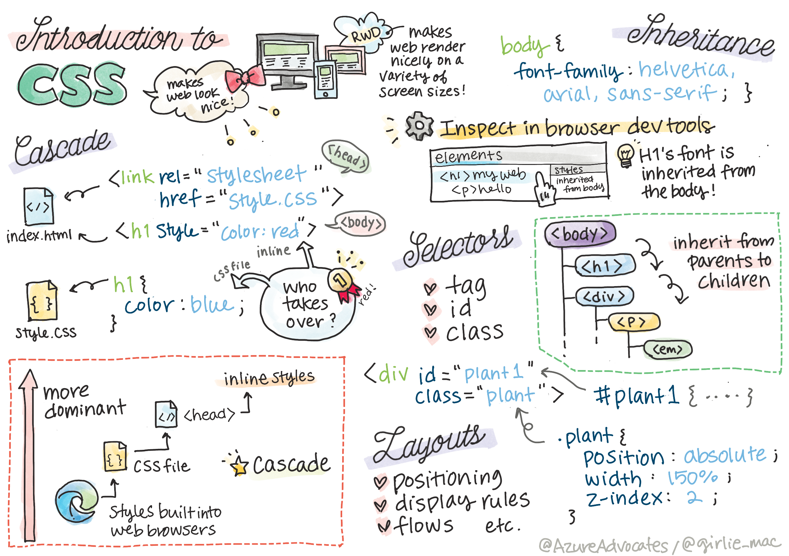

<!--
CO_OP_TRANSLATOR_METADATA:
{
  "original_hash": "e375c2aeb94e2407f2667633d39580bd",
  "translation_date": "2025-08-23T22:34:04+00:00",
  "source_file": "3-terrarium/2-intro-to-css/README.md",
  "language_code": "ja"
}
-->
# テラリウムプロジェクト パート2: CSS入門


> スケッチノート: [Tomomi Imura](https://twitter.com/girlie_mac)

## 講義前クイズ

[講義前クイズ](https://ashy-river-0debb7803.1.azurestaticapps.net/quiz/17)

### はじめに

CSS（Cascading Style Sheets）は、ウェブ開発における重要な課題、つまりウェブサイトを見栄え良くする方法を解決します。アプリにスタイルを適用することで、使いやすく、見た目も良くなります。また、CSSを使えばレスポンシブウェブデザイン（RWD）を実現でき、どの画面サイズでもアプリが美しく表示されるようになります。CSSは単に見た目を整えるだけでなく、アニメーションや変形を含む仕様もあり、アプリに高度なインタラクションを追加することが可能です。CSSワーキンググループは現在のCSS仕様を維持する役割を担っており、その活動は[World Wide Web Consortiumのサイト](https://www.w3.org/Style/CSS/members)で確認できます。

> [!NOTE]  
> CSSはウェブの他の技術と同様に進化する言語であり、すべてのブラウザが最新の仕様をサポートしているわけではありません。[CanIUse.com](https://caniuse.com)を参照して実装を確認することを忘れないでください。

このレッスンでは、オンラインテラリウムにスタイルを追加し、CSSのいくつかの概念について学びます。具体的には、カスケード、継承、セレクタの使用、配置、レイアウト構築にCSSを活用する方法について学びます。この過程で、テラリウムのレイアウトを作成し、実際のテラリウムを構築します。

### 前提条件

テラリウムのHTMLが完成しており、スタイルを適用する準備ができている必要があります。

> 動画をチェック

> 
> [](https://www.youtube.com/watch?v=6yIdOIV9p1I)

### タスク

テラリウムフォルダ内に新しいファイル`style.css`を作成し、それを`<head>`セクションにインポートします:

```html
<link rel="stylesheet" href="./style.css" />
```

---

## カスケード

Cascading Style Sheets（カスケーディングスタイルシート）は、スタイルが「カスケード」するという考え方を取り入れています。つまり、スタイルの適用はその優先順位によって決まります。ウェブサイトの作成者が設定したスタイルは、ブラウザが設定したスタイルよりも優先されます。また、インラインで設定されたスタイルは、外部スタイルシートで設定されたスタイルよりも優先されます。

### タスク

`<h1>`タグにインラインスタイル`color: red`を追加します:

```HTML
<h1 style="color: red">My Terrarium</h1>
```

次に、以下のコードを`style.css`ファイルに追加します:

```CSS
h1 {
 color: blue;
}
```

✅ あなたのウェブアプリではどの色が表示されますか？なぜですか？スタイルを上書きする方法を見つけられますか？いつ、またはなぜこれを行う必要があるのでしょうか？

---

## 継承

スタイルは、祖先のスタイルから子孫に継承されます。つまり、ネストされた要素は親要素のスタイルを引き継ぎます。

### タスク

`body`のフォントを指定し、ネストされた要素のフォントを確認します:

```CSS
body {
	font-family: helvetica, arial, sans-serif;
}
```

ブラウザのコンソールを開き、「Elements」タブで`<h1>`のフォントを観察してください。ブラウザ内で指定された通り、`body`からフォントを継承しています。


✅ ネストされたスタイルが異なるプロパティを継承するようにできますか？

---

## CSSセレクタ

### タグ

これまでの`style.css`ファイルでは、いくつかのタグにしかスタイルが適用されておらず、アプリの見た目が少し奇妙です:

```CSS
body {
	font-family: helvetica, arial, sans-serif;
}

h1 {
	color: #3a241d;
	text-align: center;
}
```

このようにタグをスタイリングすることで、特定の要素を制御できますが、テラリウム内の多くの植物のスタイルを制御する必要があります。そのためには、CSSセレクタを活用する必要があります。

### ID

左と右のコンテナにスタイルを追加します。マークアップ内で左コンテナと右コンテナはそれぞれ1つしか存在しないため、IDが付けられています。これらをスタイリングするには、`#`を使用します:

```CSS
#left-container {
	background-color: #eee;
	width: 15%;
	left: 0px;
	top: 0px;
	position: absolute;
	height: 100%;
	padding: 10px;
}

#right-container {
	background-color: #eee;
	width: 15%;
	right: 0px;
	top: 0px;
	position: absolute;
	height: 100%;
	padding: 10px;
}
```

ここでは、これらのコンテナを絶対配置で画面の左端と右端に配置し、幅をパーセンテージで指定して、小さなモバイル画面にも対応できるようにしています。

✅ このコードはかなり繰り返しが多く、「DRY」（Don't Repeat Yourself: 繰り返しを避ける）ではありません。マークアップを変更し、CSSをリファクタリングすることで、IDとクラスを組み合わせてより良い方法を見つけられますか？

```html
<div id="left-container" class="container"></div>
```

### クラス

上記の例では、画面上の2つのユニークな要素をスタイリングしました。画面上の多くの要素にスタイルを適用したい場合は、CSSクラスを使用できます。これを使って、左と右のコンテナ内の植物をレイアウトします。

HTMLマークアップ内の各植物には、IDとクラスの組み合わせが含まれています。ここでのIDは、後で追加するJavaScriptによってテラリウム内の植物の配置を操作するために使用されます。一方、クラスはすべての植物に特定のスタイルを適用します。

```html
<div class="plant-holder">
	
</div>
```

以下を`style.css`ファイルに追加します:

```CSS
.plant-holder {
	position: relative;
	height: 13%;
	left: -10px;
}

.plant {
	position: absolute;
	max-width: 150%;
	max-height: 150%;
	z-index: 2;
}
```

このスニペットで注目すべき点は、相対配置と絶対配置の組み合わせです。この点については次のセクションで説明します。高さの扱いにパーセンテージを使用している点にも注目してください:

- 植物ホルダーの高さを13%に設定しています。これにより、各垂直コンテナ内にすべての植物がスクロールなしで表示されるようになります。
- 植物ホルダーを左に移動させ、植物がコンテナ内でより中央に配置されるようにしています。画像にはドラッグ可能にするための透明な背景が多く含まれているため、画面上でより適切に収まるよう左に寄せる必要があります。
- 植物自体には最大幅150%を設定しています。これにより、ブラウザが縮小されると植物も縮小されます。ブラウザのサイズを変更してみてください。植物はコンテナ内に収まり続け、縮小してフィットします。

また、`z-index`の使用にも注目してください。これは要素の相対的な高さを制御し、植物がコンテナの上に配置され、テラリウム内に収まっているように見せます。

✅ なぜ植物ホルダーと植物の両方にCSSセレクタが必要なのでしょうか？

## CSSの配置

位置プロパティ（static、relative、fixed、absolute、sticky）を組み合わせるのは少し難しいですが、適切に行うとページ上の要素をうまく制御できます。

絶対配置された要素は、最も近い配置された祖先を基準に配置されます。祖先がない場合は、ドキュメントのボディを基準に配置されます。

相対配置された要素は、CSSの指示に基づいて元の位置から調整されます。

このサンプルでは、`plant-holder`は相対配置された要素で、絶対配置されたコンテナ内に配置されています。この結果、サイドバーコンテナは左右に固定され、`plant-holder`はサイドバー内で調整され、植物を縦に並べるスペースを確保します。

> `plant`自体も絶対配置されており、次のレッスンで学ぶようにドラッグ可能にするために必要です。

✅ サイドコンテナと`plant-holder`の配置タイプを切り替えてみてください。何が起こりますか？

## CSSレイアウト

ここで学んだことを使って、CSSだけでテラリウム自体を構築します！

まず、`.terrarium`の子要素をCSSで丸みを帯びた長方形にスタイリングします:

```CSS
.jar-walls {
	height: 80%;
	width: 60%;
	background: #d1e1df;
	border-radius: 1rem;
	position: absolute;
	bottom: 0.5%;
	left: 20%;
	opacity: 0.5;
	z-index: 1;
}

.jar-top {
	width: 50%;
	height: 5%;
	background: #d1e1df;
	position: absolute;
	bottom: 80.5%;
	left: 25%;
	opacity: 0.7;
	z-index: 1;
}

.jar-bottom {
	width: 50%;
	height: 1%;
	background: #d1e1df;
	position: absolute;
	bottom: 0%;
	left: 25%;
	opacity: 0.7;
}

.dirt {
	width: 60%;
	height: 5%;
	background: #3a241d;
	position: absolute;
	border-radius: 0 0 1rem 1rem;
	bottom: 1%;
	left: 20%;
	opacity: 0.7;
	z-index: -1;
}
```

ここでのパーセンテージの使用に注目してください。ブラウザを縮小すると、ジャーも縮小する様子がわかります。また、ジャー要素の幅と高さのパーセンテージや、各要素が絶対配置されている方法にも注目してください。これにより、要素がビューの下部に固定され、中央に配置されます。

また、`rem`を使用して`border-radius`を設定しています。これはフォント相対の長さです。この種の相対的な測定については、[CSS仕様](https://www.w3.org/TR/css-values-3/#font-relative-lengths)で詳しく読むことができます。

✅ ジャーの色と不透明度を変更してみてください。何が起こりますか？なぜでしょうか？

---

## 🚀チャレンジ

ジャーの左下部分に「バブル」のような光沢を追加して、ガラスのように見せてみましょう。`.jar-glossy-long`と`.jar-glossy-short`をスタイリングして、反射した光沢のように見せます。以下のような仕上がりになります:


講義後のクイズを完了するには、このLearnモジュールを進めてください: [HTMLアプリをCSSでスタイリングする](https://docs.microsoft.com/learn/modules/build-simple-website/4-css-basics/?WT.mc_id=academic-77807-sagibbon)

## 講義後クイズ

[講義後クイズ](https://ashy-river-0debb7803.1.azurestaticapps.net/quiz/18)

## 復習と自己学習

CSSは一見すると簡単そうに見えますが、すべてのブラウザや画面サイズに完璧にスタイルを適用するのは多くの課題があります。CSS-GridやFlexboxは、この作業をより構造化し、信頼性を高めるために開発されたツールです。[Flexbox Froggy](https://flexboxfroggy.com/)や[Grid Garden](https://codepip.com/games/grid-garden/)をプレイして、これらのツールについて学びましょう。

## 課題

[CSSリファクタリング](assignment.md)

**免責事項**:  
この文書は、AI翻訳サービス [Co-op Translator](https://github.com/Azure/co-op-translator) を使用して翻訳されています。正確性を期すよう努めておりますが、自動翻訳には誤りや不正確な部分が含まれる可能性があります。元の言語で記載された原文が公式な情報源と見なされるべきです。重要な情報については、専門の人間による翻訳を推奨します。本翻訳の使用に起因する誤解や誤認について、当方は一切の責任を負いません。