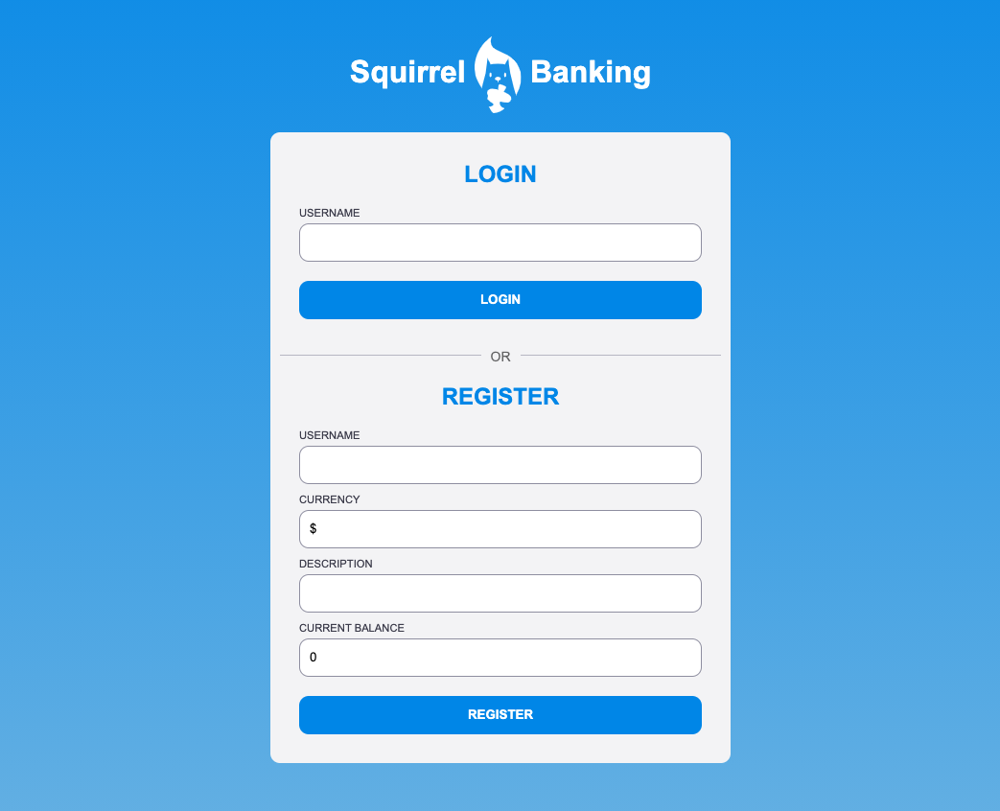

<!--
CO_OP_TRANSLATOR_METADATA:
{
  "original_hash": "b667b7d601e2ee19acb5aa9d102dc9f3",
  "translation_date": "2025-08-23T23:59:19+00:00",
  "source_file": "7-bank-project/2-forms/README.md",
  "language_code": "ja"
}
-->
# 銀行アプリを作成する Part 2: ログインと登録フォームを作成

## 講義前のクイズ

[講義前のクイズ](https://ashy-river-0debb7803.1.azurestaticapps.net/quiz/43)

### はじめに

ほとんどの現代的なウェブアプリでは、アカウントを作成して自分専用のスペースを持つことができます。複数のユーザーが同時にウェブアプリにアクセスできるため、各ユーザーの個人データを別々に保存し、どの情報を表示するかを選択する仕組みが必要です。[ユーザーの身元を安全に管理する方法](https://en.wikipedia.org/wiki/Authentication)については、非常に広範なトピックであるためここでは扱いませんが、各ユーザーが1つ（または複数）の銀行口座をアプリ内で作成できるようにします。

このパートでは、HTMLフォームを使用してウェブアプリにログインと登録機能を追加します。データをサーバーAPIにプログラム的に送信する方法や、ユーザー入力に対する基本的な検証ルールを定義する方法を学びます。

### 前提条件

このレッスンを進めるには、ウェブアプリの[HTMLテンプレートとルーティング](../1-template-route/README.md)を完了している必要があります。また、[Node.js](https://nodejs.org)をインストールし、[サーバーAPIをローカルで実行](../api/README.md)して、アカウントを作成するためのデータを送信できるようにする必要があります。

**注意**
以下の2つのターミナルを同時に実行する必要があります。
1. [HTMLテンプレートとルーティング](../1-template-route/README.md)レッスンで作成したメインの銀行アプリ用
2. 上記でセットアップした[銀行アプリのサーバーAPI](../api/README.md)用

これら2つのサーバーを稼働させることで、レッスンの残りの部分を進めることができます。それぞれ異なるポート（ポート`3000`とポート`5000`）でリスニングしているため、問題なく動作するはずです。

サーバーが正しく動作しているかどうかを確認するには、ターミナルで以下のコマンドを実行してください。

```sh
curl http://localhost:5000/api
# -> should return "Bank API v1.0.0" as a result
```

---

## フォームとコントロール

`<form>`要素は、ユーザーがインタラクティブなコントロールを使用してデータを入力および送信できるHTMLドキュメントのセクションをカプセル化します。フォーム内で使用できるユーザーインターフェース（UI）コントロールはさまざまで、最も一般的なものは`<input>`と`<button>`要素です。

`<input>`には多くの異なる[タイプ](https://developer.mozilla.org/docs/Web/HTML/Element/input)があります。たとえば、ユーザー名を入力するフィールドを作成するには以下のようにします。

```html
<input id="username" name="username" type="text">
```

`name`属性は、フォームデータが送信される際にプロパティ名として使用されます。`id`属性は、`<label>`をフォームコントロールに関連付けるために使用されます。

> [`<input>`タイプ](https://developer.mozilla.org/docs/Web/HTML/Element/input)や[その他のフォームコントロール](https://developer.mozilla.org/docs/Learn/Forms/Other_form_controls)の全リストを確認して、UIを構築する際に使用できるネイティブUI要素を理解してください。

✅ `<input>`は[空要素](https://developer.mozilla.org/docs/Glossary/Empty_element)であり、対応する閉じタグを追加してはいけません。ただし、自己閉じタグ`<input/>`の記法を使用することはできますが、必須ではありません。

フォーム内の`<button>`要素は少し特別です。`type`属性を指定しない場合、押されたときにフォームデータをサーバーに自動的に送信します。以下は可能な`type`値です：

- `submit`: `<form>`内のデフォルトで、ボタンがフォーム送信アクションをトリガーします。
- `reset`: ボタンがすべてのフォームコントロールを初期値にリセットします。
- `button`: ボタンが押されたときにデフォルトの動作を割り当てません。JavaScriptを使用してカスタムアクションを割り当てることができます。

### タスク

まず、`login`テンプレートにフォームを追加しましょう。*username*フィールドと*Login*ボタンが必要です。

```html
<template id="login">
  <h1>Bank App</h1>
  <section>
    <h2>Login</h2>
    <form id="loginForm">
      <label for="username">Username</label>
      <input id="username" name="user" type="text">
      <button>Login</button>
    </form>
  </section>
</template>
```

よく見ると、ここに`<label>`要素も追加されていることがわかります。`<label>`要素は、ユーザー名フィールドのようなUIコントロールに名前を付けるために使用されます。ラベルはフォームの読みやすさを向上させるだけでなく、以下のような追加の利点もあります：

- ラベルをフォームコントロールに関連付けることで、支援技術（スクリーンリーダーなど）を使用するユーザーがどのデータを提供する必要があるかを理解しやすくなります。
- ラベルをクリックすると、関連付けられた入力に直接フォーカスを当てることができ、タッチスクリーンデバイスでの操作が簡単になります。

> [ウェブアクセシビリティ](https://developer.mozilla.org/docs/Learn/Accessibility/What_is_accessibility)は、しばしば見過ごされがちな非常に重要なトピックです。[セマンティックHTML要素](https://developer.mozilla.org/docs/Learn/Accessibility/HTML)を適切に使用すれば、アクセシブルなコンテンツを作成するのは難しくありません。[アクセシビリティについてさらに読む](https://developer.mozilla.org/docs/Web/Accessibility)ことで、一般的なミスを避け、責任ある開発者になることができます。

次に、登録用の2つ目のフォームを前のフォームの下に追加します：

```html
<hr/>
<h2>Register</h2>
<form id="registerForm">
  <label for="user">Username</label>
  <input id="user" name="user" type="text">
  <label for="currency">Currency</label>
  <input id="currency" name="currency" type="text" value="$">
  <label for="description">Description</label>
  <input id="description" name="description" type="text">
  <label for="balance">Current balance</label>
  <input id="balance" name="balance" type="number" value="0">
  <button>Register</button>
</form>
```

`value`属性を使用して、特定の入力にデフォルト値を定義できます。
また、`balance`の入力が`number`タイプであることに注意してください。他の入力と見た目が異なりますか？試して操作してみてください。

✅ キーボードだけでフォームを操作できますか？どうやってそれを行いますか？

## サーバーへのデータ送信

機能的なUIができたので、次のステップはデータをサーバーに送信することです。現在のコードを使用して簡単なテストを行いましょう：*Login*または*Register*ボタンをクリックするとどうなりますか？

ブラウザのURLセクションに変化があったことに気づきましたか？


`<form>`のデフォルトの動作は、現在のサーバーURLにフォームを[GETメソッド](https://www.w3.org/Protocols/rfc2616/rfc2616-sec9.html#sec9.3)を使用して送信し、フォームデータをURLに直接追加することです。しかし、この方法にはいくつかの欠点があります：

- 送信されるデータのサイズが非常に制限されている（約2000文字）
- データがURLに直接表示される（パスワードには適していない）
- ファイルアップロードには対応していない

そのため、[POSTメソッド](https://www.w3.org/Protocols/rfc2616/rfc2616-sec9.html#sec9.5)を使用して、フォームデータをHTTPリクエストのボディに送信し、これらの制限を回避することができます。

> POSTはデータ送信に最も一般的に使用されるメソッドですが、[特定のシナリオ](https://www.w3.org/2001/tag/doc/whenToUseGet.html)ではGETメソッドを使用する方が適している場合があります。たとえば、検索フィールドを実装する場合などです。

### タスク

登録フォームに`action`と`method`プロパティを追加してください：

```html
<form id="registerForm" action="//localhost:5000/api/accounts" method="POST">
```

次に、自分の名前で新しいアカウントを登録してみてください。*Register*ボタンをクリックすると、以下のような画面が表示されるはずです：


すべてが正常に動作すれば、サーバーはリクエストに応答し、作成されたアカウントデータを含む[JSON](https://www.json.org/json-en.html)レスポンスを返します。

✅ 同じ名前で再度登録を試みてください。何が起こりますか？

## ページをリロードせずにデータを送信する

先ほど使用した方法には少し問題があることに気づいたかもしれません：フォームを送信すると、アプリから離れてブラウザがサーバーURLにリダイレクトしてしまいます。私たちは[シングルページアプリケーション（SPA）](https://en.wikipedia.org/wiki/Single-page_application)を作成しているため、すべてのページリロードを避けたいと考えています。

ページをリロードせずにフォームデータをサーバーに送信するには、JavaScriptコードを使用する必要があります。`<form>`要素の`action`プロパティにURLを指定する代わりに、`javascript:`文字列を先頭に付けた任意のJavaScriptコードを使用してカスタムアクションを実行できます。この方法を使用すると、ブラウザが自動的に行っていた以下のタスクを自分で実装する必要があります：

- フォームデータの取得
- フォームデータを適切な形式に変換およびエンコード
- HTTPリクエストを作成してサーバーに送信

### タスク

登録フォームの`action`を以下に置き換えてください：

```html
<form id="registerForm" action="javascript:register()">
```

`app.js`を開き、`register`という名前の新しい関数を追加してください：

```js
function register() {
  const registerForm = document.getElementById('registerForm');
  const formData = new FormData(registerForm);
  const data = Object.fromEntries(formData);
  const jsonData = JSON.stringify(data);
}
```

ここでは、`getElementById()`を使用してフォーム要素を取得し、[`FormData`](https://developer.mozilla.org/docs/Web/API/FormData)ヘルパーを使用してフォームコントロールからキー/値ペアとして値を抽出します。その後、[`Object.fromEntries()`](https://developer.mozilla.org/docs/Web/JavaScript/Reference/Global_Objects/Object/fromEntries)を使用してデータを通常のオブジェクトに変換し、最終的に[JSON](https://www.json.org/json-en.html)にシリアル化します。JSONはウェブ上でデータを交換する際によく使用される形式です。

データはサーバーに送信する準備が整いました。`createAccount`という名前の新しい関数を作成してください：

```js
async function createAccount(account) {
  try {
    const response = await fetch('//localhost:5000/api/accounts', {
      method: 'POST',
      headers: { 'Content-Type': 'application/json' },
      body: account
    });
    return await response.json();
  } catch (error) {
    return { error: error.message || 'Unknown error' };
  }
}
```

この関数は何をしているのでしょうか？まず、ここで`async`キーワードに注目してください。これは、関数内に[**非同期**](https://developer.mozilla.org/docs/Web/JavaScript/Reference/Statements/async_function)で実行されるコードが含まれていることを意味します。`await`キーワードと組み合わせて使用すると、ここでサーバーの応答を待つなど、非同期コードの実行を待機してから処理を続行できます。

`async/await`の使用方法についての簡単な動画はこちらです：

[](https://youtube.com/watch?v=YwmlRkrxvkk "AsyncとAwaitでプロミスを管理する")

> 🎥 上の画像をクリックすると、async/awaitに関する動画が再生されます。

`fetch()`APIを使用してJSONデータをサーバーに送信します。このメソッドは2つのパラメータを取ります：

- サーバーのURL。ここでは`//localhost:5000/api/accounts`を指定します。
- リクエストの設定。ここでメソッドを`POST`に設定し、リクエストの`body`を提供します。JSONデータをサーバーに送信しているため、`Content-Type`ヘッダーを`application/json`に設定して、サーバーがコンテンツを解釈できるようにします。

サーバーがリクエストにJSONで応答するため、`await response.json()`を使用してJSONコンテンツを解析し、結果のオブジェクトを返します。このメソッドは非同期であるため、解析中のエラーもキャッチできるように`await`キーワードを使用します。

次に、`register`関数に`createAccount()`を呼び出すコードを追加してください：

```js
const result = await createAccount(jsonData);
```

ここで`await`キーワードを使用しているため、`register`関数の前に`async`キーワードを追加する必要があります：

```js
async function register() {
```

最後に、結果を確認するためのログを追加します。最終的な関数は以下のようになります：

```js
async function register() {
  const registerForm = document.getElementById('registerForm');
  const formData = new FormData(registerForm);
  const jsonData = JSON.stringify(Object.fromEntries(formData));
  const result = await createAccount(jsonData);

  if (result.error) {
    return console.log('An error occurred:', result.error);
  }

  console.log('Account created!', result);
}
```

少し長くなりましたが、これで完了です！[ブラウザの開発者ツール](https://developer.mozilla.org/docs/Learn/Common_questions/What_are_browser_developer_tools)を開き、新しいアカウントを登録してみてください。ウェブページには変化が見られませんが、コンソールにメッセージが表示され、すべてが正常に動作していることを確認できます。


✅ データは安全にサーバーに送信されていると思いますか？リクエストが傍受された場合はどうなるでしょうか？[HTTPS](https://en.wikipedia.org/wiki/HTTPS)について読んで、安全なデータ通信について学んでください。

## データの検証

ユーザー名を設定せずに新しいアカウントを登録しようとすると、サーバーが[400 (Bad Request)](https://developer.mozilla.org/docs/Web/HTTP/Status/400#:~:text=The%20HyperText%20Transfer%20Protocol%20(HTTP,%2C%20or%20deceptive%20request%20routing).)ステータスコードでエラーを返すことがわかります。

データをサーバーに送信する前に可能であれば[フォームデータを検証](https://developer.mozilla.org/docs/Learn/Forms/Form_validation)することは、正しいリクエストを送信するための良い習慣です。HTML5フォームコントロールは、さまざまな属性を使用して組み込みの検証を提供します：

- `required`: フィールドが入力されていない場合、フォームを送信できません。
- `minlength`と`maxlength`: テキストフィールドの最小および最大文字数を定義します。
- `min`と`max`: 数値フィールドの最小および最大値を定義します。
- `type`: `number`、`email`、`file`などのデータの種類を定義します。[その他の組み込みタイプ](https://developer.mozilla.org/docs/Web/HTML/Element/input)もあります。この属性はフォームコントロールの視覚的なレンダリングを変更する場合もあります。
- `pattern`: [正規表現](https://developer.mozilla.org/docs/Web/JavaScript/Guide/Regular_Expressions)パターンを定義して、入力されたデータが有効かどうかをテストします。
ヒント: `:valid` および `:invalid` CSS疑似クラスを使用して、フォームコントロールが有効か無効かに応じて外観をカスタマイズすることができます。
### タスク

新しいアカウントを作成するには、ユーザー名と通貨の2つの必須フィールドが必要です。他のフィールドは任意です。フォームのHTMLを更新し、`required`属性とフィールドラベル内のテキストを使用して次のようにします：

```html
<label for="user">Username (required)</label>
<input id="user" name="user" type="text" required>
...
<label for="currency">Currency (required)</label>
<input id="currency" name="currency" type="text" value="$" required>
```

このサーバー実装では、フィールドの最大長に特定の制限を課していませんが、ユーザーが入力するテキストには常に適切な制限を設けるのが良い習慣です。

テキストフィールドに`maxlength`属性を追加してください：

```html
<input id="user" name="user" type="text" maxlength="20" required>
...
<input id="currency" name="currency" type="text" value="$" maxlength="5" required>
...
<input id="description" name="description" type="text" maxlength="100">
```

次に、*登録*ボタンを押して、定義したバリデーションルールに従わないフィールドがある場合、次のようなエラーメッセージが表示されるはずです：


このように、データをサーバーに送信する*前に*行われるバリデーションは、**クライアントサイド**バリデーションと呼ばれます。ただし、すべてのチェックをデータを送信せずに行うことは常に可能ではありません。例えば、同じユーザー名のアカウントが既に存在するかどうかは、サーバーにリクエストを送信しないと確認できません。サーバーで行われる追加のバリデーションは、**サーバーサイド**バリデーションと呼ばれます。

通常、両方を実装する必要があります。クライアントサイドバリデーションは、ユーザーに即時のフィードバックを提供することでユーザー体験を向上させますが、サーバーサイドバリデーションは、操作するユーザーデータが正確で安全であることを保証するために重要です。

---

## 🚀 チャレンジ

ユーザーが既に存在する場合、HTMLにエラーメッセージを表示してください。

以下は、少しスタイリングを加えた後の最終的なログインページの例です：



## 講義後のクイズ

[講義後のクイズ](https://ashy-river-0debb7803.1.azurestaticapps.net/quiz/44)

## 復習と自己学習

開発者たちは、特にバリデーション戦略に関して、フォーム作成に非常に創造的になっています。[CodePen](https://codepen.com)を見て、さまざまなフォームフローについて学んでみてください。興味深く、インスピレーションを与えるフォームを見つけられますか？

## 課題

[銀行アプリをスタイリングする](assignment.md)

**免責事項**:  
この文書は、AI翻訳サービス [Co-op Translator](https://github.com/Azure/co-op-translator) を使用して翻訳されています。正確性を追求しておりますが、自動翻訳には誤りや不正確な部分が含まれる可能性があることをご承知ください。元の言語で記載された文書が正式な情報源とみなされるべきです。重要な情報については、専門の人間による翻訳を推奨します。この翻訳の使用に起因する誤解や誤解釈について、当社は責任を負いません。