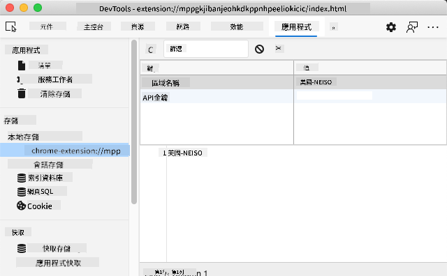

<!--
CO_OP_TRANSLATOR_METADATA:
{
  "original_hash": "e10f168beac4e7b05e30e0eb5c92bf11",
  "translation_date": "2025-08-25T23:28:53+00:00",
  "source_file": "5-browser-extension/2-forms-browsers-local-storage/README.md",
  "language_code": "mo"
}
-->
# 瀏覽器擴充功能專案第二部分：呼叫 API，使用本地存儲

## 課前測驗

[課前測驗](https://ashy-river-0debb7803.1.azurestaticapps.net/quiz/25)

### 簡介

在本課中，你將透過提交瀏覽器擴充功能的表單來呼叫 API，並在擴充功能中顯示結果。此外，你還將學習如何將資料存儲在瀏覽器的本地存儲中，以供未來參考和使用。

✅ 按照適當檔案中的編號段落，了解應將程式碼放置在哪裡。

### 設置擴充功能中需要操作的元素：

到目前為止，你已經為瀏覽器擴充功能建立了表單和結果 `<div>` 的 HTML。接下來，你需要在 `/src/index.js` 檔案中逐步構建擴充功能。請參考[上一課](../1-about-browsers/README.md)以了解如何設置專案及其構建過程。

在 `index.js` 檔案中，首先建立一些 `const` 變數來保存與各個欄位相關的值：

```JavaScript
// form fields
const form = document.querySelector('.form-data');
const region = document.querySelector('.region-name');
const apiKey = document.querySelector('.api-key');

// results
const errors = document.querySelector('.errors');
const loading = document.querySelector('.loading');
const results = document.querySelector('.result-container');
const usage = document.querySelector('.carbon-usage');
const fossilfuel = document.querySelector('.fossil-fuel');
const myregion = document.querySelector('.my-region');
const clearBtn = document.querySelector('.clear-btn');
```

所有這些欄位都是通過其 CSS 類名來引用的，這些類名是在上一課的 HTML 中設置的。

### 添加事件監聽器

接下來，為表單和重置按鈕添加事件監聽器，這樣當使用者提交表單或點擊重置按鈕時，會觸發相應的操作，並在檔案底部添加初始化應用程式的呼叫：

```JavaScript
form.addEventListener('submit', (e) => handleSubmit(e));
clearBtn.addEventListener('click', (e) => reset(e));
init();
```

✅ 注意這裡使用的簡化方式來監聽提交或點擊事件，以及事件如何被傳遞到 `handleSubmit` 或 `reset` 函數。你能否用更長的格式寫出這種簡化方式的等效程式碼？你更喜歡哪種方式？

### 構建 `init()` 函數和 `reset()` 函數：

現在你需要構建初始化擴充功能的函數，這個函數叫做 `init()`：

```JavaScript
function init() {
	//if anything is in localStorage, pick it up
	const storedApiKey = localStorage.getItem('apiKey');
	const storedRegion = localStorage.getItem('regionName');

	//set icon to be generic green
	//todo

	if (storedApiKey === null || storedRegion === null) {
		//if we don't have the keys, show the form
		form.style.display = 'block';
		results.style.display = 'none';
		loading.style.display = 'none';
		clearBtn.style.display = 'none';
		errors.textContent = '';
	} else {
        //if we have saved keys/regions in localStorage, show results when they load
        displayCarbonUsage(storedApiKey, storedRegion);
		results.style.display = 'none';
		form.style.display = 'none';
		clearBtn.style.display = 'block';
	}
};

function reset(e) {
	e.preventDefault();
	//clear local storage for region only
	localStorage.removeItem('regionName');
	init();
}

```

在這個函數中，有一些有趣的邏輯。仔細閱讀，你能看出發生了什麼嗎？

- 設置兩個 `const` 來檢查使用者是否在本地存儲中保存了 APIKey 和地區代碼。
- 如果其中任何一個為 null，通過將表單的樣式更改為 'block' 來顯示表單。
- 隱藏結果、加載狀態和清除按鈕，並將任何錯誤文字設置為空字串。
- 如果存在 APIKey 和地區代碼，則啟動以下流程：
  - 呼叫 API 以獲取碳使用數據。
  - 隱藏結果區域。
  - 隱藏表單。
  - 顯示重置按鈕。

在繼續之前，了解瀏覽器中一個非常重要的概念是很有幫助的：[LocalStorage](https://developer.mozilla.org/docs/Web/API/Window/localStorage)。LocalStorage 是一種在瀏覽器中以 `key-value` 配對形式存儲字串的有用方式。這種網頁存儲可以通過 JavaScript 操作來管理瀏覽器中的資料。LocalStorage 不會過期，而另一種網頁存儲 SessionStorage 則會在瀏覽器關閉時清除。這些存儲類型在使用上各有利弊。

> 注意 - 瀏覽器擴充功能有自己的本地存儲；主瀏覽器窗口是不同的實例，行為獨立。

你可以將 APIKey 設置為一個字串值，例如，你可以通過 "檢查" 網頁（右鍵點擊瀏覽器並選擇檢查）並進入應用程式選項卡來查看存儲。



✅ 思考哪些情況下你不應該將某些資料存儲在 LocalStorage 中。一般來說，將 APIKey 放在 LocalStorage 中是個壞主意！你能看出原因嗎？在我們的案例中，由於我們的應用程式純粹是用於學習，並不會部署到應用程式商店，因此我們將使用這種方法。

注意，你使用 Web API 來操作 LocalStorage，可以使用 `getItem()`、`setItem()` 或 `removeItem()`。它在各大瀏覽器中都得到了廣泛支持。

在構建 `displayCarbonUsage()` 函數（在 `init()` 中被呼叫）之前，讓我們先構建處理初始表單提交的功能。

### 處理表單提交

建立一個名為 `handleSubmit` 的函數，接受一個事件參數 `(e)`。阻止事件傳播（在這種情況下，我們希望阻止瀏覽器刷新），並呼叫一個新函數 `setUpUser`，傳入 `apiKey.value` 和 `region.value` 作為參數。通過這種方式，你使用了初始表單中填寫的兩個值。

```JavaScript
function handleSubmit(e) {
	e.preventDefault();
	setUpUser(apiKey.value, region.value);
}
```

✅ 回憶一下 - 你在上一課設置的 HTML 有兩個輸入欄位，其 `values` 是通過你在檔案頂部設置的 `const` 捕獲的，並且它們都是 `required`，因此瀏覽器會阻止使用者輸入空值。

### 設置使用者

接下來是 `setUpUser` 函數，這裡你將為 apiKey 和 regionName 設置本地存儲值。添加一個新函數：

```JavaScript
function setUpUser(apiKey, regionName) {
	localStorage.setItem('apiKey', apiKey);
	localStorage.setItem('regionName', regionName);
	loading.style.display = 'block';
	errors.textContent = '';
	clearBtn.style.display = 'block';
	//make initial call
	displayCarbonUsage(apiKey, regionName);
}
```

此函數設置一個加載訊息，以在呼叫 API 時顯示。到目前為止，你已經到達了建立此瀏覽器擴充功能最重要的函數！

### 顯示碳使用數據

最後，是時候查詢 API 了！

在進一步操作之前，我們應該討論 API。API，即[應用程式介面](https://www.webopedia.com/TERM/A/API.html)，是網頁開發者工具箱中的重要元素。它們提供了標準化的方式，讓程式能夠相互交互和介面。例如，如果你正在建立一個需要查詢資料庫的網站，可能有人已經為你建立了一個 API 可以使用。雖然 API 有很多種類型，其中一種最受歡迎的是 [REST API](https://www.smashingmagazine.com/2018/01/understanding-using-rest-api/)。

✅ "REST" 的意思是 "表現層狀態轉移"，其特點是使用不同配置的 URL 來獲取資料。研究一下開發者可用的各種 API 類型。哪種格式最吸引你？

這個函數有一些重要的注意事項。首先，注意 [`async` 關鍵字](https://developer.mozilla.org/docs/Web/JavaScript/Reference/Statements/async_function)。將函數設置為異步執行意味著它會等待某些操作（例如資料返回）完成後再繼續。

這裡有一段關於 `async` 的簡短影片：

[](https://youtube.com/watch?v=YwmlRkrxvkk "管理 Promise 的 Async 和 Await")

> 🎥 點擊上方圖片觀看有關 async/await 的影片。

建立一個新函數來查詢 C02Signal API：

```JavaScript
import axios from '../node_modules/axios';

async function displayCarbonUsage(apiKey, region) {
	try {
		await axios
			.get('https://api.co2signal.com/v1/latest', {
				params: {
					countryCode: region,
				},
				headers: {
					'auth-token': apiKey,
				},
			})
			.then((response) => {
				let CO2 = Math.floor(response.data.data.carbonIntensity);

				//calculateColor(CO2);

				loading.style.display = 'none';
				form.style.display = 'none';
				myregion.textContent = region;
				usage.textContent =
					Math.round(response.data.data.carbonIntensity) + ' grams (grams C02 emitted per kilowatt hour)';
				fossilfuel.textContent =
					response.data.data.fossilFuelPercentage.toFixed(2) +
					'% (percentage of fossil fuels used to generate electricity)';
				results.style.display = 'block';
			});
	} catch (error) {
		console.log(error);
		loading.style.display = 'none';
		results.style.display = 'none';
		errors.textContent = 'Sorry, we have no data for the region you have requested.';
	}
}
```

這是一個較大的函數。這裡發生了什麼？

- 遵循最佳實踐，你使用 `async` 關鍵字使此函數異步執行。函數包含一個 `try/catch` 區塊，因為當 API 返回資料時，它會返回一個 Promise。由於你無法控制 API 的響應速度（它可能根本不響應！），你需要通過異步方式來處理這種不確定性。
- 你正在查詢 co2signal API，以獲取地區的資料，使用你的 APIKey。要使用該密鑰，你需要在標頭參數中使用一種身份驗證方式。
- 一旦 API 響應，你將其響應資料的各個元素分配給你設置的螢幕部分，以顯示這些資料。
- 如果出現錯誤或沒有結果，你將顯示錯誤訊息。

✅ 使用異步程式設計模式是工具箱中的另一個非常有用的工具。閱讀[各種配置此類程式碼的方法](https://developer.mozilla.org/docs/Web/JavaScript/Reference/Statements/async_function)。

恭喜！如果你構建了擴充功能（`npm run build`）並在擴充功能面板中刷新它，你就擁有了一個可運行的擴充功能！唯一尚未完成的是圖示，你將在下一課中修復它。

---

## 🚀 挑戰

我們在這些課程中已經討論了幾種 API 類型。選擇一個網頁 API，深入研究它提供的功能。例如，查看瀏覽器中可用的 API，例如 [HTML 拖放 API](https://developer.mozilla.org/docs/Web/API/HTML_Drag_and_Drop_API)。在你看來，什麼樣的 API 才是出色的？

## 課後測驗

[課後測驗](https://ashy-river-0debb7803.1.azurestaticapps.net/quiz/26)

## 回顧與自學

在本課中，你學到了 LocalStorage 和 API，這兩者對專業網頁開發者來說都非常有用。你能想到這兩者如何協同工作嗎？思考一下如何設計一個網站，將資料存儲起來以供 API 使用。

## 作業

[採用一個 API](assignment.md)

**免責聲明**：  
本文檔使用 AI 翻譯服務 [Co-op Translator](https://github.com/Azure/co-op-translator) 進行翻譯。儘管我們努力確保準確性，但請注意，自動翻譯可能包含錯誤或不準確之處。原始語言的文件應被視為權威來源。對於關鍵信息，建議使用專業人工翻譯。我們對因使用此翻譯而引起的任何誤解或錯誤解釋不承擔責任。