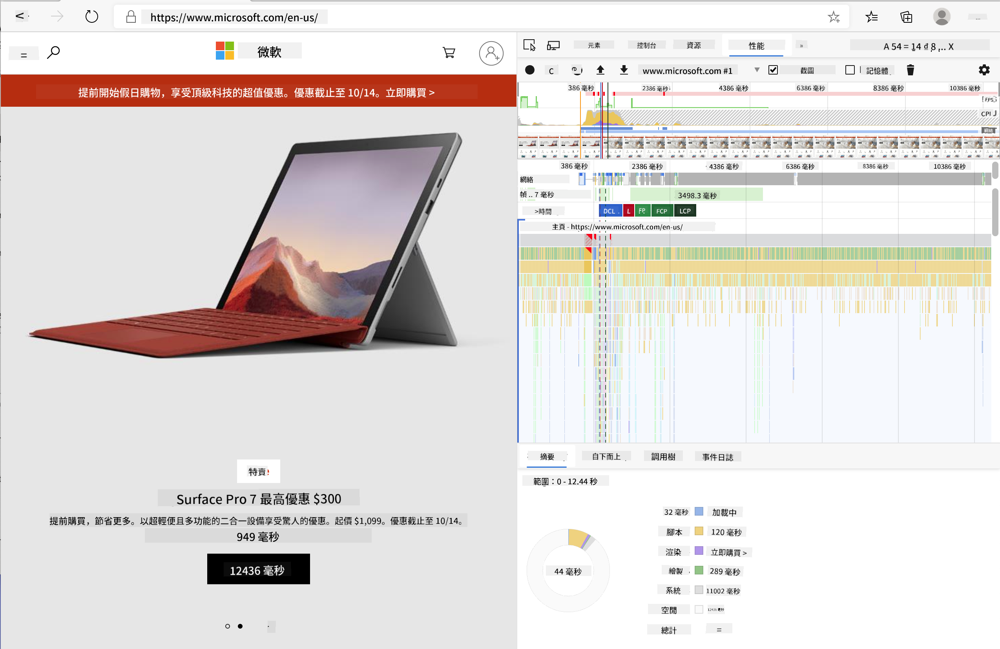
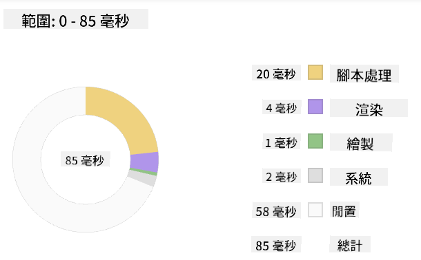

<!--
CO_OP_TRANSLATOR_METADATA:
{
  "original_hash": "f198c6b817b4b2a99749f4662e7cae98",
  "translation_date": "2025-08-25T23:44:36+00:00",
  "source_file": "5-browser-extension/3-background-tasks-and-performance/README.md",
  "language_code": "mo"
}
-->
# 瀏覽器擴展項目第 3 部分：了解背景任務與效能

## 課前測驗

[課前測驗](https://ashy-river-0debb7803.1.azurestaticapps.net/quiz/27)

### 簡介

在本模組的前兩節課中，你學會了如何建立一個表單以及用於顯示從 API 獲取的數據的區域。這是一種非常標準的方式來建立網頁。你甚至學會了如何異步獲取數據。你的瀏覽器擴展幾乎已經完成了。

現在剩下的就是管理一些背景任務，包括刷新擴展圖標的顏色，因此這是一個很好的時機來討論瀏覽器如何管理這類任務。在構建網頁資產時，讓我們從效能的角度來思考這些瀏覽器任務。

## 網頁效能基礎

> 「網站效能關乎兩件事：頁面加載的速度，以及頁面上程式碼執行的速度。」-- [Zack Grossbart](https://www.smashingmagazine.com/2012/06/javascript-profiling-chrome-developer-tools/)

如何讓你的網站在各種設備、各類用戶以及各種情況下都能快速運行，這個話題自然非常廣泛。以下是一些在構建標準網頁項目或瀏覽器擴展時需要記住的要點。

確保網站高效運行的第一步是收集其效能數據。第一個可以查看的地方是瀏覽器的開發者工具。在 Edge 瀏覽器中，你可以點擊「設定與更多」按鈕（瀏覽器右上角的三點圖標），然後導航到「更多工具 > 開發者工具」，並打開「效能」標籤。你也可以使用快捷鍵 `Ctrl` + `Shift` + `I`（Windows）或 `Option` + `Command` + `I`（Mac）來打開開發者工具。

「效能」標籤包含一個分析工具。打開一個網站（例如 [https://www.microsoft.com](https://www.microsoft.com/?WT.mc_id=academic-77807-sagibbon)），點擊「記錄」按鈕，然後刷新網站。隨時停止記錄，你將能看到生成的「腳本」、「渲染」和「繪製」網站的例程：



✅ 參考 [Microsoft 文件](https://docs.microsoft.com/microsoft-edge/devtools-guide/performance/?WT.mc_id=academic-77807-sagibbon) 了解 Edge 中「效能」面板的使用方法

> 提示：為了獲取網站啟動時間的準確讀數，請清除瀏覽器的快取

選擇分析時間軸中的元素，放大頁面加載過程中的事件。

通過選擇分析時間軸的一部分並查看摘要面板，獲取頁面效能的快照：



檢查「事件日誌」面板，查看是否有任何事件超過了 15 毫秒：


✅ 熟悉你的分析工具！打開本網站的開發者工具，看看是否有任何瓶頸。加載最慢的資產是什麼？最快的是什麼？

## 效能檢查

通常來說，為了避免在部署到生產環境時出現意外，每位網頁開發者都應該注意一些「問題區域」。

**資產大小**：近年來，網頁變得越來越「重」，因此也變得更慢。這部分重量與圖片的使用有關。

✅ 瀏覽 [Internet Archive](https://httparchive.org/reports/page-weight) 了解頁面重量的歷史視圖及更多資訊。

一個好的做法是確保圖片已經過優化，並以適合用戶的大小和解析度進行傳遞。

**DOM 遍歷**：瀏覽器需要根據你編寫的程式碼構建其文件物件模型（DOM），因此為了提升頁面效能，應保持標籤的最小化，只使用和樣式化頁面所需的內容。例如，與頁面相關的多餘 CSS 可以進行優化；僅需在某一頁面使用的樣式不需要包含在主樣式表中。

**JavaScript**：每位 JavaScript 開發者都應注意「渲染阻塞」腳本，這些腳本必須在 DOM 被遍歷和繪製到瀏覽器之前加載完成。考慮對內聯腳本使用 `defer`（如在 Terrarium 模組中所示）。

✅ 在 [網站速度測試網站](https://www.webpagetest.org/) 上嘗試一些網站，了解用於判斷網站效能的常見檢查。

現在你已經了解了瀏覽器如何渲染你傳遞的資產，讓我們來看看完成擴展所需的最後幾步：

### 建立一個計算顏色的函數

在 `/src/index.js` 中，於你設置的 `const` 變數之後新增一個名為 `calculateColor()` 的函數：

```JavaScript
function calculateColor(value) {
	let co2Scale = [0, 150, 600, 750, 800];
	let colors = ['#2AA364', '#F5EB4D', '#9E4229', '#381D02', '#381D02'];

	let closestNum = co2Scale.sort((a, b) => {
		return Math.abs(a - value) - Math.abs(b - value);
	})[0];
	console.log(value + ' is closest to ' + closestNum);
	let num = (element) => element > closestNum;
	let scaleIndex = co2Scale.findIndex(num);

	let closestColor = colors[scaleIndex];
	console.log(scaleIndex, closestColor);

	chrome.runtime.sendMessage({ action: 'updateIcon', value: { color: closestColor } });
}
```

這裡發生了什麼？你傳入一個值（來自上一課完成的 API 呼叫中的碳強度），然後計算其值與顏色陣列中索引的接近程度。接著，你將最接近的顏色值傳遞給 chrome runtime。

chrome.runtime 提供了一個 [API](https://developer.chrome.com/extensions/runtime)，用於處理各種背景任務，而你的擴展正在利用這個 API：

> 「使用 chrome.runtime API 來檢索背景頁面、返回有關 manifest 的詳細資訊，並監聽和響應應用或擴展生命週期中的事件。你還可以使用此 API 將 URL 的相對路徑轉換為完全限定的 URL。」

✅ 如果你正在為 Edge 開發此瀏覽器擴展，可能會驚訝於你正在使用 chrome API。新版 Edge 瀏覽器基於 Chromium 瀏覽器引擎，因此你可以利用這些工具。

> 注意，如果你想分析瀏覽器擴展，請從擴展本身內部啟動開發者工具，因為它是獨立的瀏覽器實例。

### 設置預設圖標顏色

現在，在 `init()` 函數中，通過再次調用 chrome 的 `updateIcon` 操作，將圖標設置為預設的綠色：

```JavaScript
chrome.runtime.sendMessage({
	action: 'updateIcon',
		value: {
			color: 'green',
		},
});
```

### 調用函數並執行呼叫

接下來，將你剛剛創建的函數添加到 C02Signal API 返回的 promise 中：

```JavaScript
//let CO2...
calculateColor(CO2);
```

最後，在 `/dist/background.js` 中，為這些背景操作呼叫新增監聽器：

```JavaScript
chrome.runtime.onMessage.addListener(function (msg, sender, sendResponse) {
	if (msg.action === 'updateIcon') {
		chrome.browserAction.setIcon({ imageData: drawIcon(msg.value) });
	}
});
//borrowed from energy lollipop extension, nice feature!
function drawIcon(value) {
	let canvas = document.createElement('canvas');
	let context = canvas.getContext('2d');

	context.beginPath();
	context.fillStyle = value.color;
	context.arc(100, 100, 50, 0, 2 * Math.PI);
	context.fill();

	return context.getImageData(50, 50, 100, 100);
}
```

在這段程式碼中，你為任何發送到後端任務管理器的消息新增了一個監聽器。如果消息名稱是 'updateIcon'，則執行接下來的程式碼，使用 Canvas API 繪製適當顏色的圖標。

✅ 你將在 [太空遊戲課程](../../6-space-game/2-drawing-to-canvas/README.md) 中學到更多關於 Canvas API 的知識。

現在，重新構建你的擴展（`npm run build`），刷新並啟動你的擴展，觀察顏色的變化。是時候去跑個腿或洗碗了嗎？現在你知道了！

恭喜！你已經構建了一個實用的瀏覽器擴展，並學到了更多關於瀏覽器的工作原理以及如何分析其效能的知識。

---

## 🚀 挑戰

調查一些已經存在很長時間的開源網站，根據其 GitHub 歷史，看看它們是否在效能方面進行了優化。如果有，找出它們的優化方式。最常見的痛點是什麼？

## 課後測驗

[課後測驗](https://ashy-river-0debb7803.1.azurestaticapps.net/quiz/28)

## 回顧與自學

考慮訂閱一份 [效能相關的電子報](https://perf.email/)

調查瀏覽器如何通過其網頁工具中的效能標籤來評估網頁效能。你是否發現了任何主要差異？

## 作業

[分析網站效能](assignment.md)

**免責聲明**：  
本文件使用 AI 翻譯服務 [Co-op Translator](https://github.com/Azure/co-op-translator) 進行翻譯。我們致力於提供準確的翻譯，但請注意，自動翻譯可能包含錯誤或不準確之處。應以原始語言的文件作為權威來源。對於關鍵資訊，建議尋求專業人工翻譯。我們對因使用此翻譯而引起的任何誤解或誤讀概不負責。