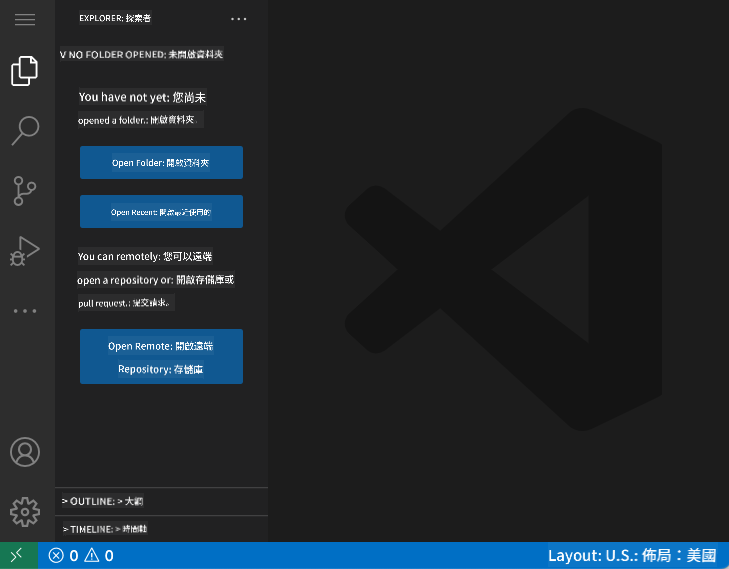
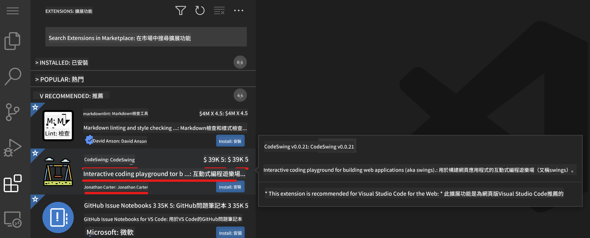
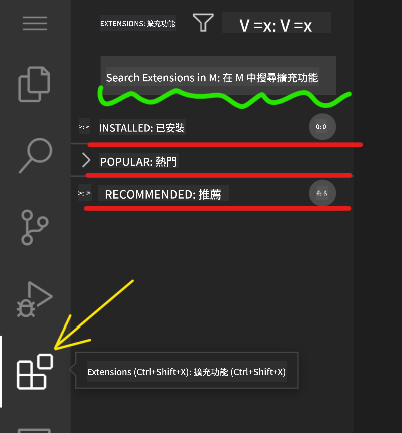
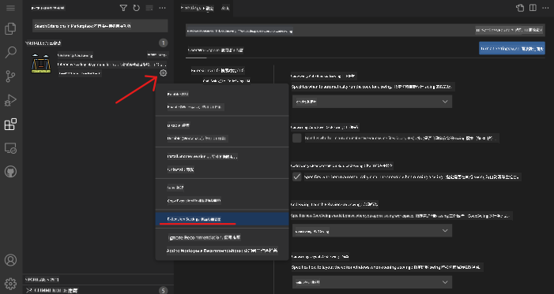

<!--
CO_OP_TRANSLATOR_METADATA:
{
  "original_hash": "7aa6e4f270d38d9cb17f2b5bd86b863d",
  "translation_date": "2025-08-25T23:16:37+00:00",
  "source_file": "8-code-editor/1-using-a-code-editor/README.md",
  "language_code": "mo"
}
-->
# 使用程式碼編輯器

本課程介紹如何使用 [VSCode.dev](https://vscode.dev)，一個基於網頁的程式碼編輯器，讓你可以在不需要安裝任何軟體的情況下，修改程式碼並參與專案。

## 學習目標

在這節課中，你將學會：

- 在程式碼專案中使用程式碼編輯器
- 使用版本控制來追蹤變更
- 自訂編輯器以適應開發需求

### 先決條件

在開始之前，你需要擁有一個 [GitHub](https://github.com) 帳戶。如果還沒有帳戶，請前往 [GitHub](https://github.com/) 註冊。

### 簡介

程式碼編輯器是撰寫程式和協作處理現有程式碼專案的重要工具。一旦你掌握了編輯器的基本操作及其功能，就能將這些技能應用到程式碼撰寫中。

## 開始使用 VSCode.dev

[VSCode.dev](https://vscode.dev) 是一個基於網頁的程式碼編輯器。你不需要安裝任何軟體，只需像打開其他網站一樣打開它即可。要開始使用，請打開以下連結：[https://vscode.dev](https://vscode.dev)。如果你尚未登入 [GitHub](https://github.com/)，請按照提示登入或創建新帳戶後再登入。

載入後，畫面應該類似於以下圖片：



畫面主要分為三個部分，從左到右依次為：

1. **活動欄**，包含一些圖示，例如放大鏡 🔎、齒輪 ⚙️ 等。
2. 展開的活動欄，預設為 **檔案總管**，稱為 **側邊欄**。
3. 最右側的程式碼區域。

點擊每個圖示以顯示不同的選單。完成後，點擊 **檔案總管** 回到初始畫面。

當你開始撰寫程式碼或修改現有程式碼時，這些操作都會在右側最大的區域進行。接下來，你將學習如何在這裡查看現有程式碼。

## 開啟 GitHub 儲存庫

首先，你需要開啟一個 GitHub 儲存庫。有多種方式可以開啟儲存庫，以下介紹兩種方法，讓你可以開始進行修改。

### 1. 使用編輯器

使用編輯器本身來開啟遠端儲存庫。進入 [VSCode.dev](https://vscode.dev)，你會看到一個 **"Open Remote Repository"** 按鈕：


你也可以使用指令面板。指令面板是一個輸入框，你可以輸入任何指令或操作的關鍵字來找到相應的指令。點擊左上角的選單，選擇 **檢視**，然後選擇 **指令面板**，或者使用以下快捷鍵：Ctrl-Shift-P（MacOS 上為 Command-Shift-P）。


選單打開後，輸入 **open remote repository**，然後選擇第一個選項。你參與的儲存庫或最近開啟的儲存庫會顯示出來。你也可以使用完整的 GitHub URL 來選擇儲存庫。將以下 URL 貼入輸入框：

```
https://github.com/microsoft/Web-Dev-For-Beginners
```

✅ 如果成功，你會看到該儲存庫的所有檔案載入到文字編輯器中。

### 2. 使用 URL

你也可以直接使用 URL 來載入儲存庫。例如，目前儲存庫的完整 URL 是 [https://github.com/microsoft/Web-Dev-For-Beginners](https://github.com/microsoft/Web-Dev-For-Beginners)，但你可以將 GitHub 網域替換為 `VSCode.dev/github`，直接載入儲存庫。結果 URL 為 [https://vscode.dev/github/microsoft/Web-Dev-For-Beginners](https://vscode.dev/github/microsoft/Web-Dev-For-Beginners)。

## 編輯檔案

當你在瀏覽器或 vscode.dev 中開啟儲存庫後，下一步就是對專案進行更新或修改。

### 1. 建立新檔案

你可以選擇在現有資料夾中建立檔案，或者直接在根目錄/資料夾中建立。要建立新檔案，打開你希望儲存檔案的位置/目錄，然後選擇 **"New file ..."** 圖示，為檔案命名並按下 Enter。


### 2. 編輯並儲存儲存庫中的檔案

使用 vscode.dev 非常方便，特別是當你想快速更新專案而不需要在本地安裝任何軟體時。

要更新程式碼，點擊活動欄上的 **檔案總管** 圖示，查看儲存庫中的檔案和資料夾。選擇一個檔案以在程式碼區域中打開，進行修改並儲存。


完成專案更新後，選擇 **`原始碼控制`** 圖示，這裡會顯示你對儲存庫所做的所有變更。

要查看你對專案的變更，選擇展開的活動欄中 **`變更`** 資料夾中的檔案。這將打開一個 **工作樹**，讓你直觀地查看檔案的變更。紅色表示刪除的內容，綠色表示新增的內容。


如果你對所做的變更感到滿意，將滑鼠移到 **`變更`** 資料夾上，點擊 `+` 按鈕以暫存變更。暫存的意思是準備將變更提交到 GitHub。

如果你對某些變更不滿意，想要捨棄它們，將滑鼠移到 **`變更`** 資料夾上，選擇 `撤銷` 圖示。

接著，輸入一個 **提交訊息**（描述你對專案所做的變更），點擊 `勾選圖示` 提交並推送你的變更。

完成專案工作後，選擇左上角的 **漢堡選單圖示** 返回 github.com 上的儲存庫。


## 使用擴充功能

在 VSCode 中安裝擴充功能可以為你的編輯器新增功能，並自訂開發環境選項，以改善開發工作流程。這些擴充功能還能幫助你支援多種程式語言，通常分為通用擴充功能或語言專用擴充功能。

要瀏覽所有可用的擴充功能列表，點擊活動欄上的 **`擴充功能圖示`**，然後在標有 **"Search Extensions in Marketplace"** 的文字框中輸入擴充功能的名稱。
你會看到一個擴充功能列表，每個項目包含 **擴充功能名稱、發佈者名稱、一句話描述、下載次數** 和 **星級評分**。



你還可以通過展開以下資料夾來查看擴充功能：
- **已安裝資料夾**：查看所有已安裝的擴充功能。
- **熱門資料夾**：查看大多數開發者使用的熱門擴充功能。
- **推薦資料夾**：根據相同工作區的使用者或你最近打開的檔案推薦的擴充功能。



### 1. 安裝擴充功能

要安裝擴充功能，在搜尋框中輸入擴充功能的名稱，當它出現在展開的活動欄中時，點擊它以查看更多資訊。

你可以點擊展開活動欄中的 **藍色安裝按鈕** 安裝，或者在選擇擴充功能後，使用程式碼區域中顯示的安裝按鈕。


### 2. 自訂擴充功能

安裝擴充功能後，你可能需要根據自己的偏好修改其行為並進行自訂。要執行此操作，選擇擴充功能圖示，然後在 **已安裝資料夾** 中找到你的擴充功能，點擊 **齒輪圖示** 並導航到 **擴充功能設定**。



### 3. 管理擴充功能

安裝並使用擴充功能後，vscode.dev 提供了多種選項來根據不同需求管理擴充功能。例如，你可以選擇：

- **停用**：當你暫時不需要某個擴充功能，但又不想完全卸載它時，可以選擇停用。

    選擇展開活動欄中的已安裝擴充功能 > 點擊齒輪圖示 > 選擇 **停用** 或 **停用（工作區）** **或者** 打開程式碼區域中的擴充功能，點擊藍色停用按鈕。

- **卸載**：選擇展開活動欄中的已安裝擴充功能 > 點擊齒輪圖示 > 選擇 **卸載** **或者** 打開程式碼區域中的擴充功能，點擊藍色卸載按鈕。

---

## 作業

[使用 vscode.dev 建立一個履歷網站](https://github.com/microsoft/Web-Dev-For-Beginners/blob/main/8-code-editor/1-using-a-code-editor/assignment.md)

## 複習與自學

閱讀更多關於 [VSCode.dev](https://code.visualstudio.com/docs/editor/vscode-web?WT.mc_id=academic-0000-alfredodeza) 的內容及其其他功能。

**免責聲明**：  
本文檔使用 AI 翻譯服務 [Co-op Translator](https://github.com/Azure/co-op-translator) 進行翻譯。儘管我們努力確保準確性，但請注意，自動翻譯可能包含錯誤或不準確之處。原始語言的文件應被視為權威來源。對於關鍵信息，建議使用專業人工翻譯。我們對因使用此翻譯而引起的任何誤解或錯誤解釋不承擔責任。