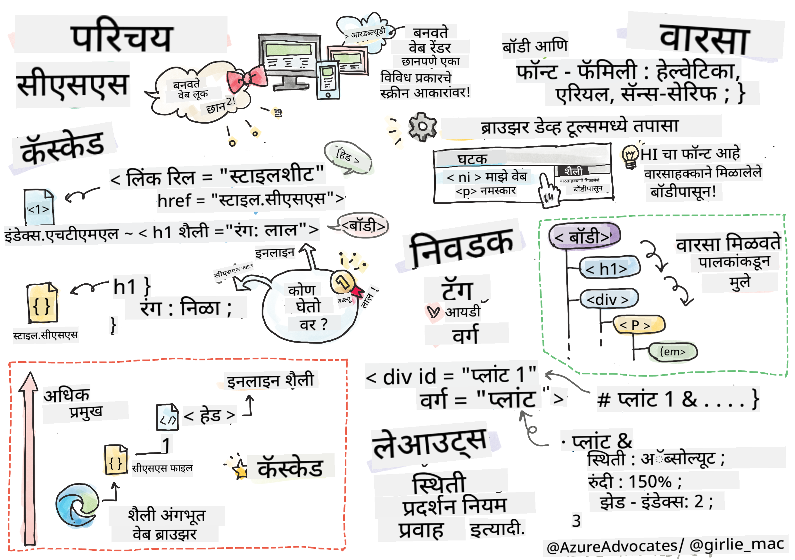
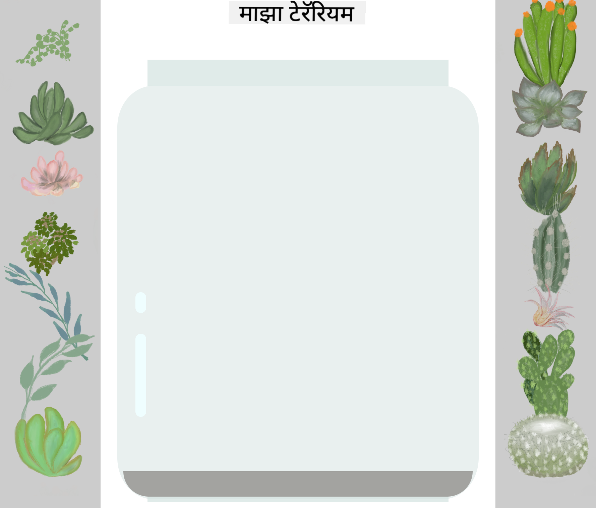

<!--
CO_OP_TRANSLATOR_METADATA:
{
  "original_hash": "e375c2aeb94e2407f2667633d39580bd",
  "translation_date": "2025-08-25T21:25:37+00:00",
  "source_file": "3-terrarium/2-intro-to-css/README.md",
  "language_code": "mr"
}
-->
# टेरॅरियम प्रकल्प भाग 2: CSS ची ओळख


> स्केच नोट [Tomomi Imura](https://twitter.com/girlie_mac) यांच्याकडून

## पूर्व-व्याख्यान प्रश्नमंजुषा

[पूर्व-व्याख्यान प्रश्नमंजुषा](https://ashy-river-0debb7803.1.azurestaticapps.net/quiz/17)

### परिचय

CSS, म्हणजेच Cascading Style Sheets, वेब विकासातील एक महत्त्वाचा प्रश्न सोडवते: तुमची वेबसाइट आकर्षक कशी दिसेल. तुमच्या अ‍ॅप्सला स्टाइलिंग केल्याने ते अधिक वापरण्यास सुलभ आणि आकर्षक बनते; तुम्ही CSS चा वापर करून Responsive Web Design (RWD) देखील तयार करू शकता - ज्यामुळे तुमचे अ‍ॅप्स कोणत्याही स्क्रीन आकारावर चांगले दिसतील. CSS फक्त तुमच्या अ‍ॅपला आकर्षक बनवण्यापुरते मर्यादित नाही; त्याच्या स्पेसिफिकेशनमध्ये अ‍ॅनिमेशन आणि ट्रान्सफॉर्म्स समाविष्ट आहेत जे तुमच्या अ‍ॅप्ससाठी प्रगत संवाद सक्षम करू शकतात. CSS Working Group सध्याच्या CSS स्पेसिफिकेशन्सचे देखरेख करते; तुम्ही त्यांचे काम [World Wide Web Consortium च्या साइटवर](https://www.w3.org/Style/CSS/members) पाहू शकता.

> लक्षात ठेवा, CSS ही एक भाषा आहे जी वेबवरील इतर गोष्टींसारखी विकसित होते आणि सर्व ब्राउझर नवीन स्पेसिफिकेशनचे समर्थन करत नाहीत. [CanIUse.com](https://caniuse.com) चा सल्ला घेऊन तुमच्या अंमलबजावणीची नेहमीच पडताळणी करा.

या धड्यात, आपण आपल्या ऑनलाइन टेरॅरियमला स्टाइल देणार आहोत आणि CSS चे काही संकल्पना अधिक जाणून घेणार आहोत: कॅस्केड, वारसा, आणि सिलेक्टर्स, पोझिशनिंग, आणि CSS चा वापर करून लेआउट तयार करणे. या प्रक्रियेत आपण टेरॅरियमचे लेआउट तयार करू आणि प्रत्यक्ष टेरॅरियम तयार करू.

### पूर्वतयारी

तुमच्याकडे टेरॅरियमसाठी HTML तयार असणे आवश्यक आहे, जे स्टाइल करण्यासाठी तयार आहे.

> व्हिडिओ पहा

> 
> [](https://www.youtube.com/watch?v=6yIdOIV9p1I)

### कार्य

तुमच्या टेरॅरियम फोल्डरमध्ये, `style.css` नावाची नवीन फाइल तयार करा. ती फाइल `<head>` विभागात इम्पोर्ट करा:

```html
<link rel="stylesheet" href="./style.css" />
```

---

## कॅस्केड

Cascading Style Sheets मध्ये 'कॅस्केड' ही कल्पना समाविष्ट आहे ज्यामुळे स्टाइल्सचा वापर त्याच्या प्राधान्याने मार्गदर्शित केला जातो. वेबसाइट लेखकाने सेट केलेल्या स्टाइल्स ब्राउझरने सेट केलेल्या स्टाइल्सपेक्षा प्राधान्य घेतात. 'इनलाइन' सेट केलेल्या स्टाइल्स बाह्य स्टाइल शीटमध्ये सेट केलेल्या स्टाइल्सपेक्षा प्राधान्य घेतात.

### कार्य

तुमच्या `<h1>` टॅगमध्ये "color: red" इनलाइन स्टाइल जोडा:

```HTML
<h1 style="color: red">My Terrarium</h1>
```

त्यानंतर, तुमच्या `style.css` फाइलमध्ये खालील कोड जोडा:

```CSS
h1 {
 color: blue;
}
```

✅ तुमच्या वेब अ‍ॅपमध्ये कोणता रंग दिसतो? का? तुम्ही स्टाइल्स ओव्हरराइड करण्याचा मार्ग शोधू शकता का? तुम्ही हे कधी कराल, किंवा का नाही?

---

## वारसा (Inheritance)

स्टाइल्स एका पूर्वजाच्या स्टाइल्सकडून वंशजाकडे वारसा म्हणून जातात, ज्यामुळे नेस्टेड घटक त्यांच्या पालकांच्या स्टाइल्सचा वारसा घेतात.

### कार्य

बॉडीचा फॉन्ट एका दिलेल्या फॉन्टवर सेट करा आणि नेस्टेड घटकाचा फॉन्ट तपासा:

```CSS
body {
	font-family: helvetica, arial, sans-serif;
}
```

तुमच्या ब्राउझरच्या कन्सोलमध्ये 'Elements' टॅब उघडा आणि H1 चा फॉन्ट निरीक्षण करा. तो बॉडीकडून त्याचा फॉन्ट वारसा म्हणून घेतो, ब्राउझरमध्ये नमूद केल्याप्रमाणे:


✅ तुम्ही नेस्टेड स्टाइलला वेगळी प्रॉपर्टी वारसा म्हणून देऊ शकता का?

---

## CSS सिलेक्टर्स

### टॅग्स

आतापर्यंत, तुमच्या `style.css` फाइलमध्ये फक्त काही टॅग्स स्टाइल केले आहेत, आणि अ‍ॅप विचित्र दिसत आहे:

```CSS
body {
	font-family: helvetica, arial, sans-serif;
}

h1 {
	color: #3a241d;
	text-align: center;
}
```

टॅगला स्टाइल करण्याचा हा मार्ग तुम्हाला अद्वितीय घटकांवर नियंत्रण देतो, परंतु तुम्हाला तुमच्या टेरॅरियममधील अनेक वनस्पतींच्या स्टाइल्सवर नियंत्रण ठेवण्याची आवश्यकता आहे. असे करण्यासाठी, तुम्हाला CSS सिलेक्टर्सचा उपयोग करावा लागेल.

### Ids

डाव्या आणि उजव्या कंटेनर्सचे लेआउट स्टाइल करा. कारण मार्कअपमध्ये फक्त एक डावा कंटेनर आणि एक उजवा कंटेनर आहे, त्यांना Ids दिले जातात. त्यांना स्टाइल करण्यासाठी, `#` वापरा:

```CSS
#left-container {
	background-color: #eee;
	width: 15%;
	left: 0px;
	top: 0px;
	position: absolute;
	height: 100%;
	padding: 10px;
}

#right-container {
	background-color: #eee;
	width: 15%;
	right: 0px;
	top: 0px;
	position: absolute;
	height: 100%;
	padding: 10px;
}
```

येथे, तुम्ही या कंटेनर्सना स्क्रीनच्या अगदी डाव्या आणि उजव्या बाजूला ठेवण्यासाठी absolute positioning वापरली आहे आणि त्यांची रुंदी टक्केवारीने सेट केली आहे जेणेकरून ते लहान मोबाइल स्क्रीनसाठी स्केल होऊ शकतील.

✅ हा कोड बराच पुनरावृत्त आहे, त्यामुळे तो "DRY" (Don't Repeat Yourself) नाही; तुम्ही Ids स्टाइल करण्याचा चांगला मार्ग शोधू शकता का, कदाचित Id आणि Class चा वापर करून? तुम्हाला मार्कअप बदलणे आणि CSS पुन्हा तयार करणे आवश्यक असेल:

```html
<div id="left-container" class="container"></div>
```

### Classes

वरील उदाहरणात, तुम्ही स्क्रीनवरील दोन अद्वितीय घटकांना स्टाइल दिली. जर तुम्हाला स्क्रीनवरील अनेक घटकांना स्टाइल लागू करायची असेल, तर तुम्ही CSS Classes वापरू शकता. डाव्या आणि उजव्या कंटेनर्समधील वनस्पतींचे लेआउट तयार करण्यासाठी असे करा.

लक्षात घ्या की HTML मार्कअपमधील प्रत्येक वनस्पतीला Ids आणि Classes चा एकत्रित वापर आहे. Ids येथे तुम्ही नंतर जोडणार असलेल्या JavaScript द्वारे टेरॅरियम वनस्पतींच्या प्लेसमेंटमध्ये फेरफार करण्यासाठी वापरले जातात. Classes, मात्र, सर्व वनस्पतींना दिलेली एक विशिष्ट स्टाइल देतात.

```html
<div class="plant-holder">
	
</div>
```

तुमच्या `style.css` फाइलमध्ये खालील कोड जोडा:

```CSS
.plant-holder {
	position: relative;
	height: 13%;
	left: -10px;
}

.plant {
	position: absolute;
	max-width: 150%;
	max-height: 150%;
	z-index: 2;
}
```

या स्निपेटमध्ये relative आणि absolute positioning चा मिश्रण उल्लेखनीय आहे, ज्याबद्दल आपण पुढील विभागात चर्चा करू. उंची टक्केवारीने हाताळण्याचा मार्ग पाहा:

तुम्ही वनस्पती धारकाची उंची 13% वर सेट केली आहे, एक चांगली संख्या जी सुनिश्चित करते की सर्व वनस्पती प्रत्येक vertical container मध्ये स्क्रोलिंगची आवश्यकता न पडता प्रदर्शित होतात.

तुम्ही वनस्पती धारकाला डावीकडे हलवले आहे जेणेकरून वनस्पती त्यांच्या कंटेनरमध्ये अधिक केंद्रित दिसतील. प्रतिमांमध्ये मोठ्या प्रमाणात पारदर्शक पार्श्वभूमी आहे ज्यामुळे त्या अधिक ड्रॅग करण्यायोग्य बनतात, त्यामुळे स्क्रीनवर चांगले बसण्यासाठी त्यांना डावीकडे हलवण्याची आवश्यकता आहे.

त्यानंतर, वनस्पतीला 150% ची max-width दिली आहे. यामुळे ब्राउझर स्केल डाउन झाल्यामुळे ते कमी होऊ शकते. तुमचा ब्राउझर रिसाइज करून पहा; वनस्पती त्यांच्या कंटेनर्समध्ये राहतात पण फिट होण्यासाठी कमी होतात.

तसेच उल्लेखनीय म्हणजे z-index चा वापर, जो घटकाची सापेक्ष उंची नियंत्रित करतो (जेणेकरून वनस्पती कंटेनरच्या वर बसतात आणि टेरॅरियममध्ये बसल्यासारखे दिसतात).

✅ तुम्हाला वनस्पती धारक आणि वनस्पती CSS सिलेक्टर दोन्ही का आवश्यक आहेत?

## CSS पोझिशनिंग

पोझिशन प्रॉपर्टीज (static, relative, fixed, absolute, आणि sticky positions) मिक्स करणे थोडे कठीण असू शकते, परंतु योग्य प्रकारे केल्यास ते तुमच्या पृष्ठांवरील घटकांवर चांगले नियंत्रण देते.

Absolute पोझिशन केलेले घटक त्यांच्या जवळच्या पोझिशन केलेल्या पूर्वजांच्या संदर्भात पोझिशन केले जातात, आणि जर असे पूर्वज नसतील, तर ते डॉक्युमेंट बॉडीच्या संदर्भात पोझिशन केले जातात.

Relative पोझिशन केलेले घटक CSS च्या निर्देशांनुसार त्यांच्या सुरुवातीच्या पोझिशनपासून दूर ठेवले जातात.

आमच्या नमुन्यात, `plant-holder` हा एक relative-positioned घटक आहे जो absolute-positioned कंटेनरमध्ये पोझिशन केलेला आहे. परिणामी वर्तन असे आहे की साइड बार कंटेनर्स डावीकडे आणि उजवीकडे पिन केले जातात, आणि plant-holder नेस्टेड असतो, साइड बारमध्ये स्वतःला समायोजित करतो, वनस्पती vertical row मध्ये ठेवण्यासाठी जागा देतो.

> `plant` स्वतः absolute positioning आहे, जे त्याला ड्रॅग करण्यायोग्य बनवण्यासाठी आवश्यक आहे, जसे तुम्ही पुढील धड्यात शोधाल.

✅ साइड कंटेनर्स आणि plant-holder च्या पोझिशनिंग प्रकार स्विच करून प्रयोग करा. काय होते?

## CSS लेआउट्स

आता तुम्ही जे शिकलात त्याचा वापर करून CSS चा वापर करून टेरॅरियम स्वतः तयार कराल!

प्रथम, `.terrarium` div च्या मुलांना CSS चा वापर करून गोलसर आयत म्हणून स्टाइल करा:

```CSS
.jar-walls {
	height: 80%;
	width: 60%;
	background: #d1e1df;
	border-radius: 1rem;
	position: absolute;
	bottom: 0.5%;
	left: 20%;
	opacity: 0.5;
	z-index: 1;
}

.jar-top {
	width: 50%;
	height: 5%;
	background: #d1e1df;
	position: absolute;
	bottom: 80.5%;
	left: 25%;
	opacity: 0.7;
	z-index: 1;
}

.jar-bottom {
	width: 50%;
	height: 1%;
	background: #d1e1df;
	position: absolute;
	bottom: 0%;
	left: 25%;
	opacity: 0.7;
}

.dirt {
	width: 60%;
	height: 5%;
	background: #3a241d;
	position: absolute;
	border-radius: 0 0 1rem 1rem;
	bottom: 1%;
	left: 20%;
	opacity: 0.7;
	z-index: -1;
}
```

येथे टक्केवारीचा वापर लक्षात घ्या. जर तुम्ही तुमचा ब्राउझर कमी केला, तर तुम्ही पाहू शकता की जार देखील कसा स्केल होतो. तसेच जार घटकांसाठी रुंदी आणि उंची टक्केवारी आणि प्रत्येक घटक कसे केंद्रात, viewport च्या तळाशी पिन केलेले आहे ते लक्षात घ्या.

आम्ही `rem` चा वापर border-radius साठी करत आहोत, जो फॉन्ट-सापेक्ष लांबी आहे. या प्रकारच्या सापेक्ष मोजमापाबद्दल अधिक वाचा [CSS spec](https://www.w3.org/TR/css-values-3/#font-relative-lengths) मध्ये.

✅ जारचे रंग आणि अपारदर्शकता बदलून पहा आणि मातीचे रंग बदलून पहा. काय होते? का?

---

## 🚀चॅलेंज

जारला अधिक काचेसारखे दिसण्यासाठी त्याच्या डाव्या तळाच्या भागात 'बबल' चमक जोडा. तुम्ही `.jar-glossy-long` आणि `.jar-glossy-short` ला परावर्तित चमकासारखे दिसण्यासाठी स्टाइल कराल. हे असे दिसेल:



पोस्ट-व्याख्यान प्रश्नमंजुषा पूर्ण करण्यासाठी, हा Learn मॉड्यूल पहा: [Style your HTML app with CSS](https://docs.microsoft.com/learn/modules/build-simple-website/4-css-basics/?WT.mc_id=academic-77807-sagibbon)

## पोस्ट-व्याख्यान प्रश्नमंजुषा

[पोस्ट-व्याख्यान प्रश्नमंजुषा](https://ashy-river-0debb7803.1.azurestaticapps.net/quiz/18)

## पुनरावलोकन आणि स्व-अभ्यास

CSS वरवर सोपे वाटते, परंतु सर्व ब्राउझर आणि सर्व स्क्रीन आकारांसाठी अ‍ॅप परिपूर्णपणे स्टाइल करण्याचा प्रयत्न करताना अनेक आव्हाने येतात. CSS-Grid आणि Flexbox ही साधने विकसित केली गेली आहेत ज्यामुळे काम थोडे संरचित आणि अधिक विश्वासार्ह बनते. [Flexbox Froggy](https://flexboxfroggy.com/) आणि [Grid Garden](https://codepip.com/games/grid-garden/) खेळून या साधनांबद्दल जाणून घ्या.

## असाइनमेंट

[CSS Refactoring](assignment.md)

**अस्वीकरण**:  
हा दस्तऐवज AI भाषांतर सेवा [Co-op Translator](https://github.com/Azure/co-op-translator) चा वापर करून भाषांतरित करण्यात आला आहे. आम्ही अचूकतेसाठी प्रयत्नशील असलो तरी, कृपया लक्षात घ्या की स्वयंचलित भाषांतरांमध्ये त्रुटी किंवा अचूकतेचा अभाव असू शकतो. मूळ भाषेतील मूळ दस्तऐवज हा अधिकृत स्रोत मानला जावा. महत्त्वाच्या माहितीसाठी, व्यावसायिक मानवी भाषांतराची शिफारस केली जाते. या भाषांतराचा वापर केल्यामुळे उद्भवणाऱ्या कोणत्याही गैरसमज किंवा चुकीच्या अर्थासाठी आम्ही जबाबदार राहणार नाही.