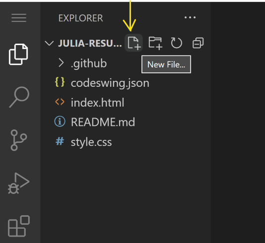
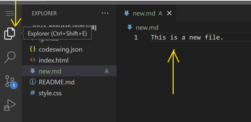

<!--
CO_OP_TRANSLATOR_METADATA:
{
  "original_hash": "7aa6e4f270d38d9cb17f2b5bd86b863d",
  "translation_date": "2025-08-24T13:03:50+00:00",
  "source_file": "8-code-editor/1-using-a-code-editor/README.md",
  "language_code": "pl"
}
-->
# Korzystanie z edytora kodu

Ta lekcja obejmuje podstawy korzystania z [VSCode.dev](https://vscode.dev), internetowego edytora kodu, dzięki któremu możesz wprowadzać zmiany w swoim kodzie i współpracować nad projektem bez konieczności instalowania czegokolwiek na swoim komputerze.

## Cele nauki

W tej lekcji nauczysz się:

- Jak korzystać z edytora kodu w projekcie programistycznym
- Jak śledzić zmiany za pomocą systemu kontroli wersji
- Jak dostosować edytor do swoich potrzeb programistycznych

### Wymagania wstępne

Zanim zaczniesz, musisz założyć konto na [GitHub](https://github.com). Przejdź na stronę [GitHub](https://github.com/) i załóż konto, jeśli jeszcze go nie masz.

### Wprowadzenie

Edytor kodu to kluczowe narzędzie do pisania programów i współpracy nad istniejącymi projektami programistycznymi. Gdy zrozumiesz podstawy korzystania z edytora i jego funkcji, będziesz mógł zastosować tę wiedzę podczas pisania kodu.

## Pierwsze kroki z VSCode.dev

[VSCode.dev](https://vscode.dev) to edytor kodu dostępny w przeglądarce. Nie musisz niczego instalować, wystarczy otworzyć go jak każdą inną stronę internetową. Aby rozpocząć, otwórz link: [https://vscode.dev](https://vscode.dev). Jeśli nie jesteś zalogowany na [GitHub](https://github.com/), postępuj zgodnie z instrukcjami, aby się zalogować lub założyć nowe konto, a następnie zaloguj się.

Po załadowaniu edytora powinien wyglądać podobnie do tego obrazu:


Są trzy główne sekcje, zaczynając od lewej strony:

1. _Pasek aktywności_, który zawiera ikony, takie jak lupa 🔎, koło zębate ⚙️ i kilka innych
2. Rozwinięty pasek aktywności, który domyślnie pokazuje _Eksplorator_, zwany _paskiem bocznym_
3. Obszar kodu po prawej stronie

Kliknij każdą z ikon, aby wyświetlić różne menu. Po zakończeniu kliknij _Eksplorator_, aby wrócić do punktu wyjścia.

Podczas tworzenia lub modyfikowania kodu będziesz pracować w największym obszarze po prawej stronie. W tym obszarze możesz również przeglądać istniejący kod, co zrobisz w następnej kolejności.

## Otwieranie repozytorium GitHub

Pierwszym krokiem jest otwarcie repozytorium GitHub. Istnieje kilka sposobów na otwarcie repozytorium. W tej sekcji zobaczysz dwa różne sposoby, aby rozpocząć pracę nad zmianami.

### 1. Za pomocą edytora

Użyj samego edytora, aby otworzyć zdalne repozytorium. Jeśli przejdziesz na [VSCode.dev](https://vscode.dev), zobaczysz przycisk _"Open Remote Repository"_:


Możesz również skorzystać z palety poleceń. Paleta poleceń to pole tekstowe, w którym możesz wpisać dowolne słowo będące częścią polecenia lub akcji, aby znaleźć odpowiednie polecenie do wykonania. Użyj menu w lewym górnym rogu, wybierz _Widok_, a następnie _Paleta poleceń_, lub użyj skrótu klawiaturowego: Ctrl-Shift-P (na MacOS Command-Shift-P).


Po otwarciu menu wpisz _open remote repository_, a następnie wybierz pierwszą opcję. Pojawią się różne repozytoria, do których należysz lub które ostatnio otwierałeś. Możesz również użyć pełnego adresu URL GitHub, aby wybrać jedno z nich. Wklej poniższy URL do pola:

```
https://github.com/microsoft/Web-Dev-For-Beginners
```

✅ Jeśli wszystko się uda, zobaczysz wszystkie pliki tego repozytorium załadowane w edytorze tekstu.

### 2. Korzystając z URL

Możesz również użyć bezpośredniego adresu URL, aby załadować repozytorium. Na przykład pełny adres URL bieżącego repozytorium to [https://github.com/microsoft/Web-Dev-For-Beginners](https://github.com/microsoft/Web-Dev-For-Beginners), ale możesz zamienić domenę GitHub na `VSCode.dev/github`, aby załadować repozytorium bezpośrednio. Wynikowy URL to [https://vscode.dev/github/microsoft/Web-Dev-For-Beginners](https://vscode.dev/github/microsoft/Web-Dev-For-Beginners).

## Edytowanie plików

Po otwarciu repozytorium w przeglądarce/vscode.dev, następnym krokiem będzie wprowadzenie aktualizacji lub zmian w projekcie.

### 1. Tworzenie nowego pliku

Możesz utworzyć plik w istniejącym folderze lub w katalogu głównym. Aby utworzyć nowy plik, otwórz lokalizację/katalog, w którym chcesz zapisać plik, i wybierz ikonę _'New file ...'_ na pasku aktywności _(po lewej)_, nadaj mu nazwę i naciśnij Enter.



### 2. Edytowanie i zapisywanie pliku w repozytorium

Korzystanie z vscode.dev jest przydatne, gdy chcesz szybko zaktualizować swój projekt bez konieczności instalowania oprogramowania lokalnie. Aby zaktualizować kod, kliknij ikonę 'Eksplorator', również znajdującą się na pasku aktywności, aby wyświetlić pliki i foldery w repozytorium. Wybierz plik, aby otworzyć go w obszarze kodu, wprowadź zmiany i zapisz.



Po zakończeniu aktualizacji projektu wybierz ikonę _`source control`_, która zawiera wszystkie nowe zmiany wprowadzone w repozytorium.

Aby zobaczyć zmiany wprowadzone w projekcie, wybierz plik(i) w folderze `Changes` na rozwiniętym pasku aktywności. Otworzy się 'Working Tree', w którym wizualnie zobaczysz zmiany wprowadzone w pliku. Kolor czerwony oznacza usunięcie, a zielony dodanie.


Jeśli jesteś zadowolony ze zmian, które wprowadziłeś, najedź na folder `Changes` i kliknij przycisk `+`, aby przygotować zmiany do zatwierdzenia. Przygotowanie oznacza przygotowanie zmian do przesłania na GitHub.

Jeśli jednak nie jesteś zadowolony z niektórych zmian i chcesz je odrzucić, najedź na folder `Changes` i wybierz ikonę `cofnij`.

Następnie wpisz `commit message` _(opis wprowadzonych zmian w projekcie)_, kliknij ikonę `check`, aby zatwierdzić i przesłać zmiany.

Po zakończeniu pracy nad projektem wybierz ikonę `hamburger menu` w lewym górnym rogu, aby wrócić do repozytorium na github.com.


## Korzystanie z rozszerzeń

Instalowanie rozszerzeń w VSCode pozwala na dodanie nowych funkcji i dostosowanie środowiska programistycznego w edytorze, co poprawia efektywność pracy. Rozszerzenia te umożliwiają również obsługę wielu języków programowania i mogą być ogólne lub specyficzne dla danego języka.

Aby przeglądać listę dostępnych rozszerzeń, kliknij ikonę _`Extensions`_ na pasku aktywności i zacznij wpisywać nazwę rozszerzenia w polu tekstowym oznaczonym _'Search Extensions in Marketplace'_.
Zobaczysz listę rozszerzeń, z których każde zawiera **nazwę rozszerzenia, nazwę wydawcy, jednozdaniowy opis, liczbę pobrań** oraz **ocenę w gwiazdkach**.


Możesz również zobaczyć wszystkie wcześniej zainstalowane rozszerzenia, rozwijając folder _`Installed`_, popularne rozszerzenia używane przez większość programistów w folderze _`Popular`_ oraz rekomendowane rozszerzenia dla Ciebie w folderze _`Recommended`_.


### 1. Instalowanie rozszerzeń

Aby zainstalować rozszerzenie, wpisz jego nazwę w polu wyszukiwania i kliknij na nie, aby wyświetlić dodatkowe informacje w obszarze kodu. Możesz kliknąć _niebieski przycisk instalacji_ na rozwiniętym pasku aktywności lub użyć przycisku instalacji, który pojawia się w obszarze kodu po wybraniu rozszerzenia.


### 2. Dostosowywanie rozszerzeń

Po zainstalowaniu rozszerzenia możesz dostosować jego działanie do swoich preferencji. Aby to zrobić, wybierz ikonę Extensions, a następnie znajdź swoje rozszerzenie w folderze _Installed_, kliknij ikonę _**Gear**_ i przejdź do _Extensions Setting_.


### 3. Zarządzanie rozszerzeniami

Po zainstalowaniu i użyciu rozszerzenia vscode.dev oferuje opcje zarządzania nim w zależności od potrzeb. Na przykład możesz:

- **Wyłączyć:** _(Tymczasowo wyłącz rozszerzenie, gdy nie jest Ci potrzebne, ale nie chcesz go całkowicie odinstalować)_

    Wybierz zainstalowane rozszerzenie na rozwiniętym pasku aktywności > kliknij ikonę Gear > wybierz 'Disable' lub 'Disable (Workspace)' **LUB** Otwórz rozszerzenie w obszarze kodu i kliknij niebieski przycisk Disable.

- **Odinstalować:** Wybierz zainstalowane rozszerzenie na rozwiniętym pasku aktywności > kliknij ikonę Gear > wybierz 'Uninstall' **LUB** Otwórz rozszerzenie w obszarze kodu i kliknij niebieski przycisk Uninstall.

---

## Zadanie

[Stwórz stronę internetową CV za pomocą vscode.dev](https://github.com/microsoft/Web-Dev-For-Beginners/blob/main/8-code-editor/1-using-a-code-editor/assignment.md)

## Przegląd i samodzielna nauka

Przeczytaj więcej o [VSCode.dev](https://code.visualstudio.com/docs/editor/vscode-web?WT.mc_id=academic-0000-alfredodeza) i jego innych funkcjach.

**Zastrzeżenie**:  
Ten dokument został przetłumaczony za pomocą usługi tłumaczenia AI [Co-op Translator](https://github.com/Azure/co-op-translator). Chociaż staramy się zapewnić dokładność, prosimy pamiętać, że automatyczne tłumaczenia mogą zawierać błędy lub nieścisłości. Oryginalny dokument w jego rodzimym języku powinien być uznawany za autorytatywne źródło. W przypadku informacji krytycznych zaleca się skorzystanie z profesjonalnego tłumaczenia przez człowieka. Nie ponosimy odpowiedzialności za jakiekolwiek nieporozumienia lub błędne interpretacje wynikające z użycia tego tłumaczenia.