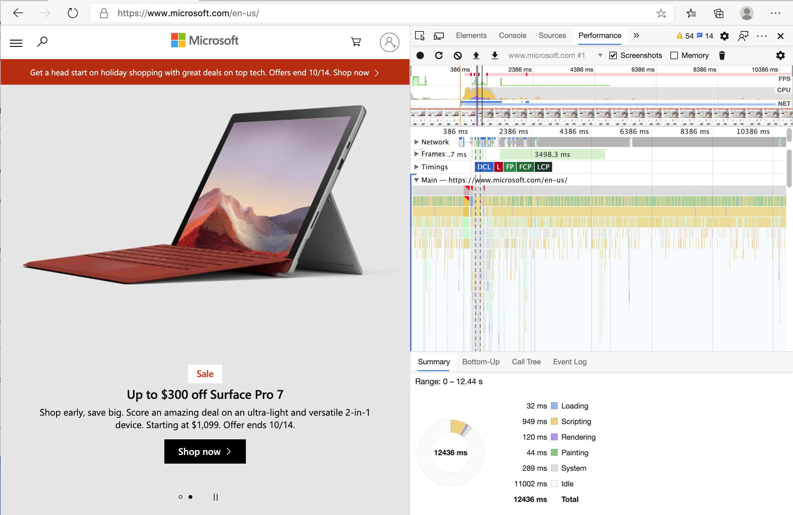

<!--
CO_OP_TRANSLATOR_METADATA:
{
  "original_hash": "f198c6b817b4b2a99749f4662e7cae98",
  "translation_date": "2025-08-23T23:45:46+00:00",
  "source_file": "5-browser-extension/3-background-tasks-and-performance/README.md",
  "language_code": "tw"
}
-->
# 瀏覽器擴充功能專案第三部分：了解背景任務與效能

## 課前測驗

[課前測驗](https://ashy-river-0debb7803.1.azurestaticapps.net/quiz/27)

### 簡介

在本模組的前兩節課中，你學習了如何建立一個表單以及顯示從 API 獲取的資料區域。這是一種非常標準的方式來建立網頁。你甚至學會了如何處理非同步資料獲取。你的瀏覽器擴充功能幾乎已經完成。

接下來需要管理一些背景任務，包括刷新擴充功能圖示的顏色，因此這是一個很好的時機來討論瀏覽器如何管理這類任務。在建立網頁資產時，我們可以從效能的角度來思考這些瀏覽器任務。

## 網頁效能基礎

> 「網站效能主要關注兩件事：頁面載入速度，以及頁面上的程式碼執行速度。」-- [Zack Grossbart](https://www.smashingmagazine.com/2012/06/javascript-profiling-chrome-developer-tools/)

如何讓你的網站在各種裝置、各種使用者以及各種情境下都能快速運行是一個非常廣泛的主題。以下是一些在建立標準網頁專案或瀏覽器擴充功能時需要注意的要點。

確保網站高效運行的第一步是收集其效能的相關資料。第一個可以查看的地方是網頁瀏覽器的開發者工具。在 Edge 瀏覽器中，你可以點選「設定及更多」按鈕（瀏覽器右上角的三點圖示），然後導航到「更多工具 > 開發者工具」，並打開「效能」標籤。你也可以使用快捷鍵 `Ctrl` + `Shift` + `I`（Windows）或 `Option` + `Command` + `I`（Mac）來打開開發者工具。

「效能」標籤包含一個分析工具。打開一個網站（例如 [https://www.microsoft.com](https://www.microsoft.com/?WT.mc_id=academic-77807-sagibbon)），點擊「記錄」按鈕，然後刷新網站。隨時停止記錄，你就可以看到生成的例程，包括「腳本」、「渲染」和「繪製」網站的過程：



✅ 參考 [Microsoft 文件](https://docs.microsoft.com/microsoft-edge/devtools-guide/performance/?WT.mc_id=academic-77807-sagibbon) 了解 Edge 中的效能面板

> 提示：為了獲得網站啟動時間的準確讀數，請清除瀏覽器的快取

選擇分析時間軸的元素，放大頁面載入過程中的事件。

透過選擇分析時間軸的一部分並查看摘要面板，獲取頁面效能的快照：


檢查事件日誌面板，查看是否有任何事件超過 15 毫秒：


✅ 熟悉你的分析工具！打開本網站的開發者工具，看看是否有任何瓶頸。哪個資產載入最慢？哪個最快？

## 分析檢查

一般來說，所有網頁開發者在建立網站時都應注意一些「問題區域」，以避免在部署到生產環境時出現意外。

**資產大小**：近年來，網頁變得「更重」，因此速度也變慢了。其中一部分重量與圖片的使用有關。

✅ 查看 [Internet Archive](https://httparchive.org/reports/page-weight) 了解頁面重量的歷史視圖及更多資訊。

一個好的做法是確保圖片已經過優化，並以適合使用者的大小和解析度交付。

**DOM 遍歷**：瀏覽器需要根據你編寫的程式碼建立其文件物件模型（DOM），因此為了良好的頁面效能，應保持標籤的最小化，只使用和樣式化頁面所需的內容。例如，與頁面相關的多餘 CSS 可以進行優化；僅需在某一頁面使用的樣式不需要包含在主樣式表中。

**JavaScript**：每個 JavaScript 開發者都應注意「渲染阻塞」腳本，這些腳本必須在瀏覽器遍歷和繪製 DOM 之前載入。考慮在內嵌腳本中使用 `defer`（如在 Terrarium 模組中所示）。

✅ 在 [網站速度測試網站](https://www.webpagetest.org/) 上嘗試一些網站，了解用於判斷網站效能的常見檢查。

現在你已經了解瀏覽器如何渲染你提供的資產，接下來我們來看看完成擴充功能所需的最後幾個步驟：

### 建立計算顏色的函式

在 `/src/index.js` 中，於你設置的一系列 `const` 變數之後新增一個名為 `calculateColor()` 的函式，以便訪問 DOM：

```JavaScript
function calculateColor(value) {
	let co2Scale = [0, 150, 600, 750, 800];
	let colors = ['#2AA364', '#F5EB4D', '#9E4229', '#381D02', '#381D02'];

	let closestNum = co2Scale.sort((a, b) => {
		return Math.abs(a - value) - Math.abs(b - value);
	})[0];
	console.log(value + ' is closest to ' + closestNum);
	let num = (element) => element > closestNum;
	let scaleIndex = co2Scale.findIndex(num);

	let closestColor = colors[scaleIndex];
	console.log(scaleIndex, closestColor);

	chrome.runtime.sendMessage({ action: 'updateIcon', value: { color: closestColor } });
}
```

這裡發生了什麼？你傳入一個值（碳強度），該值來自你在上一課完成的 API 呼叫，然後計算其值與顏色陣列中索引的接近程度。接著，你將最接近的顏色值傳送到 chrome runtime。

chrome.runtime 擁有 [一個 API](https://developer.chrome.com/extensions/runtime)，可以處理各種背景任務，而你的擴充功能正在利用它：

> 「使用 chrome.runtime API 來檢索背景頁面、返回清單的詳細資訊，並監聽和回應應用程式或擴充功能生命週期中的事件。你也可以使用此 API 將 URL 的相對路徑轉換為完全限定的 URL。」

✅ 如果你正在為 Edge 開發此瀏覽器擴充功能，可能會驚訝於你正在使用 chrome API。新版 Edge 瀏覽器基於 Chromium 瀏覽器引擎，因此你可以利用這些工具。

> 注意，如果你想分析瀏覽器擴充功能，請從擴充功能本身內部啟動開發者工具，因為它是獨立的瀏覽器實例。

### 設置預設圖示顏色

現在，在 `init()` 函式中，透過再次調用 chrome 的 `updateIcon` 操作，將圖示設置為預設的綠色：

```JavaScript
chrome.runtime.sendMessage({
	action: 'updateIcon',
		value: {
			color: 'green',
		},
});
```

### 呼叫函式並執行呼叫

接下來，透過將其新增到 C02Signal API 返回的 promise 中，呼叫你剛剛建立的函式：

```JavaScript
//let CO2...
calculateColor(CO2);
```

最後，在 `/dist/background.js` 中，新增監聽器以處理這些背景操作呼叫：

```JavaScript
chrome.runtime.onMessage.addListener(function (msg, sender, sendResponse) {
	if (msg.action === 'updateIcon') {
		chrome.browserAction.setIcon({ imageData: drawIcon(msg.value) });
	}
});
//borrowed from energy lollipop extension, nice feature!
function drawIcon(value) {
	let canvas = document.createElement('canvas');
	let context = canvas.getContext('2d');

	context.beginPath();
	context.fillStyle = value.color;
	context.arc(100, 100, 50, 0, 2 * Math.PI);
	context.fill();

	return context.getImageData(50, 50, 100, 100);
}
```

在這段程式碼中，你新增了一個監聽器，用於接收發送到後端任務管理器的任何訊息。如果訊息名稱為 'updateIcon'，則執行接下來的程式碼，使用 Canvas API 繪製適當顏色的圖示。

✅ 你將在 [太空遊戲課程](../../6-space-game/2-drawing-to-canvas/README.md) 中學到更多關於 Canvas API 的知識。

現在，重新建置你的擴充功能（`npm run build`），刷新並啟動你的擴充功能，觀察顏色變化。是時候去跑腿或洗碗了嗎？現在你知道了！

恭喜你！你已經建立了一個實用的瀏覽器擴充功能，並且更深入了解瀏覽器的運作方式以及如何分析其效能。

---

## 🚀 挑戰

調查一些已存在很久的開源網站，根據其 GitHub 歷史，看看是否能判斷它們在效能方面的優化過程。如果有的話，最常見的痛點是什麼？

## 課後測驗

[課後測驗](https://ashy-river-0debb7803.1.azurestaticapps.net/quiz/28)

## 回顧與自學

考慮訂閱 [效能電子報](https://perf.email/)

調查瀏覽器透過其網頁工具中的效能標籤來衡量網頁效能的方式。你是否發現任何主要差異？

## 作業

[分析網站效能](assignment.md)

**免責聲明**：  
本文件使用 AI 翻譯服務 [Co-op Translator](https://github.com/Azure/co-op-translator) 進行翻譯。儘管我們努力確保翻譯的準確性，但請注意，自動翻譯可能包含錯誤或不準確之處。原始文件的母語版本應被視為權威來源。對於關鍵資訊，建議使用專業人工翻譯。我們對因使用此翻譯而引起的任何誤解或錯誤解釋不承擔責任。