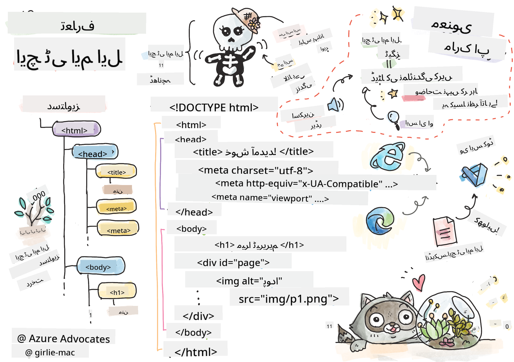
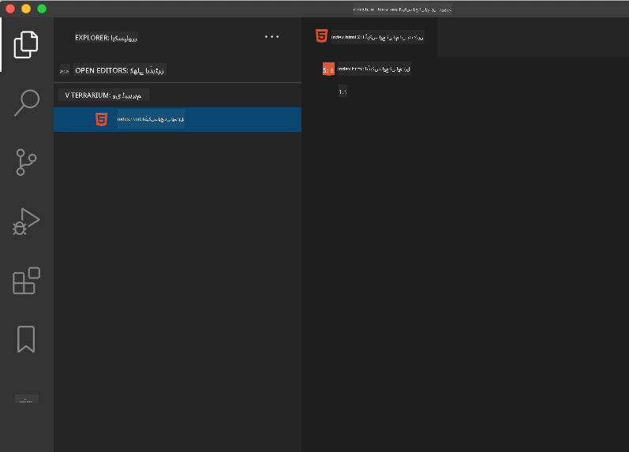

<!--
CO_OP_TRANSLATOR_METADATA:
{
  "original_hash": "46a0639e719b9cf1dfd062aa24cad639",
  "translation_date": "2025-08-25T21:06:32+00:00",
  "source_file": "3-terrarium/1-intro-to-html/README.md",
  "language_code": "ur"
}
-->
# ٹیرآریم پروجیکٹ حصہ 1: HTML کا تعارف

  
> اسکیچ نوٹ از [ٹومومی ایمورا](https://twitter.com/girlie_mac)

## لیکچر سے پہلے کا کوئز

[لیکچر سے پہلے کا کوئز](https://ashy-river-0debb7803.1.azurestaticapps.net/quiz/15)

> ویڈیو دیکھیں

> 
> [](https://www.youtube.com/watch?v=1TvxJKBzhyQ)

### تعارف

HTML، یا ہائپر ٹیکسٹ مارک اپ لینگویج، ویب کا 'ڈھانچہ' ہے۔ اگر CSS آپ کے HTML کو 'سجانے' کا کام کرتی ہے اور جاوا اسکرپٹ اسے زندگی بخشتی ہے، تو HTML آپ کی ویب ایپلیکیشن کا جسم ہے۔ HTML کی نحو (syntax) بھی اس خیال کی عکاسی کرتی ہے، کیونکہ اس میں "head"، "body"، اور "footer" ٹیگز شامل ہیں۔

اس سبق میں، ہم HTML کا استعمال کرتے ہوئے اپنے ورچوئل ٹیرآریم کے انٹرفیس کا 'ڈھانچہ' بنائیں گے۔ اس میں ایک عنوان اور تین کالم ہوں گے: ایک دائیں اور ایک بائیں کالم جہاں ڈریگ ایبل پودے ہوں گے، اور ایک درمیان کا علاقہ جو شیشے کی طرح نظر آنے والا ٹیرآریم ہوگا۔ اس سبق کے اختتام تک، آپ کالمز میں پودے دیکھ سکیں گے، لیکن انٹرفیس تھوڑا عجیب لگے گا؛ فکر نہ کریں، اگلے حصے میں آپ CSS اسٹائلز شامل کریں گے تاکہ انٹرفیس بہتر نظر آئے۔

### کام

اپنے کمپیوٹر پر ایک فولڈر بنائیں جس کا نام 'terrarium' ہو اور اس کے اندر ایک فائل بنائیں جس کا نام 'index.html' ہو۔ آپ یہ کام Visual Studio Code میں اپنے terrarium فولڈر کو کھول کر، ایک نئی ونڈو میں جا کر، 'open folder' پر کلک کر کے اور اپنے نئے فولڈر کو منتخب کر کے کر سکتے ہیں۔ Explorer پین میں چھوٹے 'file' بٹن پر کلک کریں اور نئی فائل بنائیں:



یا

اپنے git bash میں یہ کمانڈز استعمال کریں:
* `mkdir terrarium`
* `cd terrarium`
* `touch index.html`
* `code index.html` یا `nano index.html`

> index.html فائلز براؤزر کو بتاتی ہیں کہ یہ فولڈر کی ڈیفالٹ فائل ہے؛ URLs جیسے `https://anysite.com/test` ایک فولڈر اسٹرکچر پر مبنی ہو سکتے ہیں جس میں ایک فولڈر 'test' ہو اور اس کے اندر `index.html` ہو؛ `index.html` کو URL میں ظاہر ہونے کی ضرورت نہیں۔

---

## DocType اور html ٹیگز

HTML فائل کی پہلی لائن اس کا DocType ہوتی ہے۔ یہ تھوڑا حیران کن ہو سکتا ہے کہ یہ لائن فائل کے بالکل اوپر ہونی چاہیے، لیکن یہ پرانے براؤزرز کو بتاتی ہے کہ صفحہ کو موجودہ HTML وضاحت کے مطابق معیاری موڈ میں رینڈر کرنا ہے۔

> ٹپ: VS Code میں، آپ کسی ٹیگ پر ہوور کر کے MDN ریفرنس گائیڈز سے اس کے استعمال کے بارے میں معلومات حاصل کر سکتے ہیں۔

دوسری لائن `<html>` ٹیگ کی اوپننگ ٹیگ ہونی چاہیے، جس کے فوراً بعد اس کی کلوزنگ ٹیگ `</html>` ہو۔ یہ ٹیگز آپ کے انٹرفیس کے روٹ عناصر ہیں۔

### کام

اپنی `index.html` فائل کے اوپر یہ لائنیں شامل کریں:

```HTML
<!DOCTYPE html>
<html></html>
```

✅ DocType کو ایک کوئری اسٹرنگ کے ساتھ سیٹ کر کے مختلف موڈز کا تعین کیا جا سکتا ہے: [Quirks Mode اور Standards Mode](https://developer.mozilla.org/docs/Web/HTML/Quirks_Mode_and_Standards_Mode)۔ یہ موڈز بہت پرانے براؤزرز (جیسے Netscape Navigator 4 اور Internet Explorer 5) کو سپورٹ کرنے کے لیے استعمال ہوتے تھے، جو آج کل عام طور پر استعمال نہیں ہوتے۔ آپ معیاری DocType ڈیکلریشن پر قائم رہ سکتے ہیں۔

---

## دستاویز کا 'head'

HTML دستاویز کے 'head' حصے میں آپ کے ویب صفحے کے بارے میں اہم معلومات شامل ہوتی ہیں، جنہیں [میٹا ڈیٹا](https://developer.mozilla.org/docs/Web/HTML/Element/meta) کہا جاتا ہے۔ ہمارے معاملے میں، ہم ویب سرور کو یہ چار چیزیں بتاتے ہیں:

- صفحے کا عنوان  
- صفحے کا میٹا ڈیٹا، جس میں شامل ہیں:  
    - 'کریکٹر سیٹ'، جو بتاتا ہے کہ صفحے میں کون سا کریکٹر انکوڈنگ استعمال ہو رہا ہے  
    - براؤزر کی معلومات، بشمول `x-ua-compatible` جو ظاہر کرتا ہے کہ IE=edge براؤزر سپورٹڈ ہے  
    - معلومات کہ ویوپورٹ کو صفحہ لوڈ ہونے پر کیسے برتاؤ کرنا چاہیے۔ ویوپورٹ کو ابتدائی اسکیل 1 پر سیٹ کرنا صفحہ کے پہلے لوڈ ہونے پر زوم لیول کو کنٹرول کرتا ہے۔

### کام

اپنی دستاویز میں `<html>` ٹیگز کے درمیان ایک 'head' بلاک شامل کریں۔

```html
<head>
	<title>Welcome to my Virtual Terrarium</title>
	<meta charset="utf-8" />
	<meta http-equiv="X-UA-Compatible" content="IE=edge" />
	<meta name="viewport" content="width=device-width, initial-scale=1" />
</head>
```

✅ اگر آپ ویوپورٹ میٹا ٹیگ کو اس طرح سیٹ کریں: `<meta name="viewport" content="width=600">` تو کیا ہوگا؟ ویوپورٹ کے بارے میں مزید پڑھیں: [ویوپورٹ](https://developer.mozilla.org/docs/Web/HTML/Viewport_meta_tag)۔

---

## دستاویز کا `body`

### HTML ٹیگز

HTML میں، آپ اپنی .html فائل میں ٹیگز شامل کرتے ہیں تاکہ ویب صفحے کے عناصر بنائے جا سکیں۔ ہر ٹیگ کے ساتھ عام طور پر ایک اوپننگ اور کلوزنگ ٹیگ ہوتی ہے، جیسے: `<p>hello</p>` جو ایک پیراگراف کو ظاہر کرتا ہے۔ اپنے انٹرفیس کا باڈی بنانے کے لیے `<body>` ٹیگز کا ایک سیٹ `<html>` ٹیگ کے جوڑے کے اندر شامل کریں؛ آپ کا مارک اپ اب اس طرح نظر آنا چاہیے:

### کام

```html
<!DOCTYPE html>
<html>
	<head>
		<title>Welcome to my Virtual Terrarium</title>
		<meta charset="utf-8" />
		<meta http-equiv="X-UA-Compatible" content="IE=edge" />
		<meta name="viewport" content="width=device-width, initial-scale=1" />
	</head>
	<body></body>
</html>
```

اب، آپ اپنے صفحے کو بنانا شروع کر سکتے ہیں۔ عام طور پر، آپ صفحے میں الگ الگ عناصر بنانے کے لیے `<div>` ٹیگز استعمال کرتے ہیں۔ ہم ایک سیریز کے `<div>` عناصر بنائیں گے جو تصاویر پر مشتمل ہوں گے۔

### تصاویر

ایک HTML ٹیگ جو کلوزنگ ٹیگ کی ضرورت نہیں رکھتا وہ `` ٹیگ ہے، کیونکہ اس میں ایک `src` عنصر ہوتا ہے جو صفحے کو آئٹم رینڈر کرنے کے لیے تمام معلومات فراہم کرتا ہے۔

اپنی ایپ میں ایک فولڈر بنائیں جس کا نام `images` ہو اور اس میں [سورس کوڈ فولڈر](../../../../3-terrarium/solution/images) کی تمام تصاویر شامل کریں؛ (یہاں 14 پودوں کی تصاویر ہیں)۔

### کام

ان پودوں کی تصاویر کو `<body></body>` ٹیگز کے درمیان دو کالمز میں شامل کریں:

```html
<div id="page">
	<div id="left-container" class="container">
		<div class="plant-holder">
			
		</div>
		<div class="plant-holder">
			
		</div>
		<div class="plant-holder">
			
		</div>
		<div class="plant-holder">
			
		</div>
		<div class="plant-holder">
			
		</div>
		<div class="plant-holder">
			
		</div>
		<div class="plant-holder">
			
		</div>
	</div>
	<div id="right-container" class="container">
		<div class="plant-holder">
			
		</div>
		<div class="plant-holder">
			
		</div>
		<div class="plant-holder">
			
		</div>
		<div class="plant-holder">
			
		</div>
		<div class="plant-holder">
			
		</div>
		<div class="plant-holder">
			
		</div>
		<div class="plant-holder">
			
		</div>
	</div>
</div>
```

> نوٹ: اسپینز بمقابلہ ڈیو۔ ڈیو کو 'بلاک' عناصر سمجھا جاتا ہے، اور اسپینز کو 'ان لائن'۔ اگر آپ ان ڈیو کو اسپین میں تبدیل کریں تو کیا ہوگا؟

اس مارک اپ کے ساتھ، پودے اب اسکرین پر ظاہر ہوں گے۔ یہ کافی برا لگے گا، کیونکہ ابھی تک انہیں CSS کے ذریعے اسٹائل نہیں کیا گیا، اور ہم یہ اگلے سبق میں کریں گے۔

ہر تصویر میں ایک alt ٹیکسٹ ہوتا ہے جو اس وقت ظاہر ہوتا ہے جب آپ تصویر کو دیکھ یا رینڈر نہیں کر سکتے۔ یہ ایک اہم خصوصیت ہے جو رسائی کے لیے شامل کی جاتی ہے۔ رسائی کے بارے میں مزید جانیں گے؛ فی الحال، یاد رکھیں کہ alt خصوصیت ایک تصویر کے لیے متبادل معلومات فراہم کرتی ہے اگر کسی وجہ سے صارف اسے نہیں دیکھ سکتا (جیسے سست کنکشن، src عنصر میں کوئی خرابی، یا اگر صارف اسکرین ریڈر استعمال کرتا ہے)۔

✅ کیا آپ نے نوٹ کیا کہ ہر تصویر کا alt ٹیگ ایک جیسا ہے؟ کیا یہ اچھی مشق ہے؟ کیوں یا کیوں نہیں؟ کیا آپ اس کوڈ کو بہتر بنا سکتے ہیں؟

---

## معنوی مارک اپ

عام طور پر، HTML لکھتے وقت بامعنی 'معنویات' کا استعمال کرنا بہتر ہوتا ہے۔ اس کا کیا مطلب ہے؟ اس کا مطلب ہے کہ آپ HTML ٹیگز کو اس قسم کے ڈیٹا یا تعامل کی نمائندگی کے لیے استعمال کریں جس کے لیے وہ ڈیزائن کیے گئے ہیں۔ مثال کے طور پر، صفحے کے مرکزی عنوان کے متن کو `<h1>` ٹیگ کا استعمال کرنا چاہیے۔

اپنے اوپننگ `<body>` ٹیگ کے فوراً نیچے یہ لائن شامل کریں:

```html
<h1>My Terrarium</h1>
```

معنوی مارک اپ کا استعمال، جیسے کہ ہیڈرز کو `<h1>` اور غیر ترتیب شدہ فہرستوں کو `<ul>` کے طور پر رینڈر کرنا، اسکرین ریڈرز کو صفحے پر نیویگیٹ کرنے میں مدد دیتا ہے۔ عام طور پر، بٹن کو `<button>` کے طور پر لکھا جانا چاہیے اور فہرستوں کو `<li>` کے طور پر۔ اگرچہ یہ ممکن ہے کہ خاص طور پر اسٹائل کیے گئے `<span>` عناصر کے ساتھ کلک ہینڈلرز کا استعمال کر کے بٹن کی نقل کی جائے، لیکن معذور صارفین کے لیے یہ بہتر ہے کہ وہ ٹیکنالوجیز کا استعمال کر کے صفحے پر بٹن کی جگہ کا تعین کریں اور اس کے ساتھ تعامل کریں، اگر عنصر بٹن کے طور پر ظاہر ہوتا ہے۔ اس وجہ سے، جتنا ممکن ہو معنوی مارک اپ کا استعمال کریں۔

✅ ایک اسکرین ریڈر دیکھیں اور [یہ دیکھیں کہ یہ ویب صفحے کے ساتھ کیسے تعامل کرتا ہے](https://www.youtube.com/watch?v=OUDV1gqs9GA)۔ کیا آپ دیکھ سکتے ہیں کہ غیر معنوی مارک اپ صارف کو کیوں مایوس کر سکتا ہے؟

## ٹیرآریم

اس انٹرفیس کا آخری حصہ ایسا مارک اپ بنانا شامل ہے جسے اسٹائل کر کے ٹیرآریم بنایا جائے گا۔

### کام:

آخری `</div>` ٹیگ کے اوپر یہ مارک اپ شامل کریں:

```html
<div id="terrarium">
	<div class="jar-top"></div>
	<div class="jar-walls">
		<div class="jar-glossy-long"></div>
		<div class="jar-glossy-short"></div>
	</div>
	<div class="dirt"></div>
	<div class="jar-bottom"></div>
</div>
```

✅ اگرچہ آپ نے یہ مارک اپ اسکرین پر شامل کیا، آپ کو بالکل کچھ بھی نظر نہیں آتا۔ کیوں؟

---

## 🚀چیلنج

HTML میں کچھ پرانے 'وائلڈ' ٹیگز ہیں جو اب بھی کھیلنے کے لیے مزے دار ہیں، حالانکہ آپ کو اپنے مارک اپ میں [یہ پرانے اور متروک ٹیگز](https://developer.mozilla.org/docs/Web/HTML/Element#Obsolete_and_deprecated_elements) استعمال نہیں کرنے چاہئیں۔ پھر بھی، کیا آپ پرانے `<marquee>` ٹیگ کا استعمال کر کے h1 عنوان کو افقی طور پر اسکرول کر سکتے ہیں؟ (اگر آپ ایسا کریں، تو اسے بعد میں ہٹانا نہ بھولیں)

## لیکچر کے بعد کا کوئز

[لیکچر کے بعد کا کوئز](https://ashy-river-0debb7803.1.azurestaticapps.net/quiz/16)

## جائزہ اور خود مطالعہ

HTML وہ 'آزمودہ اور سچا' بلڈنگ بلاک سسٹم ہے جس نے ویب کو آج کی شکل دینے میں مدد دی ہے۔ اس کی تاریخ کے بارے میں کچھ پرانے اور نئے ٹیگز کا مطالعہ کر کے جانیں۔ کیا آپ یہ سمجھ سکتے ہیں کہ کچھ ٹیگز کو کیوں متروک کیا گیا اور کچھ شامل کیے گئے؟ مستقبل میں کون سے ٹیگز متعارف کرائے جا سکتے ہیں؟

ویب اور موبائل ڈیوائسز کے لیے سائٹس بنانے کے بارے میں مزید جانیں: [Microsoft Learn](https://docs.microsoft.com/learn/modules/build-simple-website/?WT.mc_id=academic-77807-sagibbon)۔

## اسائنمنٹ

[اپنا HTML پریکٹس کریں: ایک بلاگ ماک اپ بنائیں](assignment.md)

**ڈسکلیمر**:  
یہ دستاویز AI ترجمہ سروس [Co-op Translator](https://github.com/Azure/co-op-translator) کا استعمال کرتے ہوئے ترجمہ کی گئی ہے۔ ہم درستگی کے لیے کوشش کرتے ہیں، لیکن براہ کرم آگاہ رہیں کہ خودکار ترجمے میں غلطیاں یا غیر درستیاں ہو سکتی ہیں۔ اصل دستاویز کو اس کی اصل زبان میں مستند ذریعہ سمجھا جانا چاہیے۔ اہم معلومات کے لیے، پیشہ ور انسانی ترجمہ کی سفارش کی جاتی ہے۔ ہم اس ترجمے کے استعمال سے پیدا ہونے والی کسی بھی غلط فہمی یا غلط تشریح کے ذمہ دار نہیں ہیں۔